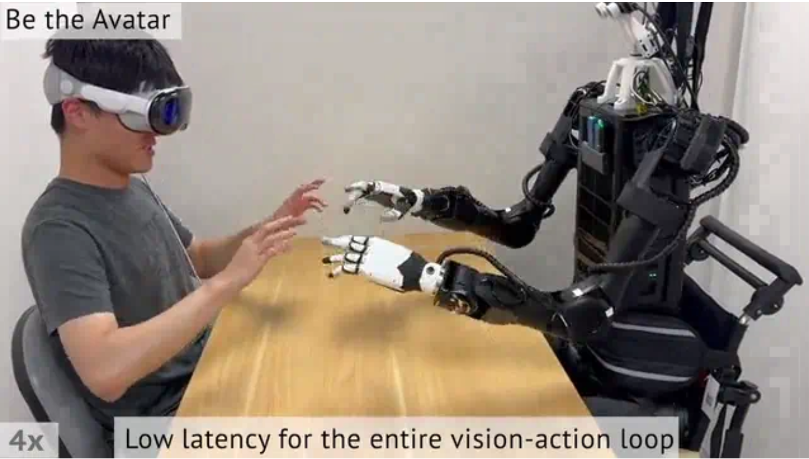

# VR 遥操作

本页讲 VR 手柄/手部追踪遥操作:头显位姿→坐标系与 scale 映射→IK/运动生成→机器人执行。要写:硬件(Quest/Vive/Index)、VR-机器人-相机三坐标系标定、适合双臂/移动/动态/中长程、坑(标定、延迟抖动、眩晕疲劳、安全过滤要严)。VR 遥操作系统详见第 6 章遥操作系统,本页讲真机采集视角与选型。参考:Deep Imitation Learning from VR arXiv:1710.04615;LeVR arXiv:2509.14349。

# VR遥操作数据采集与现场选型规范

在具身智能真机数据采集任务中，基于虚拟现实（VR）头显与手柄或手部追踪设备的遥操作已经成为获取专家演示数据的重要手段。其完整控制流程通常表现为：VR头显及传感器实时捕获人类操作位姿，通过空间坐标系转换与尺度缩放（Scale Mapping）将其映射为机器人空间中的控制意图，再经由逆运动学（Inverse Kinematics, IK）或手部骨骼重定向生成具体运动指令，最终下发至机器人本体执行。

从真机数据采集的角度出发，如何针对具体任务完成硬件与软件管线的选型，以及如何应对物理现场中的工程问题，是保证采集效率与数据质量的重要环节。



## 遥操作管线与主流硬件选型取舍

在真机数据采集现场，硬件方案的选择直接决定了系统能够达到的控制精度以及支持的交互形式。目前，具身智能领域常用的消费级 VR 硬件主要包括 Meta Quest、HTC Vive 和 Valve Index（Lighthouse）等方案。

以 HTC Vive 和 Valve Index 为代表的外部基站定位系统，通过布置激光基站实现六自由度手柄追踪，在良好的环境条件下通常能够提供毫米级定位精度以及低延迟的位置反馈，其刷新频率一般可达到 90 Hz。在需要较高操作精度的场景，例如精密装配、线缆插拔等任务中，基站方案能够提供较为稳定和平滑的控制轨迹。

然而，在工业现场或复杂实验环境中，外部基站方案也存在一定局限。一方面，其部署过程相对复杂；另一方面，遮挡、强反射表面以及基站安装位置不合理等因素可能影响定位稳定性，从而导致短时掉帧或追踪精度下降。

相比之下，以 Meta Quest 为代表的 Inside-out 自追踪头显具有无需外部基站、部署简单、移动灵活等优势，因此近年来在具身智能数据采集中得到了广泛应用。Quest 原生支持 OpenXR Hand API，可实时获取包含约 26 个关节节点的人手骨骼拓扑结构。这使其能够较好地支持多指灵巧手的数据采集，人类操作员无需握持实体手柄，仅通过自然手势即可完成对灵巧手姿态的实时重定向。

需要注意的是，基于视觉的手部追踪在手指严重遮挡、高频快速运动或光照条件较差时，容易出现关节识别误差或短暂跟踪丢失。因此，在工程实践中，对于不带灵巧手的双指夹爪任务或需要较高轨迹精度的精细操作任务，通常优先采用带有实体手柄的基站定位方案；而对于多指灵巧手操作、跨房间移动以及对部署灵活性要求较高的任务，则更适合采用 Quest 等支持骨骼追踪的自追踪设备。入门级自追踪设备的延迟可能会比较高，必要时可以更换更加专业级的VR头显，并换用带宽更高的网线来进行数据的传输。

## 三坐标系标定与位姿缩放映射

将人类动作转换为机械臂运动，需要首先解决空间坐标系之间的对齐问题。在遥操作系统中，通常同时存在三个坐标系：VR世界坐标系、机器人基座坐标系以及视觉传感器坐标系。

现场部署的第一步通常是完成三坐标系之间的联合外参标定。工程实践中，一般结合手眼标定与控制原点配准两部分完成。首先，通过相机观测机械臂末端携带的标定板（如棋盘格或 Aruco 码），在多个位姿下求解相机坐标系与机器人基座坐标系之间的空间变换关系；随后，人类操作员将 VR 手柄或手部关键点对准机器人末端已知的几何参考位置，例如夹爪闭合中心，系统同步记录此时 VR 坐标系下的位姿以及机器人正运动学计算得到的末端位姿，从而求得 VR 空间到机器人空间之间的对齐矩阵。相机标定的详细内容在第四章介绍。

完成坐标系对齐之后，需要进一步解决人类工作空间与机器人工作空间之间的尺度差异问题。由于人类手臂长度、关节活动范围与机械臂的尺寸和运动能力存在差异，直接采用绝对位姿映射容易导致机器人频繁触发关节限位或无法到达目标区域。因此，现代遥操作系统通常采用相对增量（Differential Intent）映射机制。在操作员按下触发键开始控制时，系统记录人类手部和机器人末端的初始位姿；随后，在每一个控制周期中，仅计算人类手部相对于初始状态的位移和姿态变化。位移增量经过比例系数（Scale Factor）缩放后，与机器人参考位姿进行叠加，从而生成当前时刻的目标末端位姿。对于长距离搬运或大型机械臂任务，可以适当增大比例系数以扩大操作范围；而在精密装配等任务中，则可以减小比例系数以提高控制精度。

最终生成的目标末端位姿被送入运动生成模块，由逆运动学求解器（如解析解算器、TRAC-IK、Pinocchio 或 MoveIt 中的数值求解器）计算对应的关节目标值，并在满足关节速度、加速度及运动范围约束的条件下生成控制指令。

## 适合双臂、移动、动态与中长程任务的视角转换

从模仿学习和行为克隆的数据采集角度来看，VR遥操作在双臂协作、移动操作以及长程任务等场景中具有较高的灵活性。

在双臂协同任务（如拧瓶盖、折叠衣物）中，传统牵引示教需要操作者直接推动机器人本体。当面对双臂系统时，人类需要同时协调两只机器人手臂，操作过程较为费力，也难以实现自然流畅的双手协同。而 VR 遥操作允许操作者通过双手手柄或双手骨骼追踪，同时控制机器人双臂，从而利用人类天然的双手协调能力完成更加连续的交互动作。并且有无手柄可以快速对应二指夹爪和灵巧手的遥操作，适合采集不同场景下需求的不同末端执行器数据。

对于带有移动底盘的复合机器人或双足人形机器人，VR 遥操作能够将底盘运动与上肢动作统一到同一时间轴中，通过手柄摇杆、脚踏设备或人体位姿变化等方式实现全身协调控制，从而提高复杂运动数据的采集效率。

在动态任务（如接取运动物体、动态目标跟踪）以及中长程任务（如跨房间搬运、桌面整理）中，人机分离的操作方式具有明显优势。操作员可以位于安全区域完成整个示教过程，避免频繁进入机器人视觉传感器的视野，从而显著减少人体遮挡和视觉伪影对训练数据的影响。

在视觉反馈方面，系统通常利用 RGB-D 相机获取的深度信息重建局部彩色点云，或者直接对双目图像进行立体显示，并在 Unity、LOVR 等虚拟引擎中完成实时渲染，使操作员能够获得接近机器人视角的第一人称观察体验。借助深度信息，操作者能够更加准确地判断机器人末端与目标物体之间的空间关系，从而支持长时间连续完成高质量专家演示数据的采集。

## 以 Open-TeleVision 为例的环境配置

为了完成基于 VR 的第一视角遥操作数据采集，Open-TeleVision 提供了一套完整的视觉流传输、头显交互以及遥操作控制框架。系统整体依赖 Python 环境、双目视觉驱动以及 WebXR 浏览器接口实现头显与机器人之间的实时通信。

基础环境安装
首先创建独立的 Python 虚拟环境：

```bash
conda create -n tv python=3.8
conda activate tv
pip install -r requirements.txt
cd act/detr && pip install -e .
```

其中，项目内部的 ACT 策略训练模块采用可编辑安装模式（editable install），便于后续模型开发与调试。

安装 ZED SDK 与 Python 接口
Open-TeleVision 使用 ZED 双目相机作为第一视角视觉输入，因此需要安装对应的驱动与 Python 接口。

首先安装 ZED SDK：

```text
https://www.stereolabs.com/developers/release/
```

随后安装 Python API：

```bash
cd /usr/local/zed/
python get_python_api.py
```

安装完成后，Python 程序即可直接访问双目图像、深度图以及点云信息。

仿真遥操作环境配置
若希望首先在仿真环境中验证遥操作流程，可进一步安装 Isaac Gym：

```text
https://developer.nvidia.com/isaac-gym/
```

安装完成后，可运行项目提供的 `teleop_hand.py` 示例，实现双机械手的虚拟遥操作测试。

本地局域网串流配置
对于 Meta Quest 头显，可直接采用局域网内的视频串流方案。
而对于 Apple Vision Pro，由于 Safari 浏览器默认禁止非 HTTPS 的 WebXR 连接，因此需要首先配置本地 HTTPS 证书。

假设 Ubuntu 主机和 Vision Pro 已连接到同一局域网。

1. 安装 mkcert

```text
https://github.com/FiloSottile/mkcert
```

2. 获取服务器 IP 地址

```bash
ifconfig | grep inet
```

假设当前 Ubuntu 主机地址为：

```text
192.168.8.102
```

3. 生成 HTTPS 本地证书

```bash
mkcert -install
mkcert -cert-file cert.pem -key-file key.pem \
192.168.8.102 localhost 127.0.0.1
```

生成后的 `cert.pem` 与 `key.pem` 文件需要放置到：

```text
teleop/
```

目录下。

4. 开放服务器端口

使用 iptables：

```bash
sudo iptables -A INPUT -p tcp --dport 8012 -j ACCEPT
sudo iptables-save
sudo iptables -L
```

或者使用 UFW：

```bash
sudo ufw allow 8012
```

5. 启动 OpenTeleVision 本地服务

创建 OpenTeleVision 实例时关闭 ngrok 模式：

```python
tv = OpenTeleVision(
    self.resolution_cropped,
    shm.name,
    image_queue,
    toggle_streaming,
    ngrok=False
)
```

6. 在 Vision Pro 中安装根证书

查看 mkcert 根证书位置：

```bash
mkcert -CAROOT
```

将生成的 `rootCA.pem` 文件通过 AirDrop 发送到 Vision Pro 并完成安装。

随后进入：

```text
Settings
 └── General
      └── About
           └── Certificate Trust Settings
```

启用：

```text
Enable full trust for root certificates
```

并信任刚刚安装的证书。

随后进入：

```text
Settings
 └── Apps
      └── Safari
           └── Advanced
                └── Feature Flags
```

开启：

```text
Enable WebXR Related Features
```

7. 建立 WebXR 连接

在 Vision Pro 的 Safari 浏览器中访问：

```text
https://192.168.8.102:8012
?ws=wss://192.168.8.102:8012
```

随后点击：

```text
Enter VR
```

并允许浏览器访问头显传感器，即可进入沉浸式遥操作界面。

对于 Meta Quest 3，由于安装自签名证书较为复杂，因此 Open-TeleVision 推荐采用 ngrok 创建安全隧道进行远程访问。
该方案同时适用于 Vision Pro 与 Quest 系列设备。

1. 安装 ngrok

```text
https://ngrok.com/download
```

2. 创建 HTTPS 隧道

```bash
ngrok http 8012
```

系统会生成一个公网 HTTPS 地址。

3. 使用头显访问公网地址

在 Quest 或 Vision Pro 浏览器中打开该 HTTPS 地址，即可建立远程 WebXR 会话。

此时创建 OpenTeleVision 对象时，需要开启 ngrok 模式：

```python
self.tv = OpenTeleVision(
    self.resolution_cropped,
    self.shm.name,
    image_queue,
    toggle_streaming,
    ngrok=True
)
```

完成视频串流配置后，可以启动 Isaac Gym 中的双手遥操作示例：

```bash
cd teleop
python teleop_hand.py
```

随后在 Vision Pro 或 Quest 浏览器中进入 WebXR 页面，点击：

```text
Enter VR
```

即可进入沉浸式环境并实时控制仿真机械手。
该流程能够在无需真实机器人硬件的情况下验证完整的视觉流传输、手部追踪以及控制映射链路，为后续真机遥操作部署提供调试环境。


## 真机现场工程落地缺陷

尽管 VR 遥操作在数据采集中具有明显优势，但在真实物理环境部署过程中，仍存在若干需要重点关注的工程问题。

首先是标定漂移问题。机械臂高速运动产生的振动、相机支架的微小位移以及 Inside-out 视觉惯性 SLAM 的累积误差，都可能导致原有坐标系之间的变换关系逐渐发生漂移。当误差逐渐累积至厘米级时，操作员会明显感受到控制方向与机器人实际运动方向之间存在偏差，从而产生额外的补偿动作，降低数据质量。而在实验测试中，这一问题会导致VR遥操作无法适应一些精度要求较高的任务。

第二个问题是通信延迟与高频抖动。在复杂电磁环境下，若采用无线 Wi-Fi 进行头显位姿数据传输，网络拥塞和丢包可能导致几十毫秒级的时延波动以及轨迹抖动。这会影响机械臂运动平滑性，并且会造成人手的动作和机械臂动作不匹配的问题。因此，在工程实现中，通常优先采用 USB 链路建立稳定的有线数据传输通道，以保证 50～100 Hz 控制数据流的稳定传输。同时，在控制前端引入 One Euro Filter 或指数移动平均（EMA）低通滤波器，以抑制人手自然颤动和传感器噪声，提高目标轨迹的平滑性。

此外，视觉反馈系统的设计也会直接影响操作者的舒适性。如果简单地将二维双目图像投射到固定平面，当操作者转动头部时，由于机器人相机无法同步运动，容易产生视觉与前庭感知之间的不一致，从而引发晕动症。这个问题会导致VR遥操作难以实现快速采集大量数据这一要求。

最后，遥操作系统必须配置完善的安全约束层。由于操作者无法直接感知机器人本体的物理极限，在紧急或快速操作过程中，可能产生超出工作空间范围或关节速度限制的控制指令。因此，运动控制系统需要在逆运动学求解之后对关节速度、加速度、电流等参数进行限制，同时结合实时碰撞检测、电子围栏以及安全约束层，对双臂自碰撞、设备碰撞以及接近物理限位等情况进行在线监测，并在毫秒级控制周期内及时抑制危险动作，从而保证设备与人员安全。

