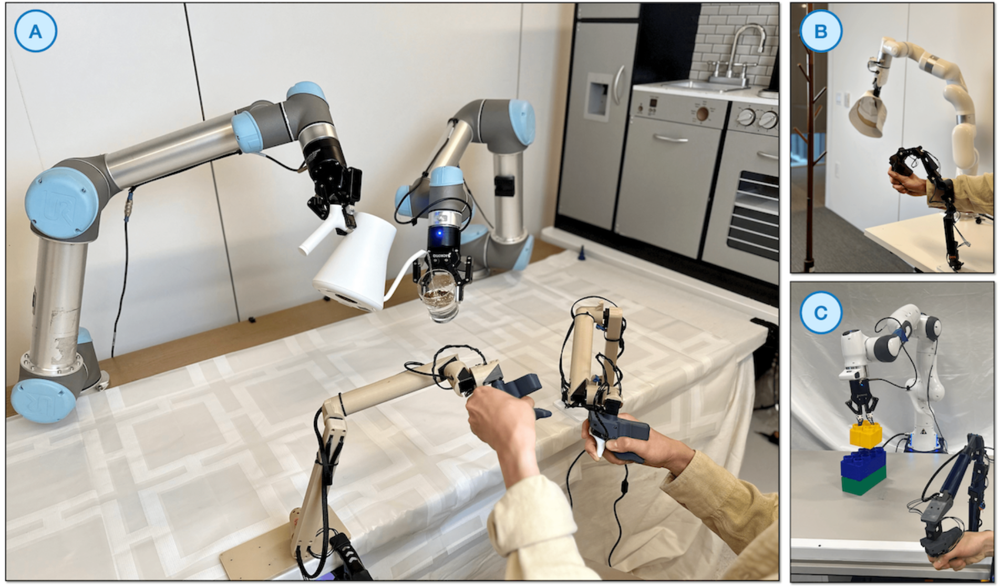

# GELLO

本页讲 GELLO:给目标臂做一个 3D 打印、运动学同构的低成本 leader,读 leader 关节角直接映射到真机(无需 IK),数据平滑、质量高、适合实验室长期采集。要写:硬件(打印件+低成本电机/编码器+夹爪输入)、controller→robot 标定、适合单/双臂与接触丰富任务。GELLO 硬件与设计详见第 6 章遥操作系统,本页讲真机接入与采集。参考:arXiv:2309.13037。

# GELLO主从同构遥操作真机接入与数据采集规范

在具身智能动作数据采集过程中，如何以较低成本、高效率地获取高质量专家演示轨迹，是一个重要的工程问题。前面提到的 VR 手柄、三维鼠标等笛卡尔空间控制器虽然部署灵活，但在接近机器人奇异构型、规避自碰撞以及执行多臂协同任务时，由于缺乏对机械臂整体构型的直观感知，往往会降低数据采集效率。

基于运动学同构原理的 GELLO 系统提供了一种单向（Unilateral）主从遥操作范式。该方法通过为目标机器人构建一个按比例缩小的硬件主控臂，直接在关节空间内建立主从映射关系，从而避免依赖复杂的逆运动学求解过程，为实验室长期、大规模真机数据采集提供了一种具有较高平滑性和稳定性的解决方案。与同构机械臂方案不同的是，该方案为制作一个与真实机械臂构型相同但尺寸不同的控制器，更加简单灵活。但是缺点是无法采集主臂的运动数据进行训练，同时操作者对机械臂的运动范围感知不够直观。



## 同构硬件架构与无源机械阻尼机制

在硬件设计上，GELLO 在成本、鲁棒性和可扩展性之间进行了较好的平衡。整套系统主要由 3D 打印结构件和低成本智能舵机构成，整体物料成本通常可控制在数百美元量级，从而降低了实验室部署多套采集平台的门槛。主控臂（Leader）的几何结构通常依据目标从属机器人（Follower，例如 UR5、Franka Panda 或 xArm7）的运动学参数进行等比例缩放设计，以兼顾操作舒适性和结构紧凑性。通过保持主从系统在运动学拓扑上的一致性，可以在关节空间中建立直接对应关系。

在关节执行单元方面，GELLO 常采用 Dynamixel XL330 系列等消费级智能舵机，例如 XL330-288T。该系列舵机内部集成绝对值编码器，分辨率约为 0.088°，能够提供较高精度的关节角测量。

从控制功能角度来看，主控臂仅需要读取各关节角度，并不依赖主动输出力矩。然而，在实际使用过程中，操作员需要反向驱动（Backdrive）各关节运动，此时舵机内部减速齿轮所产生的摩擦阻尼能够在一定程度上抑制人手的高频微小震颤，使输出轨迹具有较好的平滑性。因此，这种机械结构本身也起到了类似低通滤波的作用，有助于提高采集数据的信噪比。

在末端执行器位置，通常集成一个带有回弹结构的夹爪输入模块。操作者通过手指开合产生连续输入信号，并将其映射为真实机器人夹爪的开闭位移，从而完成抓取动作控制。

此外，为了避免主控臂在无人操作时因重力作用而发生下垂，在受重力矩影响较大的关节（例如类 UR 结构中的第二、第三关节）上，通常会加入弹簧或弹性元件实现关节正则化（Joint Regularization）。这种无源补偿结构能够部分抵消重力矩，使主控臂在静止状态下保持较稳定的姿态。同时，当操作员驱动主控臂逐渐接近运动边界时，弹性元件产生的恢复力会逐渐增大，从而为操作者提供一定程度的被动触觉提示，帮助其感知接近关节极限或奇异区域，提高长期操作过程中的舒适性和安全性。

## Controller-to-Robot 主从标定与关节空间直接映射

相较于依赖视觉追踪或惯性测量单元（IMU）的控制方案，GELLO 的一个重要特点在于其软件控制栈较为简单，并具有较强的确定性。

传统遥操作系统通常需要实时获取控制器在笛卡尔空间中的六自由度位姿，再通过逆运动学（IK）求解得到各关节目标值。在复杂场景下，逆运动学可能带来多解问题、关节突变以及奇异点附近控制性能下降等现象。

由于主从系统在运动学结构上保持一致，GELLO 可以直接建立关节空间映射关系。在每个控制周期内，系统通过 Dynamixel SDK 高频读取主控臂各关节编码器的绝对角度值，经简单的线性校准后，即可作为目标关节位置，通过机器人原生控制接口（如 ROS、ZMQ 或厂商 SDK）发送至从属机器人。由于省去了逆运动学求解过程，整个控制链路具有较低的计算开销和较小的软件延迟，从而能够实现较高频率的实时控制。

在系统部署阶段，Controller-to-Robot 的标定过程也相对直观。由于主从关节拓扑结构保持一致，标定工作的主要目标是消除主控舵机安装误差带来的零位偏置，并统一各关节旋转方向。

工程实践中，通常先将真实机器人移动至预定义零位姿态或拖拽至参考姿态，同时将 GELLO 主控臂调整到对应几何构型。随后，系统读取主控臂编码器的原始读数，并结合机器人当前反馈的关节角度，计算每个关节的静态偏置量（Offset），并将其保存至配置文件中。在后续控制过程中，主控臂读取到的角度值经过偏置补偿后，即可直接映射为从属机器人的目标关节角。

这种关节空间的一一对应关系还带来了额外的安全优势。当真实机器人逐渐接近自身关节限位或特殊构型时，由于主控臂具有相似的运动边界，操作员能够通过主控臂的几何形态感知当前构型状态，从而减少因缺乏空间直觉而导致的越界操作风险，提高系统的可操作性和安全性。

## GELLO 硬件搭建及环境配置讲解

硬件搭建参考官方文档链接 https://github.com/wuphilipp/gello_mechanical，根据自己所用的机械臂进行硬件采购及搭建，这里不作为详细讲解。

环境配置
在完成主控臂机械装配以及 Dynamixel 总线接线后，下一步工作是完成软件环境部署、关节标定以及真机通信接口配置。与依赖视觉追踪和空间坐标变换的 VR 遥操作系统不同，GELLO 的软件栈整体更加轻量，其核心任务主要围绕关节编码器读取、关节空间映射以及数据记录展开。

首先获取 GELLO 软件仓库：

```bash
git clone https://github.com/wuphilipp/gello_software.git
cd gello_software
```

官方推荐采用 Python 3.11 环境，并使用 `uv` 作为虚拟环境和依赖管理工具。

安装 `uv`：

```bash
curl -LsSf https://astral.sh/uv/install.sh | sh
```

创建并激活虚拟环境：

```bash
uv venv --python 3.11
source .venv/bin/activate
```

随后初始化项目子模块并安装依赖：

```bash
git submodule init
git submodule update

uv pip install -r requirements.txt
uv pip install -e .
uv pip install -e third_party/DynamixelSDK/python
```

其中 Dynamixel SDK 提供了主控臂编码器读取以及串口通信能力，是整个关节空间遥操作链路的基础依赖。

对于不同型号的机器人，还需要安装对应的机器人通信接口：

UR 系列机械臂使用 `ur_rtde`
Franka Panda 使用 `polymetis`
xArm 使用官方 Python SDK
YAM 使用 I2RT 提供的控制接口

例如 YAM 机械臂需要进一步安装：

```bash
uv pip install -e third_party/i2rt
```

GELLO 主控臂通常由多个 Dynamixel 舵机串联组成，因此首先需要确保每个电机具有唯一的设备 ID，即需要设置舵机的ID。

推荐使用 Robotis 官方提供的 Dynamixel Wizard 工具进行配置：

1. 将单个电机连接至 U2D2 转串口模块；
2. 扫描识别当前电机；
3. 修改其 ID；
4. 按照从底座到末端夹爪的顺序依次编号。

例如对于七自由度主控臂，可以采用：

```text
J1 -> ID 1
J2 -> ID 2
J3 -> ID 3
J4 -> ID 4
J5 -> ID 5
J6 -> ID 6
Gripper -> ID 7
```

完成配置后，再将所有电机重新接入总线。

对于 YAM 主控臂，官方提供了自动化配置生成脚本，可自动完成关节偏置检测以及配置文件生成。

首先将主控臂调整至默认装配姿态，然后运行：

```bash
python scripts/generate_yam_config.py
```

脚本会自动生成：

```text
configs/yam_auto_generated.yaml
configs/yam_auto_generated_sim.yaml
```

其中：

`yam_auto_generated.yaml` 用于真实机器人；
`yam_auto_generated_sim.yaml` 用于 MuJoCo 或仿真环境。

生成完成后，大多数情况下无需手动修改配置文件。

对于 UR、Franka Panda、xArm 等非 YAM 机器人，通常需要进行一次显式的关节零位标定。

首先将主控臂与从属机器人同时调整至已知参考姿态，例如：

* 所有关节水平展开；
* 或制造商提供的 Home Pose；
* 或实验室统一定义的 Calibration Pose。

随后运行偏置检测程序：

```bash
python scripts/gello_get_offset.py \
    --start-joints <robot_home_pose> \
    --joint-signs <joint_signs> \
    --port <u2d2_port>
```

其中：

* `start-joints` 为机器人参考姿态下的关节角；
* `joint-signs` 用于指定主从关节旋转方向是否一致；
* `port` 为 U2D2 串口设备路径。

例如 Franka Panda 的典型配置为：

```bash
python scripts/gello_get_offset.py \
    --start-joints 0 0 0 -1.57 0 1.57 0 \
    --joint-signs 1 1 1 1 1 -1 1 \
    --port /dev/serial/by-id/...
```

标定完成后，系统会自动计算每个关节的静态偏置量，并写入配置文件中。后续运行过程中，只需对编码器读数施加这一偏置即可完成主从映射。

对于真实机器人部署，需要首先启动机器人控制节点：

```bash
python experiments/launch_nodes.py --robot ur
```

或：

```bash
python experiments/launch_nodes.py --robot panda
```

随后启动 GELLO 主控节点：

```bash
python experiments/run_env.py --agent=gello
```

系统会持续读取主控臂关节编码器数据，并通过 ZMQ 通信框架实时发送至机器人控制进程，实现低延迟关节空间遥操作。

GELLO 内置了示教数据保存接口，可直接记录专家演示轨迹。

启动数据记录模式：

```bash
python experiments/run_env.py \
    --agent=gello \
    --use-save-interface
```

运行过程中：
按下 `s` 开始记录；
按下 `q` 停止记录。

所有数据默认保存在：

```text
data/
```

目录下。

采集结束后，可进一步转换为训练所需的数据格式：

```bash
python gello/data_utils/demo_to_gdict.py \
    --source-dir=<source_dir>
```

生成的数据通常包含：

* 关节状态；
* 动作指令；
* 时间戳；
* 相机图像；
* 抓取状态；
* 元信息与任务标签。

这些数据能够直接用于行为克隆（BC）、ACT、Diffusion Policy 以及离线强化学习等具身智能训练框架。

对于双臂机器人，GELLO 推荐采用 YAML 配置方式进行统一管理。

启动双臂系统：

```bash
python experiments/launch_yaml.py \
    --left-config-path configs/gello_left.yaml \
    --right-config-path configs/gello_right.yaml
```

系统会分别加载左右主控臂配置，并建立两条独立的关节控制链路。

由于双侧主控器与双机械臂之间保持严格的运动学同构关系，因此操作员能够自然地利用人体本体感觉完成复杂的双臂协同示教，而无需额外考虑逆运动学求解、多解切换或奇异构型等问题。

这一部署方式目前已经成为实验室进行双臂协同装配、接触操作以及长时序 manipulation 数据采集的重要技术路线之一。


## 多臂协同与丰富接触任务下的专家数据采集

由于引入了明确的物理形态映射关系以及机械结构自身的阻尼特性，GELLO 特别适合单臂精细操作、双臂协同以及存在大量接触交互（Contact-rich）的任务。例如双臂协同任务（折叠毛巾、物体交接以及零部件组装）中，笛卡尔空间控制器通常使操作员主要关注两个末端执行器的位置关系，而较难同时感知整个机械臂的关节构型。因此，在复杂双臂操作过程中，容易出现机械臂之间发生自碰撞或进入不良构型的问题。而在使用 GELLO 进行双臂控制时，操作者实际握持的是两套等比例缩小的机械结构，其本体感知系统能够较自然地利用对机械形态的直观认知，同时关注末端运动和中间连杆姿态，从而更容易管理冗余自由度以及双臂运动空间，降低自碰撞和环境碰撞的概率。对于具身智能中常见的丰富接触任务，例如擦拭桌面、插拔数据线、打开抽屉、操作家用电器等，GELLO 也能够提供较稳定的操作体验。

在纯视觉手部追踪系统中，当手部与环境发生接触或出现遮挡时，视觉信号可能产生跳变或短时跟踪丢失，从而导致机器人输出不连续的控制指令。而在使用 GELLO 进行接触式示教时，操作者始终通过实体机械结构完成运动输入，机械阻尼和物理支撑能够提供较好的运动稳定性，使操作员能够实现连续、渐进的位姿调整，从而提高接触任务的控制精度和轨迹连续性。得益于机械结构本身的平滑特性以及较高的控制确定性，采集得到的专家演示数据通常具有较高的信噪比。对于行为克隆（Behavioral Cloning）等模仿学习方法，这类数据往往能够直接用于端到端策略训练，而无需进行大量后处理、轨迹修补或复杂滤波。

凭借较低的成本、较好的耐用性以及较高的操作稳定性，GELLO 已成为当前具身智能实验室中使用高精度协作臂(如Franka系列，UR系列)进行长期、大规模真机数据采集的一种常用主从遥操作方案。但是在当前研究中更常见的人形双臂构型以及轻量化六轴机械臂中，更加常用的方案是主从同构机械臂遥操作以及直接手动示教。

