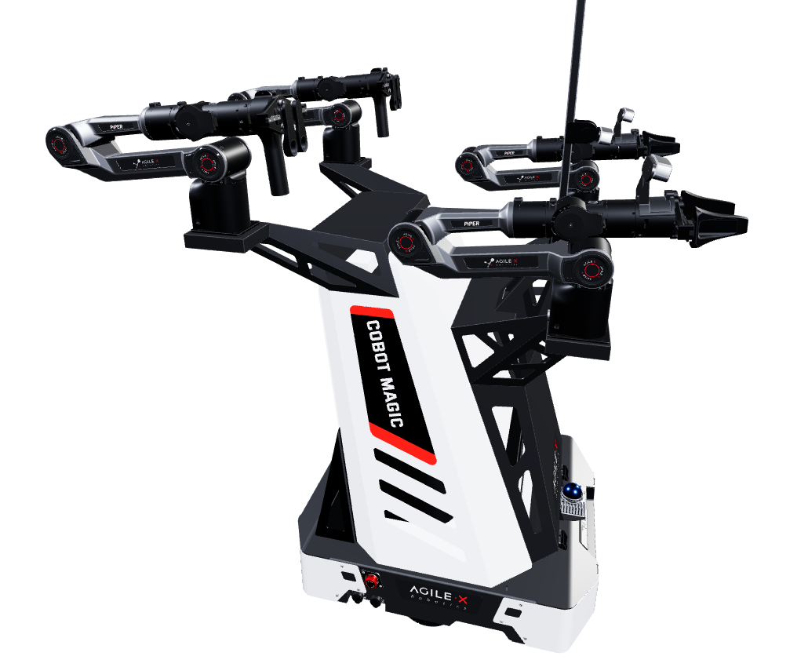

# 主从同构 / ALOHA

本页讲 leader-follower 主从遥操作(ALOHA 系):操作者动 leader、follower 在真机执行,人-机动作映射最自然、数据质量最高,是双臂/长程/精细操作的高质量数据平台。要写:单臂与双臂(ALOHA)硬件组成、多相机与脚踏/success 标注、采集组织;成本高、占地大、维护与同步复杂,不作新手第一步。ALOHA 硬件详见第 6 章遥操作系统,本页讲真机采集组织。参考:ALOHA 2 arXiv:2405.02292;Mobile ALOHA arXiv:2401.02117。

# 主从同构 / ALOHA

本页讲 leader-follower 主从遥操作(ALOHA 系):操作者动 leader、follower 在真机执行,人-机动作映射最自然、数据质量最高,是双臂/长程/精细/大范围移动操作的高质量数据平台。本节参考:ALOHA 2 arXiv:2405.02292;Mobile ALOHA arXiv:2401.02117。

## 1. 单臂与双臂（ALOHA & Mobile ALOHA）硬件组成

ALOHA 系统不仅支持桌面级双臂固定站（如 ALOHA 2），还能通过引入移动底盘扩展为支持全场景的移动双臂系统（Mobile ALOHA）。论文中其核心硬件架构如下：

* **主控端与受控端（Leader & Follower）：**
    * **受控端（Follower）：** 包含两台 Trossen Robotics 的 ViperX 6-DoF 机械臂作为执行端，负责在真机上执行高难度、多步骤的精细操作。
    * **主控端（Leader）：** 包含两台体积更小但运动学结构完全相同的 WidowX 机械臂，操作员通过“操纵（puppeteering）”这两台主控臂来同步同步驱动受控臂。
* **移动底盘与全身遥操作（Mobile Base & Tetherless Design）：**
    * **移动底盘：** 选用 AgileX Tracer这一差速驱动的低轮廓移动底盘，设计最大行驶速度为 1.6m/s。
    * **全身遥操作设计：** 操作员的下肢通过一个纯机械结构的连接件直接物理推拉移动底盘，从而驱动机器人前进、后退或转向；上肢同时操作两台主控臂。这种设计不需要任何额外的底盘电机主从映射软件，利用人类天然的身体平衡能力，实现了零延迟的全身协同（Whole-Body Teleoperation）。
    * **车载独立供电与计算：** 车载配备了 100W·h 的电池组和一台搭载 NVIDIA RTX 4090 GPU 及英特尔处理器的便携式微型主机（如 Intel NUC），整个系统无需拔插外接线缆（Tetherless），支持大范围的远距离长程操作。
* **夹爪设计升级（Grippers）：**
    * **主控端夹爪：** 在最新迭代中，放弃了初代的剪刀式设计，改用低摩擦线性导轨设计。同时将夹爪电机替换为低齿轮比的 XC430-W150-T 舵机。这使得开合夹爪所需的力减小了近 10 倍（降至 0.84N），极大缓解了操作员大批量采集数据时的手部疲劳。
    * **受控端夹爪：** 升级为 3D 打印碳纤维尼龙材质，手指内部和外侧均贴有聚氨酯防滑胶带，极大增强了抓取稳定性（最大夹持力提升至 27.9N），以便于执行擦拭桌面、推拨物件、捏取微小物等操作。
* **重力补偿与结构框架：**
    * 主控臂配备了基于现成工业件的**被动式悬挂平衡器（Hanging Retractors）**进行重力补偿。这能完全关闭主控臂电机供电，相比软件补偿更平滑，且规避了因软件 Bug 导致机械臂乱动伤人的风险。
    * 在移动版本中，所有主控臂与受控臂通过铝型材龙门架紧凑地集成在移动底盘后方，确保整体重心稳定，防止机器人在加减速时倾翻。

这里给出实际实验中可以采取的方案搭配：
* **追求移动底盘：**
    一体式的机器人方面，可选择松灵的Cobot Magic。该机器人具备主从同构双臂与移动底盘，在供电与计算方面搭载了户外电源和可以自选型号的工控机，脱离供电之后续航能力较强；遥操作不涉及代码控制，上电即用。若追求数采的灵活性，可选用分体式ALOHA。这一机器人将主臂和从臂分开，并且具备导航能力和自主返回充电桩的能力，更适配导航和抓取的复合场景。

* **不追求移动底盘：**
    可选择Piper双臂套件或最基础的LeRobot SO-Arm系列
    这一方案需将机械臂固定在工作台上，任务场景的多样性受限，但是可以快速入门且成本较低。

## 2. 多相机与脚踏 / Success 标注

为了让下游行为克隆（Behavior Cloning）等具身智能算法能够获得多视角、全方位、多模态的输入，工作站集成了传感器硬同步网络，如下为论文中作者的相机安排，可以进行一定的参考，并根据自身实验场景进行改进：

* **多相机视野配置（Cameras）：** 系统集成了多台高分辨率的 Intel RealSense 相机（通常为 D405 和 D435i 等型号），提供 RGB 和深度（Depth）信息。具体空间布设如下：
    1.  **Overhead / Forward Camera（前视全局相机）：** 部署在龙门架顶部或移动箱体前方，面向正前方环境，捕捉机器人前方的全局移动场景。
    2.  **Worms-eye Camera（虫眼相机）：** 位于操作台面或机械臂底座边缘斜向上方，捕捉物体下表面及夹爪底部的低角度精细视角。
    3.  **Left & Right Wrist Cameras（左右手腕相机）：** 分别随左右受控臂一起移动。采用低轮廓的自定义 3D 打印支架，在减少接近或狭窄空间操作时碰撞机率的同时，近距离聚焦夹爪与物体交互的绝对局部特征。
    *注：所有相机通常以 $848\times480$ 刷新率录制高带宽视频流。*
* **脚踏开关与 Success 标注（Foot Pedals）：**
    * 在桌面站或移动站的物理空间中部署有标注开关或脚踏开关（而在 Mobile ALOHA 中，操作员通常通过闭合主控臂指爪上的触点 attachment 来触发录制）。
    * **现场动作标注：** 任务执行完毕后，操作员可直接通过开关一键选择保存或废弃该段轨迹。通过这种方式，只有被成功执行的有效高质量轨迹才会被保存到训练集，实现了极低成本的真机现场数据筛选与质量过滤。

在参考该方案进行复现的实际实验中，可以不使用开关对录制数据集进行封装，只需一个单独的数据集录制脚本。在相机的安排方面，一般前视相机和两个腕部相机的搭配就已经完全足够，可以无需架设论文中的虫眼相机。

由于Aloha成品机械臂购置之后环境已经配好，只需按照官方文档启动即可，这里不进行环境配置的讲解。

## 3. 采集组织流程

大批量、高效率的真机数据采集需要极高的数据一致性与鲁棒的管理组织方案：

* **软件栈与高频采样：** 采用 ROS2 核心架构，主控端/受控端的关节位置、底盘速度以及传感器数据流均以 50Hz 频率进行高速硬同步录制（高频遥操作已被证实相比低频能带来更低的动作延迟以及显著的策略性能提升）。
* **状态监控与自动丢弃：** 在采集过程中，系统会向操作员实时投影当前 Session 的统计数据（如丢包率、通信延迟 Latency 等）。若在录制中途发生任何硬件传感器丢包或数据断流，系统会自动强制终止并丢弃该 Session，从源头上杜绝残缺或异常的数据污染下游的学习流水线。
* **元数据完整留存：** 每次录制成功后，系统除了记录原始传感器流（图像、主从关节位置、底盘速度等）之外，还会自动打包写入操作员用户名（Username）、采集时间（Time）以及机器人硬件唯一标识符（Robot ID）。
* **数据协同训练（Co-training）：** 采集组织的另一大核心在于算法复用。《Mobile ALOHA》的核心结论之一是协同训练（Co-training）。在训练移动机器人的新任务时，可以把新采集的少量移动数据（如 50 笔）与现有的、大量的静态 ALOHA 数据集（Static ALOHA Dataset）混合在一起共同训练。这能够显著提升移动双臂策略的泛化能力和鲁棒性，大幅减少了新任务的真机采集成本。

## 4. 避坑指南：为什么不建议作为新手第一步？

尽管 ALOHA 系列在双臂长程、精细化操作（如做饭、擦桌子、洗碗、高精度装配）中表现出了极其惊艳的数据上限，但由于以下系统性壁垒，它不适合作为新手入门机器人学习的第一步：

1.  **硬件及维护成本昂贵：** 如果全部参考论文中的系统的话，需要采购 4 台高级 Dynamixel 机械臂（2x ViperX + 2x WidowX）、4 台 RealSense 工业级相机、高规格的车载计算 PC（带 RTX 4090）、AgileX Tracer 工业底盘以及高容量锂电池。整体硬件造价昂贵（即使是低成本方案也在数万美元级别），损坏、烧毁舵机或更换硬件的成本较高。即使选择最基础的入门方案也要一万以上。并且该方案对协作机械臂没有成熟的适配，对于实验室来说需要自己进行主臂结构的设计。
2.  **物理占地与维护空间大：** 静态工作站需要大台面及完备的铝型材框架；移动工作站虽然支持不插线自由移动，但整体设备重达 75kg 左右。在普通工位或小型狭窄实验室中很难灵活摆放、搬运和安全调测。
3.  **多系统维护与同步极其复杂：** 4 路高带宽 RealSense 相机的高速图像编解码、主从机械臂与底盘在 ROS2 下的 50Hz 通信延迟调优、全身多链路的时间戳硬同步等，涉及极为繁琐的软硬件联调。排查和对齐这些软硬件漂移对新手的能力要求极高。

**新手推荐替代路径：** 建议首选单臂、纯摄像头引导，采用键鼠遥操作和手柄遥操作，或者基于仿真环境（如 MuJoCo Menagerie 中开源的虚拟 ALOHA / Mobile ALOHA 模型）进行行为克隆（BC）策略验证，待跑通基本具身 pipeline 后再引入复杂的真机 ALOHA 体系。