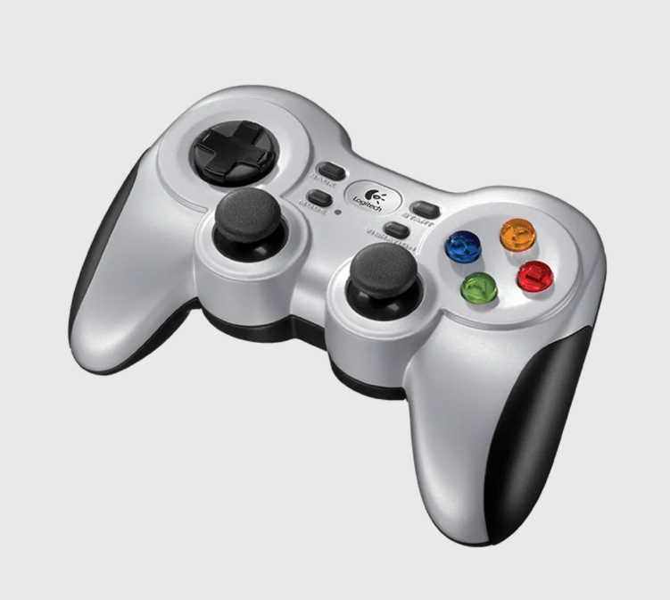

# 手柄 / 键盘

本页讲键盘/手柄/joystick 遥操作:成本最低、代码最简,自由度低、机械臂 6-DoF 控制别扭、轨迹粗。定位为"最小可运行 teleop"——适合移动底盘、粗粒度 pick/place 调试、夹爪开合测试,以及给 robot adapter/recorder/safety-stop 做 smoke test。建议放采集章最前作入门。ch7 无此页,本页详写。

# 手柄 / 键盘遥操作

手柄（Gamepad）与键盘（Keyboard）遥操作是目前成本最低、实现最简的机器人遥操作方案。与 SpaceMouse、VR 头显、GELLO 等专用设备不同，手柄和键盘属于通用外设，无需额外采购专用硬件，使用日常办公或娱乐设备即可在几分钟内搭建起一套可运行的真机遥操作系统。

该方案通过将手柄摇杆/按键或键盘按键映射为机械臂末端在笛卡尔空间中的增量位移指令或关节空间的独立运动指令，实现对单臂或移动底盘的远程控制。由于输入维度有限（手柄通常为 2–4 个模拟轴 + 若干数字按键，键盘为纯离散按键），操作者通常无法同时控制机械臂的全部六个自由度，需要通过模式切换（Mode Switch）在不同控制维度之间轮换。这决定了其轨迹质量无法与同构主从或 VR 遥操作相比，但在快速验证、简单调试和入门学习场景中具有不可替代的便利性。



## 硬件组成与输入设备选型

手柄/键盘遥操作的硬件门槛极低。一个完整的遥操作工作站通常仅需以下设备：

**机械臂与夹爪：** 任意支持外部控制接口（如 ROS、ZMQ、厂商 SDK）的协作机械臂或工业臂，夹爪类型不限（二指、三指、吸盘等）；
**控制输入设备：** 标准游戏手柄（Xbox、PlayStation、Switch Pro 等）或标准键盘，通过 USB 或蓝牙连接至控制主机；
**相机（可选）：** USB 摄像头或 RealSense 等 RGB-D 相机，用于提供操作视野反馈；
**控制主机：** 普通 PC 或笔记本电脑，运行控制脚本。

在输入设备的选型上，手柄和键盘各有适用场景：

**游戏手柄（Gamepad）** 是最推荐的入门设备。现代游戏手柄通常提供双模拟摇杆（各两自由度）、方向键（D-pad）、模拟扳机键（Trigger）以及多个数字按键。模拟摇杆提供连续量输入，适用于控制机械臂末端的位移或关节角度变化；扳机键适合控制夹爪开合力度；数字按键则可用于模式切换、急停触发等离散指令。常见的选型包括：

Xbox Series / Xbox One 手柄：Windows 原生支持，通过 XInput API 或 `pygame`、`inputs` 等 Python 库可直接读取，兼容性最好；
PlayStation DualSense / DualShock 4：支持蓝牙连接，模拟轴数量充足，部分型号支持触觉反馈；
第三方兼容手柄（如 8BitDo、GuliKit）：成本更低，功能基本等效。

**键盘（Keyboard）** 提供纯离散输入，适合控制移动底盘或进行简单的关节空间点动（Jogging）。由于按键只有按下/释放两种状态，无法产生平滑的连续速度指令，通常需要配合加减速平滑策略或时间累积逻辑来模拟连续运动。键盘遥操作的优势在于无需任何额外硬件，适合在远程 SSH 终端环境下进行快速调试。

**Joystick（工业摇杆）** 位于手柄和专业设备之间。相比游戏手柄，工业摇杆通常提供更高精度的模拟轴（如霍尔效应传感器）和更多的可编程按键，适合需要大范围连续控制的移动底盘遥操作任务，但其体积较大、不便携，在实验室环境中的普及度不如游戏手柄。

## 控制映射与模式切换机制

由于手柄和键盘的输入维度远低于机械臂的自由度数量，控制映射方案的设计直接决定了操作效率和数据质量。工程实践中常见的映射策略主要有以下三种。

### 笛卡尔空间增量映射

这是最常用的方案。将手柄的左摇杆映射为机械臂末端在笛卡尔空间中的 X/Y 平移，右摇杆映射为 Z 平移和绕 Z 轴的旋转（Yaw），扳机键或肩键映射为绕 X/Y 轴的旋转（Roll/Pitch），从而覆盖全部六个自由度。在每个控制周期中，系统读取摇杆的偏移量（通常在 $[-1, 1]$ 范围内），乘以预设的比例系数（Scale）得到末端增量位移，再与当前末端位姿叠加并经逆运动学求解得到目标关节角。

|手柄输入|笛卡尔映射|
|---|---|
|左摇杆 X/Y|末端 Δx / Δy|
|右摇杆 X/Y|末端 Δz / Δyaw|
|肩键 L/R|末端 Δroll / Δpitch|
|扳机键 RT/LT|夹爪 开 / 合|
|A/B/X/Y 按键|模式切换 / 急停 / 记录|

常见的操作逻辑为：在按下某个激活键（通常映射为 LB 或 LT 键）时，摇杆输入才会被转换为机器人运动指令；松开激活键时机器人立即停止。这种设计提供了最基本的安全保护。

### 关节空间点动映射

对于不需要末端位姿精确控制的场景（如移动底盘测试、单关节调试），可以将手柄的各个模拟轴或键盘的按键直接映射到独立的关节。例如，键盘的 Q/A 键控制关节 1 正/反转，W/S 键控制关节 2，以此类推。这种映射方式不需要逆运动学求解，代码最为简单，但操作效率较低，不易产生自然流畅的轨迹。

### 模式切换机制

受限于手柄的输入通道数量，通常需要在不同控制模式之间切换。常见的模式划分包括：

**末端位姿模式：** 控制机械臂末端的六自由度运动；
**关节模式：** 逐关节控制，用于调姿或接近奇异点时的手动调整；
**底盘模式：** 控制移动底盘的线速度和角速度；
**夹爪模式：** 精确控制夹爪位置或力矩。

模式切换通常通过方向键（D-pad）或数字按键实现，并在控制界面中给出当前模式的视觉反馈（如终端打印或 GUI 指示器），避免操作者因模式混淆而误操作。

## 工作流程

手柄/键盘遥操作的完整采集流程可以概括为以下几个步骤：

```text
连接输入设备与机械臂
        ↓
加载控制映射配置（映射表 + 比例系数）
        ↓
操作者通过手柄/键盘发送运动指令
        ↓
控制脚本实时读取输入 → 坐标转换 → IK 求解 → 下发关节指令
        ↓
同步记录 observation / state / action
        ↓
生成 demonstration 数据集
```

在实际代码实现中，控制循环通常以固定频率运行（如 30–50 Hz）。每个循环周期内依次完成：读取手柄/键盘输入 → 判断当前模式 → 计算末端或关节增量 → 调用 IK 求解器 → 通过机器人接口发送指令 → 记录当前帧数据。控制脚本通常以 Python 编写，核心依赖仅需 `pygame`（手柄读取）、`pynput` 或 `keyboard`（键盘读取）以及机器人对应的 Python SDK。

以下是一个最小化手柄遥操作伪代码示例，展示核心控制循环的结构：

```python
import pygame
import numpy as np
from robot_sdk import Robot  # 替换为实际机器人 SDK

# 初始化手柄
pygame.init()
joystick = pygame.joystick.Joystick(0)
joystick.init()

# 初始化机器人
robot = Robot()
robot.connect()

# 控制参数
scale_pos = 0.005   # 位置增量比例 (m)
scale_rot = 0.02    # 姿态增量比例 (rad)
deadman_button = 4  # LB 键作为安全开关

try:
    while True:
        pygame.event.pump()
        
        # 安全检查：未按下 Deadman Switch 则停止
        if not joystick.get_button(deadman_button):
            robot.stop()
            continue
        
        # 读取摇杆输入并映射为 delta pose
        dx = joystick.get_axis(0) * scale_pos      # 左摇杆 X → Δx
        dy = joystick.get_axis(1) * scale_pos      # 左摇杆 Y → Δy
        dz = joystick.get_axis(3) * scale_pos      # 右摇杆 Y → Δz
        dyaw = joystick.get_axis(2) * scale_rot    # 右摇杆 X → Δyaw
        
        # 构建 delta pose
        delta_pose = np.array([dx, dy, dz, 0, 0, dyaw])
        
        # IK 求解并执行
        target_pose = robot.get_ee_pose() + delta_pose
        joint_angles = robot.ik(target_pose)
        robot.move_joints(joint_angles)
        
        # 夹爪控制：RT/LT 扳机键
        gripper_cmd = (joystick.get_axis(5) - joystick.get_axis(4)) / 2 + 0.5
        robot.move_gripper(gripper_cmd)
        
        # 记录数据
        record(observation=robot.get_state(), action=joint_angles)
        
        pygame.time.wait(20)  # ~50 Hz 控制频率
        
except KeyboardInterrupt:
    robot.stop()
    robot.disconnect()
```

## 优势

手柄/键盘遥操作在工程实践中的核心优势集中在低门槛和快速部署两个方面。

1.极低的硬件成本。游戏手柄的零售价格通常在 200–500 元人民币，键盘则几乎为零成本。与 VR 头显（数千至上万元）、SpaceMouse（约 1500 元）、GELLO（数百美元物料 + 3D 打印）或 ALOHA（数万至数十万元）相比，手柄/键盘方案的成本几乎可以忽略不计。对于刚接触真机数据采集的实验室或个人开发者而言，这是唯一可以在不增加任何硬件预算的前提下立刻启动的方案。

2.代码实现极其简单。手柄读取库（如 `pygame`、`inputs`）的 API 非常简洁，核心控制循环通常不超过 50 行代码。不需要处理复杂的坐标系标定（VR 方案的痛点）、不需要 3D 打印和硬件装配（GELLO/ALOHA 的门槛）、也不需要处理网络流媒体传输（手机/Web 方案的复杂度）。初学者可以在一个下午内从零搭建起可运行的遥操作采集管线，快速理解 state/action/observation 的数据流和机器人控制的基本概念。

3.部署灵活、即插即用。手柄和键盘通过 USB 或蓝牙连接，无需任何前置标定或机械安装步骤。更换控制主机、切换机器人型号或调整控制映射都可以通过修改几行配置完成，非常适合在多个机器人平台之间快速切换和复用。

4.配适移动底盘效果好。对于差速或阿克曼转向的移动底盘，手柄摇杆的二维模拟输入天然适配线速度和角速度的控制，操作直觉与驾驶遥控车或玩赛车游戏高度一致，学习成本极低。这是其他方案（如 SpaceMouse 或 VR 手柄）相对不擅长的一个方向。

5.适合做 smoke test。在开发 robot adapter（机器人驱动适配层）、data recorder（数据记录模块）或 safety-stop（安全急停逻辑）等基础设施组件时，手柄/键盘遥操作提供了一个轻量级的端到端测试手段。不需要完整的遥操作管线，即可验证"输入→控制→执行→记录→急停"的全流程是否正常工作，从而在早期阶段快速发现和修复集成问题。

## 局限性

手柄/键盘遥操作的主要局限来源于输入设备自由度的根本性不足以及缺乏力反馈通道。

1.六自由度同时控制困难。机械臂末端在笛卡尔空间中具有六个自由度（三个平移 + 三个旋转），而标准游戏手柄仅有四个模拟轴（两个摇杆），加上扳机键也仅能同时提供 4–6 个连续输入通道。操作者必须频繁进行模式切换才能覆盖全部自由度，这导致轨迹中不可避免地出现停顿、分段和模式切换带来的非平滑过渡。与同构主从（关节空间一一映射，操作自然流畅）或 VR 遥操作（手腕六自由度直接映射）相比，手柄产生的轨迹在平滑性和连续性上存在显著差距。

2.轨迹质量粗劣、不适合精细任务。由于拇指操作摇杆的运动精度远低于手臂/手腕的自然运动精度，手柄产生的末端轨迹通常存在明显的高频抖动和超调。虽然可以通过低通滤波进行平滑处理，但这会引入额外的控制延迟，形成平滑性与响应速度之间的权衡。对于较高精度的插入、装配或接触式操作，手柄遥操作难以产生满足模仿学习训练要求的专家级数据。

3.缺乏力反馈与空间直觉。操作者无法感知机器人与环境之间的接触力，也无法像手把手拖动示教那样直观感受关节限位和奇异构型。这增加了误操作的风险，尤其是在接近工作空间边界或与物体发生意外碰撞时。

4.键盘的离散输入限制更严。纯键盘遥操作由于只有开/关两种状态，无法产生连续的速度曲线。对于机械臂的笛卡尔空间控制，通常只能以固定步长进行点动，操作效率极低。键盘更适合移动底盘的指令级控制（前进/后退/左转/右转），或者在无图形界面的远程 SSH 环境中进行单步调试。

5.长时间操作易疲劳。拇指长时间在摇杆上进行精细控制容易导致手部疲劳，这在大批量数据采集场景中会显著限制单次采集的持续时长和轨迹一致性。

## 适用场景

综合以上特点，手柄/键盘遥操作的适用场景可以归纳为：

1.最小可运行遥操作系统的搭建：作为具身智能真机数据采集的入门第一步，帮助初学者快速跑通"输入→控制→机器人运动→数据记录"的完整链路，建立对遥操作系统整体架构的直观理解；
2.移动底盘的遥操作：手柄摇杆天然适配差速或阿克曼转向底盘的速度控制，是目前最方便、最简单的底盘遥操作方案之一；
3.低精度机械臂运动代码调试：对于无需高轨迹精度的简单抓取和放置任务，手柄可以提供足够的控制能力完成基础的功能验证；
4.夹爪/末端执行器的独立测试：通过扳机键或按键独立控制夹爪开合，快速验证夹爪的机械动作、通信延迟和抓取力度；
5.robot adapter / recorder / safety-stop 的 smoke test：在开发数据采集基础设施组件时，作为轻量级的端到端集成测试手段，验证各模块的接口正确性和运行时稳定性；
6.低成本教育场景：在教学、工作坊或 hackathon 等场景中，利用零成本或极低成本快速搭建可交互的机器人控制系统；
7.紧急手动接管：例如在机械臂或底盘自主策略运行过程中，操作者可通过手柄随时接管机器人控制权，作为安全备份手段。

对于需要高质量 demonstration 数据的正式采集任务（如精细装配、接触式操作、双臂协同等），手柄/键盘方案不适合作为主力采集工具，建议在跑通基础流程后升级至 GELLO、VR 遥操作或主从同构方案。

## 与其他遥操作方案的对比

| 维度 | 手柄/键盘 | SpaceMouse | VR 遥操作 | GELLO |
|------|----------|-----------|----------|-------|
| 代码复杂度 | 极低 | 低 | 中–高 | 中 |
| 6-DoF 同时控制 | 困难（需模式切换） | 支持（单旋钮 6-DoF） | 支持（手腕 6-DoF） | 关节空间直接映射 |
| 轨迹平滑度 | 粗 | 中 | 良 | 优 |
| 力反馈 | 无 | 无 | 部分支持 | 被动机械阻尼 |
| 部署时间 | 分钟级 | 分钟级 | 小时级 | 天级（需 3D 打印） |
| 适合双臂 | 困难 | 困难 | 支持 | 支持 |
| 适合移动底盘 | 优秀 | 一般 | 支持 | 不支持 |

从选型路径来看，手柄/键盘方案最适合作为真机数据采集的起点。建议所有初次接触真机遥操作的开发者先通过手柄/键盘方案跑通完整的控制-记录链路，理解数据格式、控制频率、安全机制和机器人接口的基本概念，使用手柄采集一两条数据进行入门，再根据任务需求逐步升级到更专业的遥操作方案。
