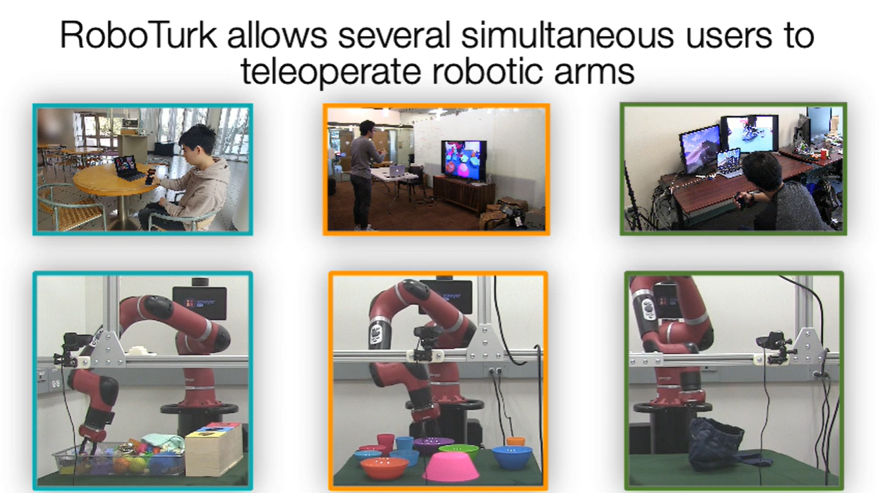

# 手机 / Web 远程

本页讲手机/Web 远程遥操作与众包采集(RoboTurk 路线):移动设备做 6-DoF 轨迹遥操作 + 远程视频流,支持远程、众包式大规模采集。要写:架构(手机/Web 接口、视频流、服务器、权限与延迟监控)、优点(远程、众包、规模)、缺点(真机安全风险大、网络延迟/丢包、无触觉、需严格权限隔离),当前更适合研究平台。ch7 无此页,本页详写。参考:RoboTurk arXiv:1811.02790;Scaling RoboTurk arXiv:1911.04052。

# 手机/Web 远程遥操作与众包采集（RoboTurk 路线）



## 系统架构设计

手机与 Web 远程遥操作平台的核心设计理念是将复杂的机器人仿真、视觉渲染和控制逻辑部署在云端或本地高性能计算节点上，而将用户交互接口扩展到普及程度较高的消费级移动设备。系统的用户侧通常由 Web 浏览器和智能手机协同构成。其中，浏览器负责显示机器人工作空间实时回传的视频流，而智能手机则充当六自由度（6-DoF）空间控制器。

移动端应用通常利用 Apple ARKit、Google ARCore 等增强现实框架，通过融合视觉里程计与惯性测量单元（IMU）信息，对手机在空间中的相对位姿变化进行实时估计。为了改善操作体验并减轻人体疲劳，系统通常借鉴手术机器人中的控制离合（Clutch）机制，允许操作员在不影响机器人当前状态的情况下重新调整手部姿态和手机位置。随后，控制指令以及手机姿态信息被打包，并通过低延迟实时通信链路发送至后端遥操作服务器。

视频流和控制指令的双向传输通常依赖于 WebRTC（Web Real-Time Communication）框架。无论是仿真环境中的虚拟相机画面，还是物理机器人上的 RGB 或 RGB-D 相机视频流，服务器端都会利用硬件编码器对图像进行压缩，并通过低延迟链路实时推送至浏览器端，从而为不同地理位置的远程用户提供视觉闭环反馈。

在服务器层面，平台一般采用协调服务器（Coordinator）和遥操作服务器（Teleoperation Server）相结合的分层架构。协调服务器负责用户接入、会话管理、状态监控以及硬件资源调度。当用户建立连接后，系统会为其创建独立的通信通道。在仿真模式下，平台可以为每位用户启动独立的仿真实例，并负责画面渲染与状态管理；而在真机模式下，由于实体机器人属于稀缺资源，协调服务器会通过互斥锁（Mutual Exclusion）和队列调度机制控制访问权限，仅允许队首用户获得当前机器人的独占控制权。

对于真机部署场景，遥操作服务器通常部署在与机器人距离较近的本地计算节点，以减少广域网带来的额外延迟。服务器负责解析来自手机端的位置和姿态增量，并通过逆运动学求解器将其转换为机械臂关节速度或末端轨迹指令，从而实现实时控制。

针对复杂网络环境下的远程控制需求，系统通常还会集成权限管理和延迟补偿机制。为了缓解网络抖动以及人手自然微震颤带来的影响，服务器端会对原始控制指令进行低通滤波或平滑处理，在保证响应速度的同时提高运动轨迹的连续性。

在安全机制方面，除了协调服务器提供的访问控制之外，移动端应用还会对手机姿态变化速度和加速度进行监测。当检测到异常剧烈运动时，系统可以限制控制指令输出或触发保护模式，同时结合实验室现场人员的人工干预机制，以降低设备碰撞和硬件损坏的风险。

## RoboTurk环境配置

为了支持远程众包示教与机器人视频预测研究，RoboTurk 项目公开发布了对应的真实机器人操作数据集以及配套的数据解析与训练代码。整个软件栈主要围绕 HDF5 数据格式解析、数据集划分以及视频预测模型训练展开。

首先获取 RoboTurk 数据集处理仓库：

```bash
git clone https://github.com/StanfordVL/roboturk_real_dataset.git
cd roboturk_real_dataset
pip install -r requirements.txt
```

该仓库包含数据解析工具、数据划分脚本以及视频预测模型训练所需的辅助程序。

RoboTurk 真实机器人数据集由三个典型长时序操作任务构成：

* Laundry Layout（衣物整理）
* Object Search（目标搜索）
* Tower Creation（堆塔任务）

完整数据集规模约为 55GB，其中：

| 数据集            | 数据规模    |
| -------------- | ------- |
| Laundry Layout | 17.2 GB |
| Object Search  | 18.8 GB |
| Tower Creation | 18.8 GB |

下载命令如下：

```bash
# Laundry Layout
wget http://downloads.cs.stanford.edu/downloads/roboturk_real_dataset/SawyerLaundryLayout_dataset.zip
unzip SawyerLaundryLayout_dataset.zip

# Object Search
wget http://downloads.cs.stanford.edu/downloads/roboturk_real_dataset/SawyerObjectSearch_dataset.zip
unzip SawyerObjectSearch_dataset.zip

# Tower Creation
wget http://downloads.cs.stanford.edu/downloads/roboturk_real_dataset/SawyerTowerCreation_dataset.zip
unzip SawyerTowerCreation_dataset.zip
```

为了便于算法验证和快速实验，RoboTurk 同时提供了每个任务对应的 Mini 数据集版本。

Mini 数据集从完整数据集中随机抽取约 10 条示教轨迹，因此能够显著降低存储占用与训练时间。

| 数据集                 | 数据规模   |
| ------------------- | ------ |
| Laundry Layout Mini | 202 MB |
| Object Search Mini  | 355 MB |
| Tower Creation Mini | 310 MB |

下载方式如下：

```bash
# Laundry Layout
wget http://downloads.cs.stanford.edu/downloads/roboturk_real_dataset/SawyerLaundryLayout_mini_dataset.zip
unzip SawyerLaundryLayout_mini_dataset.zip

# Object Search
wget http://downloads.cs.stanford.edu/downloads/roboturk_real_dataset/SawyerObjectSearch_mini_dataset.zip
unzip SawyerObjectSearch_mini_dataset.zip

# Tower Creation
wget http://downloads.cs.stanford.edu/downloads/roboturk_real_dataset/SawyerTowerCreation_mini_dataset.zip
unzip SawyerTowerCreation_mini_dataset.zip
```

Mini 数据集通常适用于算法调试、可视化验证以及模型结构设计阶段，而完整数据集更适用于正式训练和性能评估。

RoboTurk 数据采用 HDF5 格式进行组织，其内部按照：

```text
用户(User)
 └── 示教轨迹(Demonstration)
      ├── robot_observation
      ├── user_control
      ├── image
      └── metadata
```

的层次结构进行存储。

其中：

* `robot_observation` 保存机器人状态信息；
* `user_control` 保存用户控制输入；
* `image` 保存视觉观测；
* `metadata` 保存任务信息和时间戳等附加数据。

读取数据的典型流程如下：

```python
import h5py

f = h5py.File('SawyerLaundryLayout.hdf5', 'r')
data = f['data']

for user_id in data.keys():
    user = data[user_id]

    for demo_id in user.keys():
        demo_attrs = dict(user[demo_id].attrs)

        robot_obs_keys = \
            user[demo_id]['robot_observation'].keys()

        user_control_keys = \
            user[demo_id]['user_control'].keys()
```

对于大规模数据处理，通常直接调用官方解析脚本：

```bash
python scripts/parse_aligned_hdf5.py \
    --hdf5_input=SawyerLaundryLayout_aligned_dataset.hdf5
```

该脚本能够自动完成示教轨迹解析以及数据格式转换。

为了支持视频预测和行为建模训练，RoboTurk 提供了自动的数据划分工具。

首先生成全部轨迹索引文件：

```bash
python scripts/generate_files.py \
    --hdf5_input=SawyerLaundryLayout_aligned_dataset.hdf5 \
    --output=all_demos.txt \
    --video_dir=SawyerLaundryLayout
```

随后按照训练集、验证集和测试集进行划分：

```bash
python scripts/split_files.py \
    --hdf5_input=SawyerLaundryLayout_aligned_dataset.hdf5 \
    --files=all_demos.txt \
    --train_split=0.7 \
    --eval_split=0.2 \
    --test_split=0.1 \
    --problem=SawyerLaundryLayout
```

默认情况下采用：

* 70% 训练集；
* 20% 验证集；
* 10% 测试集。

生成的文本索引文件需要放置到视频预测模块能够访问的位置，供后续训练过程读取。

RoboTurk 原始工作采用 Tensor2Tensor 框架训练视频预测模型，因此首先需要将轨迹转换为 TFRecord 格式。

在开始转换之前，需要修改：

```text
video_prediction/run_svl_towel_datagen.sh
video_prediction/run_svl_towel.sh
```

中的数据目录和代码路径配置。

随后生成 TFRecord 数据：

```bash
bash run_svl_towel_datagen.sh
```

脚本会自动读取训练集划分结果，并完成视频序列和动作序列的编码工作。

完成 TFRecord 数据生成后，即可启动视频预测模型训练：

```bash
bash run_svl_towel.sh
```

训练完成后，模型能够根据历史视觉观测和机器人动作预测未来若干帧图像变化，用于评估机器人长期操作任务中的场景演化过程。

虽然 RoboTurk 原始工作主要关注视频预测任务，但其 HDF5 数据组织方式以及轨迹结构设计也对后续的大规模机器人模仿学习数据集产生了深远影响。目前大量具身智能数据集，例如 RoboNet、BridgeData 和 Open X-Embodiment 等项目，都在不同程度上继承或借鉴了这一数据组织思想。

## 技术优势分析

与数据手套、专用主从操作臂以及虚拟现实控制器等传统遥操作方案相比，RoboTurk 路线最大的特点在于其良好的远程分布式采集能力。

传统专用硬件不仅成本较高，而且通常依赖于本地高性能计算平台和复杂的软件环境，导致数据采集活动主要局限于机器人实验室内部或少量专业操作人员。而基于智能手机和 Web 浏览器的方案，将用户侧硬件简化为通用移动设备和标准浏览器，降低了部署成本和使用门槛，同时减少了对用户本地计算资源的依赖。

这种低硬件门槛和轻量化部署方式，使得机器人演示数据的众包采集成为可能。通过与互联网众包平台（如 Amazon Mechanical Turk）结合，可以调动大量非专业用户参与机器人操作示范。

在 RoboTurk 的实验中，研究人员曾利用该平台在约一周时间内组织 54 名没有机器人操作经验的远程用户，在物体搜索、杯塔搭建以及衣物整理等长时序任务中累计采集超过 111 小时的真实机器人操作数据。这表明，基于远程众包的方式能够在较低成本下实现较大规模的数据收集，并验证了该模式在具身智能数据生产中的可行性。

除了数据规模之外，该路线的重要价值还体现在行为策略的多样性上。由于不同操作者具有不同的经验背景和行为习惯，即使面对相同任务，也可能采用不同的高层决策策略和低层操作方式。例如，在杂乱环境中搜索目标物体时，有些用户倾向于逐步清理障碍，而另一些用户则更倾向于直接搜索目标附近区域；在堆叠任务中，不同操作者也会采用不同的构型规划方式。

这种来源于人类经验差异的多模态行为模式，是少量专家示范难以完全覆盖的，也为模仿学习（Imitation Learning）、行为克隆（Behavioral Cloning）以及机器人基础模型训练提供了更加丰富的数据分布，有助于提高模型在未知环境中的泛化能力和鲁棒性。

## 面临的挑战与不足

尽管该路线在降低数据采集门槛和提高数据规模方面具有明显优势，但在真实机器人部署过程中仍然存在若干挑战。

首先是真机运行中的安全问题。与仿真环境不同，实体机器人工作于真实物理空间中，远程用户往往难以准确感知机械臂的运动边界、奇异构型以及周围环境的空间关系。在仅依赖远程视觉反馈的情况下，误操作可能导致机器人与环境发生碰撞、工具脱落或者电机进入保护状态。

虽然系统通常会通过控制指令平滑、访问权限管理以及安全约束层降低风险，但对于缺乏机器人操作经验的大规模用户群体而言，物理安全仍然是远程众包采集需要重点考虑的问题。

其次，互联网通信中不可避免的网络延迟、抖动和丢包会影响系统的实时闭环性能。遥操作系统本质上依赖于视觉反馈形成闭环控制。当网络质量下降时，操作员通常会采用“观察—调整—继续操作”的间歇式策略进行补偿。然而，在严重网络拥堵或高丢包情况下，视觉反馈延迟可能导致操作员产生过量控制输入，从而引起机械臂运动过冲。

因此，工程系统一般不会简单缓存全部控制指令，而是采用最新指令覆盖、限幅器以及速度约束等机制，以避免网络恢复后产生大幅度突变运动。

此外，触觉和力觉反馈的缺失也是移动设备遥操作的一项天然限制。虽然智能手机能够利用线性振动马达提供简单的触觉提示，但这种反馈形式与专业力反馈设备所提供的多自由度力觉信息存在较大差距。

对于需要精细力位混合控制的任务，例如卡扣装配、柔性物体抓取以及盲插操作，仅依赖视觉反馈会显著增加操作员的认知负担，并限制系统在高精度灵巧操作场景中的应用能力。

最后，在实体机器人部署场景下，多用户访问还会给系统带来额外的资源调度和权限管理压力。由于物理机器人无法像虚拟仿真实例那样通过增加计算资源实现无限扩展，当大量用户同时访问平台时，后台系统需要设计严格的排队机制、超时释放机制、异常断连恢复机制以及恶意操作检测机制。

如何在保证系统吞吐量的同时，实现不同用户之间控制权限的安全切换，并确保网络异常时机器人能够自动进入安全状态，对平台状态机设计、权限管理以及系统可靠性提出了较高要求。

## 总结与当前发展现状

总体来看，基于手机与 Web 接口的远程遥操作与众包采集路线突破了传统机器人数据采集对专用硬件和实验室环境的依赖，验证了利用普及化移动设备进行大规模人类示范数据采集的可行性，为具身智能和机器人模仿学习提供了一种兼具低成本和高扩展性的解决方案。

然而，受限于实体机器人的安全问题、公共网络环境的不确定性、力觉反馈能力不足以及物理资源调度复杂度等因素，该路线目前仍主要应用于科研平台和受控实验环境，而尚未形成完全无人值守、可大规模商业化部署的数据生产模式。

因此，该技术路线目前更适合作为具身智能研究中的实验平台以及多模态数据采集框架。研究人员可以利用这一体系，以较低成本获取具有丰富行为多样性和认知策略差异的人类演示数据，并进一步用于机器人基础模型、离线强化学习以及行为克隆模型的训练与微调，为构建具有更强泛化能力和自主决策能力的具身智能系统提供数据基础。

