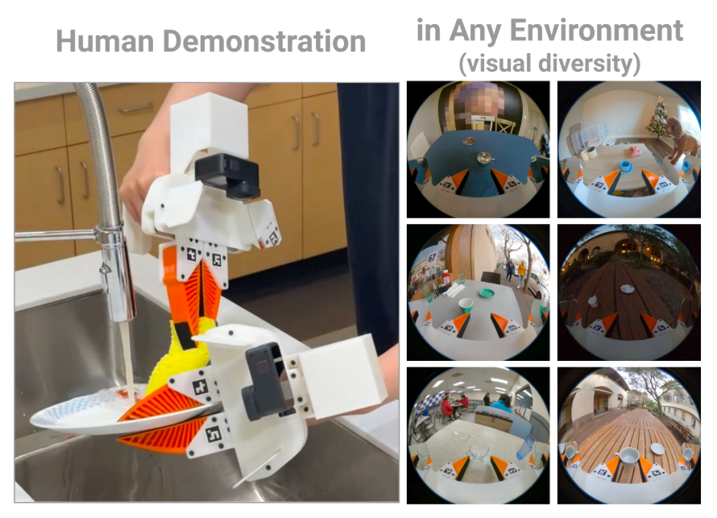

# UMI 手持夹爪

本页讲 UMI(Universal Manipulation Interface):人持手持平行夹爪 + GoPro 在真实世界完成任务,用 SLAM 恢复夹爪位姿、相对轨迹动作表示、latency matching,使策略可跨机器人平台部署;采到的不是机器人 joint action,需 retarget。要写:采集流程、与真机部署的 gap 与落地注意(见本章 Sim2Real)。UMI 系统详见第 6 章遥操作系统,本页讲真机采集与迁移。参考:UMI arXiv:2402.10329。

# UMI 手持夹爪

UMI（Universal Manipulation Interface）是一种面向机器人模仿学习的数据采集框架，其核心思想是在真实环境中利用人手持夹爪完成操作任务，通过视觉 SLAM 恢复夹爪运动轨迹，并将这些人类演示数据转换为能够在机器人平台上执行的动作序列。与传统遥操作系统直接控制机器人不同，UMI 的数据采集过程完全脱离机器人本体，操作者只需拿着一个带有相机的平行夹爪，像正常使用工具一样完成任务，随后再通过轨迹重建和动作重定向将这些演示迁移到真实机器人上执行。

这种方式最大的特点在于，数据采集和机器人执行被彻底解耦。人类采集数据时不需要机械臂、控制器或者复杂的通信系统，因此能够在家庭、办公室、餐厅甚至户外环境中快速获取大量演示数据。论文作者将这种方式称为 “in-the-wild data collection”，即在真实世界中进行数据采集，而不是局限于实验室环境。实验表明，仅依靠这种方式采集的数据，就能够训练出能够完成杯子摆放、动态抛掷、双臂折叠衣物以及洗碗等复杂任务的视觉运动策略。



## 系统组成

UMI 系统主要由手持夹爪、广角相机以及离线轨迹恢复模块组成。操作者手持一个与机器人末端形态接近的平行夹爪，在夹爪上安装 GoPro 相机，并利用相机同步记录视频和 IMU 数据。整个示教过程中，不需要任何机器人参与，人类只需要像正常使用工具一样完成任务即可。

与直接使用人手演示相比，手持夹爪能够让人手的动作直接转化为机械臂末端夹爪的动作。由于人手拥有二十多个自由度，而工业机械臂末端通常只有简单的平行夹爪，如果直接利用人手动作进行学习，需要解决复杂的人机动作映射问题。而 UMI 通过让操作者直接握持一个与机器人末端结构相似的夹爪，使采集得到的运动轨迹天然更接近机器人能够执行的动作，从而降低后续动作迁移的难度。

在夹爪运动过程中，GoPro 会连续记录第一视角视频以及 IMU 信息。随后利用视觉惯性 SLAM 技术恢复夹爪在空间中的六自由度位姿，并结合夹爪开合宽度信息，构建完整的 demonstration 数据。实验结果表明，该系统能够达到约 6 mm 的位置误差和 3.5° 的姿态误差，对于大多数机器人操作任务已经足够精确。

## 环境配置

为了实现基于第一视角视频的人类操作轨迹恢复，UMI 将多目视频采集、视觉 SLAM、轨迹重建以及策略训练整合为统一的数据处理流水线。整个系统目前主要在 Ubuntu 22.04 环境下进行开发和验证，并大量依赖 Docker、CUDA 以及 Conda 环境管理工具。

首先需要完成 Docker 环境安装，并按照 Docker 官方文档完成 Linux Post-installation 配置，使当前用户能够无需 `sudo` 即可运行容器。

随后安装 UMI 所依赖的系统级图形与 OpenGL 库：

```bash
sudo apt install -y \
    libosmesa6-dev \
    libgl1-mesa-glx \
    libglfw3 \
    patchelf
```

官方推荐采用 Miniforge 或 Miniconda，而非完整 Anaconda 发行版，以减少环境构建时间与依赖冲突。

创建运行环境：

```bash
mamba env create -f conda_environment.yaml
```

激活环境：

```bash
conda activate umi
```

环境激活后终端提示符通常变为：

```text
(umi)$
```

UMI 的核心思想是利用头戴式或手持式 RGB 视频，通过视觉 SLAM 恢复相机轨迹，再结合目标检测与手部追踪结果重建人类操作行为。因此，SLAM 的稳定性直接决定了最终示教数据的质量上限。

首先下载官方提供的示例数据：

```bash
wget \
    --recursive \
    --no-parent \
    --no-host-directories \
    --cut-dirs=2 \
    --relative \
    --reject="index.html*" \
    https://real.stanford.edu/umi/data/example_demo_session/
```

随后运行完整的 SLAM 重建流程：

```bash
python run_slam_pipeline.py example_demo_session
```

系统会自动完成以下步骤：

* 视频帧提取；
* 多相机时间同步；
* ORB 特征提取与匹配；
* 相机位姿优化；
* 回环检测；
* 轨迹恢复；
* 左右夹爪相机自动分配。

例如输出结果可能为：

```text
Found following cameras:
camera_serial
C3441328164125    5

Assigned camera_idx:
right=0
left=1
non_gripper=2,3...
```

随后系统会统计 SLAM 成功率：

```text
99% of raw data are used.
n_dropped_demos 0
```

该结果表示：

* 99% 的原始数据成功完成轨迹恢复；
* 无示教轨迹因重建失败而被丢弃。

如果成功率显著低于这一水平，通常意味着采集阶段存在以下问题：

* 相机运动速度过快；
* 视频存在严重运动模糊；
* 场景纹理不足；
* 多相机时间同步误差较大；
* 数据采集过程中未严格遵循官方采集规范。

需要注意的是，视觉 SLAM 仍然是 UMI 整个技术路线中最脆弱且最容易失败的模块。目前系统主要基于 Stanford 修改版本的 OBR-SLAM3 实现，虽然针对第一视角示教进行了大量鲁棒性优化，但在强反光环境、大面积白墙或剧烈快速运动场景下仍可能发生跟踪失败或地图漂移。

完成轨迹恢复后，需要进一步将重建结果转换为训练所需的数据格式。

UMI 使用基于 Zarr 的 Replay Buffer 数据组织方式，相比传统 HDF5 更适合大规模并行读取和多进程训练。

生成数据集：

```bash
python scripts_slam_pipeline/07_generate_replay_buffer.py \
    -o example_demo_session/dataset.zarr.zip \
    example_demo_session
```

生成的数据通常包含：

* RGB 图像；
* 相机位姿；
* 手部轨迹；
* 机器人动作标签；
* 时间戳；
* 元信息。

最终得到：

```text
dataset.zarr.zip
```

该文件可以直接作为 Diffusion Policy 的训练输入，UMI 默认采用 Diffusion Policy 作为行为生成模型。

单卡训练配置已经在 RTX3090 24GB 显存环境下完成验证：

```bash
python train.py \
    --config-name=train_diffusion_unet_timm_umi_workspace \
    task.dataset_path=example_demo_session/dataset.zarr.zip
```

对于更大的数据集，可以采用 Accelerate 进行多 GPU 分布式训练：

```bash
accelerate \
    --num_processes <ngpus> \
    train.py \
    --config-name=train_diffusion_unet_timm_umi_workspace \
    task.dataset_path=example_demo_session/dataset.zarr.zip
```

其中：

* `<ngpus>` 为参与训练的 GPU 数量；
* 每张 GPU 均会独立维护 Diffusion 模型副本；
* 参数同步由 HuggingFace Accelerate 自动完成。

除了实验室示例数据之外，UMI 还公开发布了真实环境下采集的大规模杯子整理数据集。

下载命令：

```bash
wget https://real.stanford.edu/umi/data/zarr_datasets/cup_in_the_wild.zarr.zip
```

随后即可直接启动训练：

```bash
accelerate \
    --num_processes <ngpus> \
    train.py \
    --config-name=train_diffusion_unet_timm_umi_workspace \
    task.dataset_path=cup_in_the_wild.zarr.zip
```

这一数据集包含：

* 多种光照条件；
* 不同背景环境；
* 大量未见过的杯具外观；
* 丰富的人类操作策略。

因此被广泛用于评估策略模型的泛化能力。

## 数据采集流程

UMI 的数据采集过程与传统遥操作有着明显区别。

首先，操作者手持夹爪进入任务环境，通过自身运动完成整个操作过程。例如在杯子摆放任务中，操作者像正常拿取杯子一样完成抓取、移动和放置；在动态抛掷任务中，则通过快速挥动夹爪将物体抛向指定区域；在双臂任务中，两只手分别握持两个夹爪，同时完成衣物折叠等复杂动作。

整个过程中，系统记录的内容包括：

* 第一视角 RGB 图像；
* IMU 数据；
* 夹爪开合宽度；
* 时间戳信息。

这些信息最终被统一保存下来，形成一条原始演示数据。

随后，通过视觉惯性 SLAM 对视频进行离线处理，恢复夹爪在每一个时刻的空间位姿，从而得到完整的末端执行器轨迹。对于双手系统，两只夹爪会共享同一个场景地图，因此还能够进一步计算两个夹爪之间的相对位姿，这对于双臂协调操作非常重要。根据论文实验表明，如果缺少双夹爪之间的相对位姿信息，双臂折叠衣物任务的成功率会从 70% 降低到 30%。

整个流程可以表示为：

```text
人手持夹爪完成任务
          ↓
记录视频、IMU 和夹爪状态
          ↓
视觉惯性 SLAM 恢复位姿
          ↓
获得六自由度轨迹
          ↓
构建 observation-action 数据
          ↓
训练视觉运动策略
          ↓
部署到真实机器人
```

## 相对轨迹动作表示

传统机器人通常使用绝对位姿或者增量位姿作为动作空间，但 UMI 采用了一种更加特殊的表示方式——相对轨迹（Relative Trajectory）。

对于每一次策略推理，系统都以当前末端位置作为参考坐标系，将未来一段时间内的目标位姿表示成相对于当前位姿的 SE(3) 变换序列。这样得到的动作既不是绝对坐标，也不是逐步累积的增量，而是一个相对于当前状态定义的局部轨迹。

这种表示方式具有几个重要优势。

首先，它不依赖于机器人基座坐标系，因此不同机器人平台之间能够共享同一种动作表示。无论是 UR5、Franka 还是移动机械臂，只要末端能够到达目标位置，都可以直接使用同一套策略。

其次，相对轨迹对于轨迹跟踪误差更加鲁棒。如果采用关节动作的增量，误差会随着时间不断累积；而绝对位姿又需要精确标定世界坐标系。相比之下，相对轨迹不需要全局坐标，因此能够避免标定误差带来的性能下降。论文中的实验表明，采用绝对动作表示时，成功率仅为 25%，而相对轨迹能够达到 100% 的成功率。

此外，这种表示方式还使系统具有无需标定的特性。当机器人底座位置发生变化时，只要目标物体仍位于工作空间范围内，策略依然能够正常工作，因此特别适用于移动机器人平台。

## 延迟补偿机制

在训练过程中，数据中的观测和动作是严格同步的。然而真实机器人系统中，各种传感器和执行器都存在不同程度的延迟。

例如，相机、机械臂控制器以及夹爪控制器的更新时间并不一致，机械臂和夹爪本身也存在执行延迟。如果不进行处理，训练时的数据分布与部署时的真实情况之间就会出现时间错位，从而导致性能显著下降。

为了解决这一问题，UMI 在部署阶段引入了 latency matching 机制。

对于观测数据，系统首先测量每一路信号的延迟，然后以延迟最大的传感器作为基准，通过时间插值的方法对机器人状态和夹爪状态进行同步，从而得到与训练阶段一致的 observation。

对于动作输出，则采用提前发送控制命令的方法补偿执行延迟。策略预测得到未来一段时间的动作序列后，会丢弃已经过时的部分，只执行真正对应未来时刻的动作，从而保证机器人能够在正确时间到达目标位置。

论文中的动态抛掷实验表明，如果关闭 latency matching，成功率会从 87.5% 下降到 57.5%，同时机器人运动会出现明显抖动。

## 与真实机器人之间的 Gap

虽然 UMI 能够在没有机器人参与的情况下完成数据采集，但从人手持夹爪到真实机器人执行之间仍然存在一定差异。

最直接的问题是，采集得到的是夹爪在空间中的运动轨迹，而不是机器人关节空间中的控制命令。因此在部署之前，需要根据目标机器人的运动学模型，将恢复出的末端轨迹转换为机器人能够执行的动作。这一过程通常称为动作重定向。

不同机器人具有不同的连杆长度、关节限制以及工作空间范围，因此同一条轨迹在不同机器人上可能对应完全不同的关节运动。论文中通过运动学约束过滤（Kinematic-based Filtering）的方法，提前筛除超出机器人运动能力的轨迹，以保证最终学习得到的策略满足目标机器人的约束。

此外，数据采集阶段是在完全自由的人体运动环境中完成的，而机器人执行时受到速度、加速度以及关节极限的限制，因此一些人类能够轻松完成的动作可能无法直接迁移。例如快速挥动、过大的姿态变化或者超出工作空间的动作，都需要在后处理阶段进行修正，也就是对脏数据进行清洗，而这个必要的过程限制是 UMI 相比于用机械臂直接采集的最大劣势。

因此，虽然 UMI 实现了“无需机器人即可采集数据”，但真正部署到机器人时，仍然需要考虑运动学约束、控制延迟以及动作重定向等 Sim2Real 问题。

## 小结

UMI 提供了一种与传统遥操作完全不同的数据采集思路。它将数据采集过程从机器人系统中解耦出来，使操作者能够像使用普通工具一样在真实世界中完成任务，再通过 SLAM 恢复位姿、相对轨迹表示和延迟补偿机制，将这些演示迁移到不同机器人平台上。

这种方法不仅降低了数据采集成本，还显著提高了数据规模扩展能力，使机器人能够利用来自家庭、办公室甚至户外环境的大量真实演示数据进行学习。正因为如此，UMI 被认为是近年来机器人模仿学习领域中最具有代表性的 in-the-wild 数据采集框架之一，也为构建大规模机器人数据集提供了一种新的思路。相比于机器人本体进行采集，UMI 在操作方面更加简单便携，搭建采集环境更加简单，在解决清洗数据这一问题之后，UMI 会成为夹爪式机器人的最优大规模数据采集方案。

参考文献：Chi C, Xu Z, Pan C, et al. Universal manipulation interface: In-the-wild robot teaching without in-the-wild robots[J]. arXiv preprint arXiv:2402.10329, 2024.
