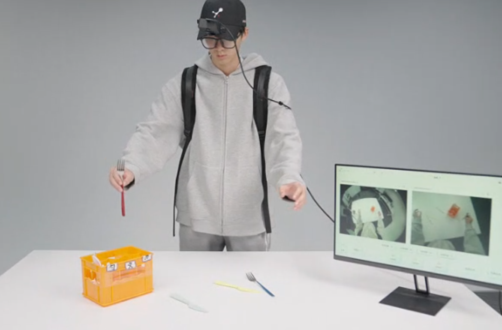

# 人体视频与第一视角数据

本页讲用第一视角(egocentric)视频或互联网人类视频作示教来源:采集门槛低、规模与多样性强,但与机器人 action schema 差异大、retarget 难。本页只讲它作为真机数据来源的取舍与落地;数据集、迁移方法与数据视角见第 6 章。参考:EMMA(egocentric human data 训移动操作)arXiv:2509.04443。

# 基于第一视角视频的人类示教数据

## 第一视角视频作为机器人数据来源

传统模仿学习通常依赖机器人遥操作（teleoperation）采集数据，即由操作者直接控制机器人完成任务，并记录视觉观测与动作序列。这种方式能够获得与机器人本体完全一致的状态—动作对应关系，因此学习过程较为直接。然而，遥操作系统本身往往需要专门硬件、较长的调试周期以及较高的人力成本，使得大规模数据采集变得十分困难。尤其是在移动操作、双臂协调等复杂任务中，获取数十小时甚至数百小时的高质量机器人示教数据往往代价昂贵，从而成为机器人学习规模化发展的主要瓶颈。而上一小节讲的 UMI 方案虽然解决了一定的数据采集困难的问题，但是只能适配二指夹爪。而很多具身智能落地的任务里面，灵巧手的适配是更加重要的，这一小节的ego方案为解决这一难题提供了思路。

以人类视频作为示教来源能够显著降低数据获取门槛。这里的人类视频既包括佩戴头显、智能眼镜等设备采集的第一视角（Egocentric）视频，也包括互联网中大量存在的第三人称视频和人类操作视频。这类数据无需依赖机器人本体即可采集，获取成本极低，并且天然具有丰富的环境、多样的操作对象以及更广泛的任务覆盖范围。因此，近年来越来越多的工作开始尝试利用人类视频作为机器人学习的数据来源，希望借助海量人类行为数据来突破机器人数据规模受限的问题。

从数据规模的角度来看，人类视频相比机器人数据具有天然优势。机器人遥操作数据的获取通常受到设备数量和采集效率的限制，而人类视频几乎不存在这一问题。研究人员可以通过佩戴智能眼镜记录日常活动，也可以直接利用互联网中已有的视频资源，从而快速积累大量演示数据。这种数据来源不仅覆盖了抓取、放置、开门等基础操作，还能够包含导航、双手协同、人机交互等复杂行为。由于数据来源更加开放，模型能够接触到更丰富的场景变化、物体分布以及任务流程，从而获得更好的泛化能力。

除了规模优势之外，人类视频还具有更强的多样性。机器人实验通常在固定实验室环境中进行，背景、光照以及物体摆放方式相对单一，而人类行为则天然发生在开放环境中，不同个体之间也存在明显差异。这种多样性能够帮助模型学习更加鲁棒的视觉表示和任务语义，使得策略在面对新的环境布局和新的物体组合时仍然能够保持较好的性能。相关研究发现，在已有机器人数据基础上加入人类演示数据，往往能够提升模型在未知场景中的迁移能力，并且随着人类数据规模的增加，性能能够持续提升，表现出较好的扩展规律。

由于多家公司如松灵机器人，鹿明机器人，方舟无限等已经有成熟的ego相机套件，因此这里不进行环境配置的讲解。

## Human-Robot Embodiment Gap

然而，人类视频作为机器人学习的数据来源并不是直接可用的，其最大的挑战在于人和机器人之间存在显著的 embodiment gap，即本体差异问题。人类和机器人在结构、运动方式以及感知系统上都存在本质区别，因此人类动作无法直接映射为机器人动作。首先，人类具有较高自由度的身体结构，双手和身体能够自然协调运动，而机器人往往采用固定结构，其运动范围和自由度受到机械设计的限制。其次，人类的导航方式与移动机器人也存在明显差异，例如人类能够自由转身、侧移并通过头部运动改变视角，而差速轮机器人只能沿特定运动约束进行移动。因此，即使两者完成相同任务，其动作轨迹也可能存在较大差异。

这种差异进一步导致 action schema 的不一致。对于机器人而言，动作通常表示为关节角度、末端位姿或者底盘速度等低层控制量；而在人类视频中，能够直接获得的信息通常只有视觉观测、手部轨迹或者人体关键点。两者在动作空间上的表达方式并不一致，使得传统模仿学习中基于状态—动作配对的监督关系难以直接建立。换言之，人类演示所包含的是“任务意图”，而机器人实际执行所需要的是“可执行动作”，二者之间仍然存在一层复杂的转换过程。

最新有研究提出可以将人类视频进行处理，将人体部分替换成机器人的身体以解决本体差异问题，并且在仿真环境中进行轨迹的回放和修正。这一方案为ego数据的处理提供了新的思路。

## 动作重定向问题

动作重定向（retargeting）成为利用人类视频进行机器人学习时必须面对的问题。重定向是将人类动作转换为满足机器人运动约束的动作表示。例如，对于操作任务，可以利用手部关键点、末端轨迹或者目标物体运动来推断机器人末端执行器的运动；对于移动操作任务，则需要将人类行走轨迹转换为符合机器人运动学约束的导航命令。由于人类和机器人在运动能力上的差异，这一转换过程往往无法做到完全一致，只能尽可能保持任务语义的一致性。因此，重定向过程既是跨本体学习中的关键环节，也是影响最终性能的重要因素。

除了动作空间的差异之外，视觉视角差异同样会影响知识迁移效果。第三人称互联网视频与机器人第一视角观测之间往往存在明显的视角偏移，而第一视角视频由于观察方式与机器人头部摄像机更加接近，因此能够有效减小视觉域差异。近年来，一些工作开始采用智能眼镜等可穿戴设备采集人类第一视角数据，通过让人类和机器人共享相似的观察视角，减少视觉输入分布之间的偏差。这种方式在一定程度上缓解了视觉域迁移问题，使得模型能够更容易学习到可迁移的操作策略。

## 第一视角人类数据的实际落地方式

尽管存在上述困难，人类视频依然被认为是实现机器人规模化学习的重要方向。人类数据能够提供大量关于环境结构、物体关系以及任务流程的信息，这些高层语义知识并不依赖于具体机器人结构。例如，人类在整理餐桌、递送物品或者购物时所遵循的任务顺序、目标选择以及交互逻辑，与机器人需要完成的任务本质上是一致的。因此，人类视频能够帮助模型学习更加通用的任务表示，而少量机器人数据则负责建立具体执行动作与机器人本体之间的对应关系。二者结合，可以在降低机器人数据采集成本的同时，获得更好的性能和泛化能力。

总体而言，第一视角视频和互联网人类视频为机器人学习提供了一种低成本、高规模、强多样性的数据来源。然而，由于人类与机器人之间存在显著的本体差异和动作表达差异，人类视频无法直接作为机器人动作监督信号使用，必须通过动作重定向、表示对齐以及跨本体学习等方法建立两者之间的联系。因此，在实际系统中，人类视频更多承担的是提供大规模任务经验和行为先验的角色，而机器人自身的数据则负责完成最终的动作落地。如何在充分利用海量人类数据优势的同时有效解决重定向问题，已经成为当前机器人模仿学习领域的重要研究方向。