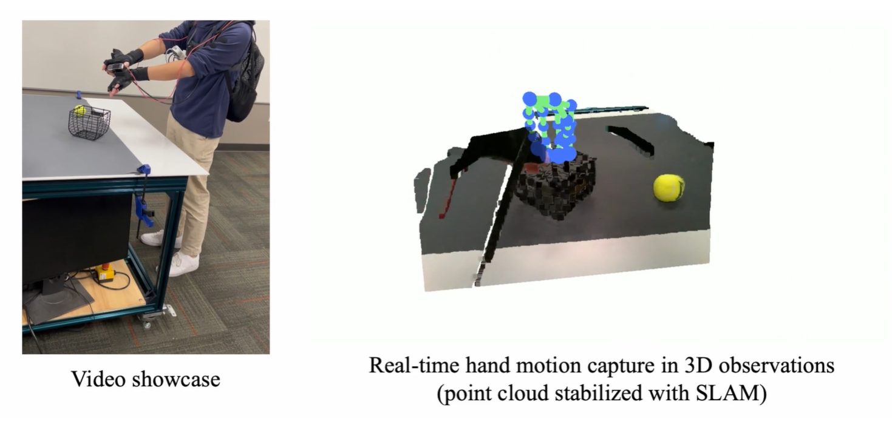

# 手部 Mocap

本页讲便携手部动作捕捉:用 SLAM + 电磁追踪 + 3D 观测捕捉手腕与手指运动,再 retarget 到机器人灵巧手。对灵巧手/人形价值大,但人手与机器人手结构差异大、retarget 难、缺真实动力学与力反馈。与第 6 章人形全身数据采集衔接。参考:DexCap arXiv:2403.07788。

# 便携式手部动作捕捉系统

上两个小节的 UMI 方案和 ego 方案分别解决了数采的便捷性问题和视频数据的来源问题，相比于通过机器人本体遥操作采集数据的方法，直接记录人手在自然环境中的操作过程能够显著降低数据采集成本，并保留人类在日常任务中丰富而细致的操作策略。然而，ego 方案所使用的视觉手势估计方法容易受到遮挡影响，而实验室级光学动作捕捉系统又往往依赖固定摄像机和严格校准环境，难以满足大规模、野外场景的数据采集需求。因此这一小节以 DexCap 为例，讲解一下便携式手部动作捕捉系统。

DexCap 提出了一种面向灵巧操作的数据采集方案，通过结合 SLAM 定位、电磁动作捕捉以及三维环境观测，实现对手腕六自由度运动和手指精细动作的同步记录，并进一步通过运动重定向（retargeting）将人手轨迹映射到机器人灵巧手，从而为灵巧操作策略学习提供高质量示教数据。该方法特别适用于多指灵巧手和未来人形机器人系统的数据采集，并为全身动作数据获取提供基础。



## 系统组成与总体设计

DexCap 的目标是在保证便携性的同时，实现高精度、长时间、抗遮挡的手部动作采集。整个系统主要由三部分组成：手指运动捕捉模块、手腕位姿跟踪模块以及三维环境观测模块。系统采用穿戴式设计，所有计算设备、电源和传感器均集成于人体背包和胸前支架中。操作者无需依赖外部摄像机或实验室环境即可完成数据采集，因此能够在厨房、办公室、桌面等真实场景中记录操作过程。

整个系统的数据流包括：

1. 电磁数据手套记录手指关节运动；
2. 手背安装的 SLAM 相机估计手腕六自由度位姿；
3. 胸前 RGB-D LiDAR 相机采集环境三维信息；
4. 所有传感器统一到同一坐标系下进行时间同步和空间标定；
5. 将得到的人体运动轨迹重定向到机器人灵巧手；
6. 利用得到的数据训练具身智能策略。

这种设计使得系统既能够记录人与物体之间的精细接触关系，又能够提供与机器人控制直接相关的三维位姿信息。

## 环境配置与使用

DexCap 是一种基于第一视角 RGB-D 视频与动作捕捉手套的人类示教数据采集方案，其核心目标是在不依赖机器人遥操作设备的前提下，直接恢复人类双手的操作轨迹，并进一步映射到机器人灵巧手与机械臂的动作空间中。整个系统由数据采集端（NUC Mini-PC）、离线处理工作站以及策略训练服务器组成。

DexCap 的环境部署分为两个部分：

* 数据采集端 Mini-PC（通常为 Intel NUC，运行 Windows）
* 数据处理与训练工作站（Ubuntu Linux）

首先完成 Rokoko 动作捕捉手套驱动软件以及 Anaconda 的安装。

随后创建数据采集环境：

```bash
cd DexCap/install
conda env create -n mocap -f env_nuc_windows.yml
```

环境创建完成后即可用于动作捕捉数据接收与缓存。

Ubuntu 工作站负责：

* 数据预处理；
* SLAM 与轨迹修正；
* 人手到机器人手的运动重定向；
* 数据集生成；
* 策略训练。

创建运行环境：

```bash
conda create -n dexcap python=3.8
conda activate dexcap
```

安装依赖：

```bash
cd DexCap/install
pip install -r env_ws_requirements.txt
```

安装训练模块：

```bash
cd STEP3_train_policy
pip install -e .
```

至此完成整个 DexCap 软件环境部署。

下一步进行 Rokoko 动捕手套的配置。
启动 Rokoko Studio 软件，并确认动作捕捉手套已经成功连接。

进入 **Livestreaming** 功能页面，选择 **Custom Connection**，并配置如下参数：

| 参数                 | 设置值           |
| ------------------ | ------------- |
| Include Connection | True          |
| Forward IP         | 192.168.0.200 |
| Port               | 14551         |
| Data Format        | JSON          |

其中：

* `192.168.0.200` 为 NUC 的固定 IP 地址；
* NUC 与动作捕捉设备通常通过便携式 Wi-Fi 路由器组成局域网；
* 若修改 IP 地址，需要同步修改 Rokoko 与 DexCap 的配置文件。

启动数据流后，即可开始接收手套数据。

打开终端：

```bash
conda activate mocap
cd DexCap/STEP1_collect_data
python redis_glove_server.py
```

该程序负责：

* 接收 Rokoko 的实时骨骼数据；
* 将数据写入 Redis 缓存；
* 为后续采集进程提供统一的数据接口。

下一步启动数据采集。

打开新的终端：

```bash
python data_recording.py \
    -s \
    --store_hand \
    -o ./save_data_scenario_1
```

采集过程中：

* 所有数据首先缓存至内存；
* 当前 Episode 结束后，通过 `Ctrl+C` 停止录制；
* 系统自动启动多线程数据写盘流程；
* 数据被保存至本地 SSD。

采集得到的数据按照帧进行组织：

```text
save_data_scenario_1
├── frame_0
│   ├── color_image.jpg
│   ├── depth_image.png
│   ├── pose.txt
│   ├── pose_2.txt
│   ├── pose_3.txt
│   ├── left_hand_joint.txt
│   └── right_hand_joint.txt
├── frame_1
└── ...
```

其中：

| 文件                   | 含义            |
| -------------------- | ------------- |
| color_image.jpg      | 胸前 RGB 相机图像   |
| depth_image.png      | 深度图           |
| pose.txt             | 胸前相机在世界坐标系下位姿 |
| pose_2.txt           | 左手腕位姿         |
| pose_3.txt           | 右手腕位姿         |
| left_hand_joint.txt  | 左手 3D 关节位置    |
| right_hand_joint.txt | 右手 3D 关节位置    |

手部关节坐标均定义在对应手掌坐标系下。

首先对采集结果进行检查：

```bash
cd DexCap/STEP1_collect_data

python replay_human_traj_vis.py \
    --directory save_data_scenario_1
```

程序将启动基于 Open3D 的点云可视化界面，用于查看：

* 相机轨迹；
* 双手运动轨迹；
* 点云重建效果；
* 时间同步情况。

若存在明显的 SLAM 初始漂移，可进行人工校正。

启动校正模式：

```bash
python replay_human_traj_vis.py \
    --directory save_data_scenario_1 \
    --calib
```

随后利用数字键盘调整轨迹偏移：

```bash
python calculate_offset_vis_calib.py \
    --directory save_data_scenario_1
```

修正结果会被应用到整个视频序列。

下一步需要将人类动作转换至机器人工作空间。

运行：

```bash
python transform_to_robot_table.py \
    --directory save_data_scenario_1
```

随后使用数字键盘调整：

* 平移偏置；
* 旋转偏置；
* 桌面法向方向；

使世界坐标系与机器人桌面坐标系对齐。

通常该过程耗时不超过 10 秒，并且每个 Episode 仅需执行一次。

完成坐标对齐后，需要将长视频拆分为多个独立任务。

执行：

```bash
python demo_clipping_3d.py \
    --directory save_data_scenario_1
```

最终生成：

* 单个抓取任务；
* 单个操作任务；
* 单个演示 Episode。

这些片段将作为后续训练的最小数据单元。

完成数据清洗后，将原始数据传输至工作站并生成训练数据集：

```bash
python demo_create_hdf5.py
```

该步骤主要完成：

* 人手轨迹到机器人动作空间映射；
* 点云预处理；
* 背景点云移除；
* 数据格式转换。

其中，人手到机器人灵巧手的映射采用基于 PyBullet 的逆运动学求解：

* 将人类指尖位置作为目标；
* 求解 LEAP Hand 的关节配置；
* 生成机器人动作标签。

当人手出现在视野中时，系统还会利用机器人正运动学模型生成机器人手部点云，并融合进观测空间。

同时系统会自动去除：

* 背景点云；
* 桌面点云；
* 无关环境点。

最终生成符合 Robomimic 标准的数据集：

```text
dataset.hdf5
```

数据集生成后即可启动训练。

进入训练目录：

```bash
cd DexCap/STEP3_train_policy/robomimic
```

执行训练：

```bash
python scripts/train.py \
    --config training_config/[NAME_OF_CONFIG].json
```

DexCap 默认训练配置采用基于点云观测的 Diffusion Policy。

模型输入包括：

* 胸前 RGB-D 相机点云；
* 世界坐标系下的环境信息；
* 手部历史状态。

模型输出为未来动作序列：

* 双机械臂动作；
* 双灵巧手动作；
* 共计 46 维控制量。

策略采用动作 Chunk 预测方式，每次预测未来约 20 个控制步，从而有效提高动作连续性与控制稳定性。

更多算法实现细节可参考 DexCap 对应论文与开源代码仓库。

DexCap 同时公开提供：

* 原始采集数据；
* 处理后的训练数据集。

原始数据可通过：

```bash
python replay_human_traj_vis.py
```

进行可视化检查。

处理后的数据则可直接用于：

* Behavioral Cloning；
* Diffusion Policy；
* Offline Reinforcement Learning；
* Vision-Language-Action 模型训练。

## 基于电磁传感器的手指动作捕捉

灵巧操作过程中，大量关键动作发生在手指与物体的接触区域，例如捏取、旋转、夹持和工具使用等。为了获得稳定可靠的手指运动信息，DexCap 并未采用纯视觉方法，而是使用电磁动作捕捉手套进行数据采集。即为在每个指尖位置布置微型磁传感器，手背处安装接收单元。从而系统能够实时测量各个传感器相对于手背参考坐标系的位置，从而恢复手指运动状态。

与单目或 RGB-D 手势估计相比，电磁方案最大的优势在于对遮挡具有天然鲁棒性。当手指被物体、手掌或另一只手遮挡时，视觉算法往往无法准确恢复三维位置，而电磁传感器不依赖可见光信息，因此能够持续输出稳定的指尖轨迹。这一特点对于剪刀、瓶盖、工具以及双手协同操作等任务尤为重要，因为这些场景中频繁出现严重遮挡。同时，由于传感器直接输出三维空间信息，避免了视觉方法从二维图像恢复深度所带来的误差，因此更加适合用于机器人控制策略学习。

## 基于 SLAM 的手腕六自由度跟踪

仅有手指关节信息还不足以描述完整的操作动作。对于机器人而言，末端执行器的位置和姿态同样决定着任务能否成功，因此需要进一步获得手腕在世界坐标系中的六自由度运动。

DexCap 在每只手背上安装 Intel RealSense T265 跟踪相机，通过双鱼眼摄像头和惯性测量单元（IMU）构建局部地图，并利用视觉惯性 SLAM 实时估计手腕位姿。

相较于传统方案，该方法具有几个明显优势。首先，手腕位置不需要始终出现在第三视角摄像机视野内，因此具有更好的便携性。其次，SLAM 在构建环境地图之后能够周期性校正累计误差，相比纯 IMU 方法能够有效抑制长时间漂移。此外，IMU 提供的姿态信息能够帮助系统获得稳定的旋转角度估计，为后续机器人末端姿态控制提供依据。

因此，DexCap 实际上形成了“电磁传感器负责局部精细运动、SLAM 负责全局空间定位”的组合方案，使得整个系统同时具备精度和稳定性。

## 三维环境观测与统一坐标系构建

除了记录人体动作之外，机器人学习还需要获得环境状态信息。

为此，DexCap 在胸前安装 RGB-D LiDAR 相机，对操作对象及周围场景进行观测。深度图经过转换后形成彩色点云，从而得到完整的三维环境表示。

为了将手部运动与环境观测统一起来，系统设计了专门的相机支架结构。在采集开始前，各个跟踪相机先被固定在预定义位置完成标定；随后将手腕相机安装到手套上，由于安装机构具有固定几何关系，因此能够快速恢复不同坐标系之间的外参关系。整个标定过程仅需数秒即可完成。系统定义胸前主 SLAM 相机初始时刻的位置作为世界坐标系，之后所有手部轨迹和点云数据都被转换到该坐标系下，从而形成统一的数据表示。这种设计使得采集到的数据天然具备空间一致性，也为后续机器人策略训练提供了基础。

## 数据重定向到机器人灵巧手

虽然能够获得高精度的人手运动轨迹，但机器人手与人手在尺寸比例、自由度数量以及运动范围方面存在明显差异，因此不能直接将人体关节角映射到机器人。针对这一问题，DexCap 采用基于指尖位置约束的重定向方法。

首先利用 SLAM 获得的人手腕位姿作为初始参考，然后通过逆运动学求解，使机器人指尖尽可能到达与人手指尖相同的位置。在论文实验中使用的 LEAP Hand 为四指结构，因此在计算过程中忽略小拇指信息，仅保留四个主要手指参与逆运动学求解。使用五指灵巧手只需把所有信息都参与求解即可。相比直接复制关节角度，这种基于指尖位置匹配的方法能够更好地保留人与物体之间的接触关系，原因是在实际操作中，大多数接触都发生在指尖区域，因此只要保证指尖轨迹一致，就能够较好地复现人类操作行为。

经过重定向之后，可以得到机器人末端六自由度位姿和灵巧手关节状态，进一步构成机器人的动作空间。

## 灵巧操作中的结构差异问题

尽管指尖逆运动学能够实现大部分动作迁移，但人手与机器人手之间仍然存在不可避免的 embodiment gap。

这种差异主要体现在以下几个方面：

1.机器人手尺寸通常大于人手，不同手指长度比例也存在差异。

2.机器人关节结构与人手并不完全对应，一些机器人缺少拇指旋转自由度或小拇指。

3.人手能够通过柔顺性和皮肤形变产生丰富接触，而刚性机器人手难以完全复现这种能力。

因此，即使机器人指尖位置与人类一致，也不意味着能够产生相同的接触力和操作效果。例如在剪刀使用任务中，人手能够深入指环内部施加力矩，而较粗的机器人手指可能无法形成相同的接触状态；在旋开瓶盖、使用镊子等任务中，接触力分布的差异也会显著影响任务成功率。因此，重定向过程本质上只是几何映射，而非动力学映射。这一问题也是所有用人类动作迁移的数采方法存在的通病，即难以在转换采集到的数据的时候提供动力学约束。

## 系统优势与应用价值

相较于传统遥操作方式，DexCap 的最大特点在于数据采集过程不依赖机器人本体，并且相比于上文的两种方案可以更好的适配迁移灵巧手的动作。操作者可以像日常生活一样直接完成任务，因此采集效率接近自然动作速度，远高于通过 VR 或机械主手控制机器人完成任务的方式。同时，系统具备较好的便携性，能够在实验室之外进行长时间数据采集，为构建大规模灵巧操作数据集提供可能。

对于多指灵巧手机器人而言，这种方法能够提供高质量的三维动作轨迹和环境观测数据，有助于学习精细抓取、工具使用以及双手协同操作等复杂技能。对于人形机器人全身动作而言，手部动作捕捉系统还可以进一步扩展到手臂、头部和全身运动，实现从局部操作到全身协调控制的数据获取。因此，解决了手部运动数据采集的 DexCap 可以视为人形机器人全身动作采集体系中的重要组成部分。

## 局限性与未来发展方向

尽管便携式手部动作捕捉系统展示出了较强的数据采集能力，但仍存在一些限制。首先，当前系统主要采集运动信息和视觉信息，缺乏接触力和触觉信息，因此无法完整描述人与物体之间的动力学交互。其次，人手与机器人手之间存在天然结构差异，仅依靠几何重定向无法完全解决 embodiment gap 问题。此外，系统续航时间仍然受到计算平台和电池容量限制，连续工作时间约为数十分钟。

这一采集系统未来的发展方向包括引入柔性触觉传感器、融合力反馈信息、优化机器人手结构以及扩展到全身动作采集。随着手、臂、躯干和腿部运动能够统一记录，便携式动作捕捉系统将逐步从灵巧手数据采集发展为面向人形机器人的全身行为采集平台。

参考文献：Wang C, Shi H, Wang W, et al. Dexcap: Scalable and portable mocap data collection system for dexterous manipulation[J]. arXiv preprint arXiv:2403.07788, 2024.
