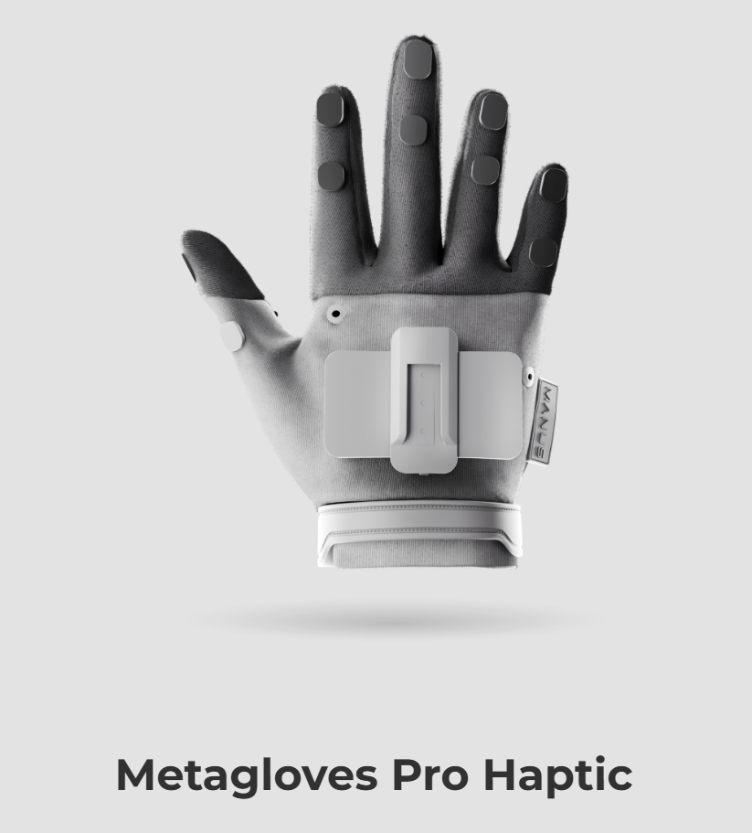

# 外骨骼与数据手套

本页讲外骨骼 / haptic gloves / 上身追踪采集:操作者穿戴被动外骨骼或数据手套记录手指级动作,部分系统保留直接接触反馈,再映射到机器人手/上身。表达力最强、对灵巧手与人形最有价值,但极贵、穿戴与标定复杂、易疲劳。与第 6 章人形全身数据采集衔接。参考:DEXOP(被动手部外骨骼,perioperation)arXiv:2509.04441。

# 外骨骼与触觉数据手套

上一节介绍的 DexCap 系统主要通过 SLAM、磁追踪和视觉观测等非接触式传感器对人手运动进行记录，其核心目标是在保证便携性和采集规模的前提下，以较低成本获取灵巧操作示教数据。该类方法强调对人手运动轨迹和环境状态的感知，通过后续运动重定向实现向机器人灵巧手的映射。然而，由于系统本身并不直接参与人体运动，也缺乏对操作者的主动反馈，并且该系统主要是使用手指末端进行逆运动学解算而非直接采集指关节的运动，因此能够获得的信息主要集中在几何运动层面，对于关节本体感觉的表达能力仍然有限。

相比之下，外骨骼和触觉数据手套系统属于一种更加紧耦合的人机交互方式。系统不仅能够记录手指、手腕和上肢运动，还通过机械结构直接与人体连接，在部分系统中进一步引入力反馈和触觉反馈，从而形成双向信息闭环。例如外骨骼可以在人手采集数据之后直接取下装在机械臂末端作为灵巧手。操作者在完成任务时能够采集物体的接触状态、阻力变化以及关节运动信息，使得示教过程更加接近自然的人类操作行为。因此，这类系统不仅采集动作轨迹，还能够在一定程度上保留操作过程中隐含的力学信息和本体感觉信息。

## 触觉数据手套与外骨骼系统的总体架构

现代触觉数据手套已经不再是简单的角度传感器集合，而是集成了动作捕捉、触觉反馈、力反馈和上肢运动追踪的复杂人机交互系统。整个系统通常由手部动作捕捉模块、触觉反馈模块、外骨骼力反馈机构以及上身追踪模块构成。操作者佩戴数据手套后，手指运动通过高精度传感器实时记录，而上肢外骨骼则负责测量肩部、肘部和腕部关节运动。对于双臂系统，还会进一步加入躯干姿态估计，从而形成完整的上身运动模型。在数据流层面，系统首先获取人手和上肢的运动状态，然后通过运动重定向算法将人体运动映射到机器人对应关节空间。当机器人与环境发生接触时，机器人末端的触觉传感器和力传感器会将接触信息反馈至控制端，进一步通过触觉手套和外骨骼机构作用于操作者，从而形成完整的双向闭环。

这种信息回路，使操作者能够像直接使用自己的双手一样完成复杂操作，从而显著提升灵巧任务的完成效率。

## 基于数据手套的手指级动作捕捉

手指运动是灵巧操作中最核心的信息来源。

高级数据手套通常采用柔性角度传感器、磁追踪系统或光学传感器组合，对每根手指的多个关节进行连续测量。相比视觉估计方法，这种直接测量方式不受遮挡影响，并且具有较高的位置分辨率和较低的延迟。一些工业级系统能够捕获单手超过三十个自由度的运动信息，并达到亚毫米级的位置精度和亚度级姿态精度。通过这些传感器，可以完整恢复拇指对掌、指尖捏取以及多指协同等复杂动作。采集得到的关节状态经过运动学求解后，可以实时映射到机器人灵巧手的关节空间。对于采用仿人结构设计的机器人手，例如 EyeSight Hand、LEAP Hand 或 Allegro Hand，这种映射能够较好地保持人手操作习惯，从而降低控制难度。

由于操作者无需学习额外的控制指令，而是直接利用自身的运动能力完成操作，因此这种方式能够保留大量人类在长期生活实践中形成的隐式操作经验。

与传统数据手套最大的区别在于，触觉数据手套不仅能够记录动作，还能够向人体返回感知信息。

以 HaptX 等系统为代表，其核心技术建立在微流控智能织物基础之上。手套内部布置大量微型气动驱动单元，当机器人末端检测到接触时，压缩空气被动态输送到对应位置，使局部表面产生微小形变，从而模拟真实的接触压力。这种反馈方式能够重建物体的边缘轮廓、表面纹理以及局部刚度，相较于传统振动马达能够提供更加丰富的触觉信息。除了皮肤层面的触觉反馈之外，系统还通过被动外骨骼或外伸腱机构提供机械阻力。当机器人抓取到坚硬物体时，外骨骼会限制操作者手指继续闭合；当抓取柔性物体时，则只施加较小阻力。

因此，操作者不仅能够感知接触是否发生，还能够估计物体的尺寸、硬度和受力状态。这种本体感觉和力反馈的结合，使得复杂操作过程更加接近自然状态。

## 上身外骨骼与全身运动采集

对于人形机器人而言，仅记录手部动作往往是不够的。大量复杂任务需要双臂、肩部甚至躯干协同完成。例如双手装配、工具操作以及大尺寸物体搬运，都涉及上身整体运动。

因此，近年来越来越多的系统开始采用上肢外骨骼结构记录人体运动。DEXOP 系统便将触觉灵巧手与 AirExo-2 外骨骼结合，通过编码器直接测量各关节状态，并按照 Unitree H1 人形机器人的运动学结构进行定制，从而实现人类上肢运动与机器人关节空间的一一对应。由于外骨骼和机器人具有相同的运动拓扑结构，因此在数据采集阶段无需复杂逆运动学求解，也不需要额外的数据后处理，能够有效减小 embodiment gap。

整个系统同时记录手部关节状态、腕部视觉信息以及触觉图像，并以约二十赫兹频率进行同步采集。这种同构结构不仅提高了控制精度，也使采集的数据能够直接用于后续策略训练。

DEXOP 的实验表明，在钻孔、灯泡安装、盒子折叠和瓶盖旋开等任务中，具有本体感觉反馈的系统能够显著提高操作效率。尤其是在需要判断接触状态和施加适当扭矩的任务中，操作者能够更快完成操作，并减少错误动作。例如在灯泡安装任务中，传统遥操作由于缺少触觉信息，操作者往往难以判断灯泡是否已经拧紧，因此会持续进行旋转动作，导致数据中出现明显偏差。而具有触觉反馈的 DEXOP 系统能够利用剪切力变化判断安装状态，从而及时进入下一阶段。实验结果表明，基于 DEXOP 采集的数据训练得到的策略在复杂双手任务中取得了更高成功率，同时数据采集效率约为传统遥操作的 2.67 倍。这些结果说明，丰富的本体感觉不仅能够提高示教效率，也能够减少数据中的系统性偏差，从而提升模仿学习策略的泛化能力。

## 价值与局限性

外骨骼与触觉数据手套系统能够最大程度地保留人类操作能力，因此在灵巧手和人形机器人领域具有极高的数据价值。

首先，这类系统能够记录细粒度的多指协调运动。无论是螺丝旋紧、注射器操作、喷雾器按压还是纸刀释放机构等任务，都涉及复杂的全手接触与力传递，仅依赖夹爪或简单遥操作难以实现。其次，双臂协同任务需要肩部、肘部和躯干共同参与，而上肢外骨骼能够提供完整的运动链信息，为人形机器人学习双手协同操作提供基础。更重要的是，由于系统能够同时记录视觉、触觉和运动信息，因此采集的数据天然具有多模态特征。这种高保真专家示范数据对于模仿学习、基础模型预训练以及具身智能系统的发展具有重要意义。因此，外骨骼和触觉数据手套可以看作连接人类操作能力与机器人自主智能之间的重要桥梁。

尽管该类系统具有极强的表达能力，但其具有一定的局限性。

首先是成本问题。微流控触觉阵列、气动控制系统、高精度传感器以及定制外骨骼结构使得整套系统价格通常达到数万美元，限制了其大规模普及。其次，系统对标定精度要求较高。外骨骼结构误差、传感器安装误差以及人体姿态变化都会导致数据偏移。DEXOP 的实验中发现，由于碳纤维结构加工误差以及操作者姿态变化，上肢外骨骼会产生累计误差，从而影响策略学习效果。为此，需要引入少量传统遥操作数据进行校正。此外，当前系统仍无法完全重现人类丰富的触觉感知。虽然能够提供本体感觉反馈，但对于纹理、摩擦以及精细接触信息的重建仍然有限，同时机器人手自由度也尚未达到人手水平，因此一些复杂的手内操作任务仍难以实现。最后，长期佩戴外骨骼和力反馈机构会带来明显的肌肉疲劳，同时气动管路和机械结构也会对操作者运动范围产生一定限制，从而影响连续作业时间。

但是从技术发展路径来看，触觉数据手套和上肢外骨骼构成了人形机器人全身动作采集系统的重要组成部分。在人形机器人研究中，手部和双臂承担着绝大多数复杂操作任务，而躯干、头部和下肢则负责提供稳定支撑和全身协调能力。随着上身追踪、视觉系统、触觉反馈以及下肢运动捕捉逐渐融合，未来的人形机器人数据采集将从局部灵巧操作扩展到全身行为建模。因此，外骨骼与触觉数据手套不仅是高精度灵巧操作数据获取的重要工具，也为后续人形机器人全身动作采集系统奠定了基础。

讨论面向人形机器人的全身动作采集方法的内容位于第七章，包括头部、躯干、双臂以及下肢运动的统一建模与同步采集。

参考文献：Fang H S, Romero B, Xie Y, et al. Dexop: A device for robotic transfer of dexterous human manipulation[J]. arXiv preprint arXiv:2509.04441, 2025.
