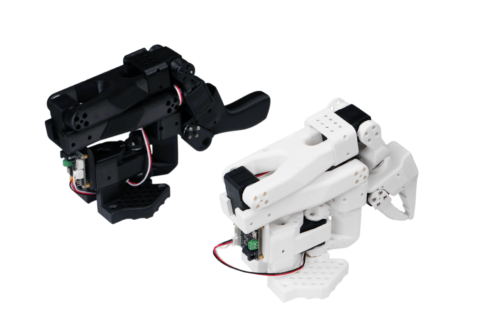

# SO-ARM（SO-100 / SO-101）真机适配

本节按统一模板（见本组模板页）写 SO-ARM 系列低成本舵机臂的接入：LeRobot 原生支持、串口总线舵机的标定与限位、leader-follower 遥操作、record/replay 命令与常见坑。它是本章推荐的零基础入门平台。

## 1. 适用场景

单臂 leader-follower 遥操作与数据采集，适合桌面级 pick-and-place、简单 manipulation 任务；不适合高负载、高速或精密装配任务。

## 2. 硬件清单

SO-100/SO-101 3D 打印臂体、12 个 Feetech 总线舵机、USB 转 TTL 串口模块、夹爪、RGB 相机、12V/5V 电源。

按照官方教程进行机械臂的安装和相机的摆放，对每个舵机设置编号之后进行总线的连接。



## 3. 软件环境

Python 3.10+、LeRobot 库、Feetech 舵机 SDK，无需 ROS；固件使用官方 STS 协议
环境配置流程：
1.安装miniforge或者miniconda，这里以安装miniconda为例

```bash
wget https://repo.anaconda.com/miniconda/Miniconda3-latest-Linux-x86_64.sh
sudo chmod 666 Miniconda3-latest-Linux-x86_64.sh
bash ./Miniconda3-latest-Linux-x86_64.sh
```

然后一直按enter到最后一步(默认下载位置为~/miniconda)
最后一步输入yes，然后输入

```bash
source .bashrc
```

2.新建conda环境

```bash
conda create -y -n lerobot python=3.10 && conda activate lerobot
conda activate lerobot
```

3.克隆lerobot仓库

```bash
git clone https://github.com/huggingface/lerobot.git ~/lerobot
```

4.配置环境

```bash
conda install ffmpeg -c conda-forge
cd ~/lerobot && pip install -e ".[feetech]"
```

5.检查环境

```bash
python   #  终端中开启python的命令
import torch
print(torch.cuda.is_available())
exit()   #  退出python
```

如果使用50系的显卡，则需要重装pytorch，按照下列命令进行，否则会出现训练时显卡架构不匹配的问题。

```bash
pip install --pre torch torchvision torchaudio --index-url https://download.pytorch.org/whl/nightly/cu128
```

## 4. Bring-up

这一部分需按顺序完成7和8的内容

## 5. Observation schema

`observation_features` 返回 6 个关节位置键（`shoulder_pan.pos`、`shoulder_lift.pos`、`elbow_flex.pos`、`wrist_flex.pos`、`wrist_roll.pos`、`gripper.pos`，类型 float）以及各相机图像（shape 来自 config 的 height/width/3）。`get_observation()` 内部通过 `bus.sync_read("Present_Position")` 读取电机状态，并调用 `cam.read_latest()` 获取最新图像帧；返回字典键与 `observation_features` 完全一致。

## 6. Action schema

`action_features` 与 `_motors_ft` 相同（6 个 `.pos` 键）。`send_action(action)` 接收目标关节位置（归一化模式由 `config.use_degrees` 决定：True 时为角度，False 时为 -100~100；gripper 始终 0~100），若 `config.max_relative_target` 不为 None，则通过 `ensure_safe_goal_position` 进行相对位移裁剪以保证安全，最后调用 `bus.sync_write("Goal_Position", goal_pos)` 下发；函数返回实际发送的 action 字典。控制频率通常 30-50 Hz。

## 7. 标定

接下来，需要对 SO-10x 机器人接上电源和数据线进行校准，以确保在相同的物理位置时，Leader 臂和 Follower 臂的位置信息一致。

如果需要重新校准机械臂，有两种方案

方案1：完全删除 `~/.cache/huggingface/lerobot/calibration/robots` 或者 `~/.cache/huggingface/lerobot/calibration/teleoperators` 下的文件并重新校准机械臂，否则会出现报错提示，校准的机械臂信息会存储该目录下的json文件中。

方案2：直接在终端输入校准机械臂的命令，如果机械臂曾经被校准过，则在终端出现是否进行重新校准的命令 “ Press ENTER to use provided calibration file associated with the id my_awesome_leader_arm, or type 'c' and press ENTER to run calibration: “ 此时在输入 'c ' 并按下 ENTER 则进行重新校准；直接按下 ENTER 则沿用之前的校准数据。

然后运行以下命令来校准从臂和主臂：

```python
lerobot-calibrate \
    --robot.type=so101_follower \  #从臂
    --robot.port=/dev/ttyACM0 \
    --robot.id=my_awesome_follower_arm

lerobot-calibrate \
    --teleop.type=so101_leader \  # 主臂
    --teleop.port=/dev/ttyACM1 \
    --teleop.id=my_awesome_leader_arm
```

首先，将机器人移动到所有关节都位于其活动范围中间的位置。然后按下回车键后，将每个关节在其完整的运动范围内移动。

## 8. 遥操作

遥操作有两种方式，分为同步打开摄像头和不打开摄像头，这里推荐同步打开摄像头的方案
输入以下命令：

```python
lerobot-teleoperate \
    --robot.type=so101_follower \
    --robot.port=/dev/ttyACM0 \
    --robot.id=my_awesome_follower_arm \
    --robot.cameras='{ front: {type: opencv, index_or_path: 0, width: 640, height: 480, fps: 30, fourcc: "MJPG"}, side: {type: opencv, index_or_path: 2, width: 640, height: 480, fps: 30, fourcc: "MJPG"} }' \
    --teleop.type=so101_leader \
    --teleop.port=/dev/ttyACM1 \
    --teleop.id=my_awesome_leader_arm \
    --display_data=true
```

`robot.cameras`里面相机参数的获取在03部分的相机配置里
`fourcc: "MJPG"`这一格式的图像是经过压缩后的图像，尝试更高分辨率会导致图像的分辨率和FPS降低导致机械臂运行卡顿。目前 MJPG 格式下可支持 3 个摄像头 1920*1080 分辨率并且保持 30FPS, 尽量不要 2 个摄像头通过同一个 USB 拓展坞接入电脑。同时，如果摄像头接在 USB2.0 的接口，也可能会出现无法读取的问题，建议优先使用 USB3.0 接口并尽量直连设备。

## 9. 数据采集

如果你想数据集保存在本地，可以直接运行：

```python
lerobot-record \
    --robot.type=so101_follower \
    --robot.port=/dev/ttyACM0 \
    --robot.id=my_awesome_follower_arm \
    --robot.cameras='{ front: {type: opencv, index_or_path: 0, width: 640, height: 480, fps: 30, fourcc: "MJPG"}, side: {type: opencv, index_or_path: 2, width: 640, height: 480, fps: 30, fourcc: "MJPG"} }' \
    --teleop.type=so101_leader \
    --teleop.port=/dev/ttyACM1 \
    --teleop.id=my_awesome_leader_arm \
    --display_data=true \
    --dataset.repo_id=data/test \
    --dataset.num_episodes=5 \
    --dataset.single_task="Put the blue ball into the bowl" \
    --dataset.push_to_hub=false \
    --dataset.episode_time_s=30 \
    --dataset.reset_time_s=30 
```

其中repo_id可以自定义修改，数据集会保存在主目录的~/.cache/huggingface/lerobot下的data/test文件夹，不要事先创建，否则会导致报错。

如果使用 Hugging Face Hub 的功能来上传您的数据集，并且您之前尚未这样做，请确保您已使用具有写入权限的令牌登录，该令牌可以从 Hugging Face 设置 中生成：

```bash
hf login --token ${HUGGINGFACE_TOKEN} --add-to-git-credential
```

将 Hugging Face 仓库名称存储在一个变量中，运行以下命令：

```bash
HF_USER=$(hf whoami | head -n 1)
echo $HF_USER
```

将数据集上传到 Hub：

```python
lerobot-record \
    --robot.type=so101_follower \
    --robot.port=/dev/ttyACM0 \
    --robot.id=my_awesome_follower_arm \
    --robot.cameras='{ front: {type: opencv, index_or_path: 0, width: 640, height: 480, fps: 30, fourcc: "MJPG"}, side: {type: opencv, index_or_path: 2, width: 640, height: 480, fps: 30, fourcc: "MJPG"} }' \
    --teleop.type=so101_leader \
    --teleop.port=/dev/ttyACM1 \
    --teleop.id=my_awesome_leader_arm \
    --display_data=true \
    --dataset.repo_id=${HF_USER}/record-test \
    --dataset.num_episodes=5 \
    --dataset.single_task="Put the blue ball into the bowl" \
    --dataset.push_to_hub=true \
    --dataset.episode_time_s=30 \
    --dataset.reset_time_s=30 
```

你会看到类似如下数据:

```bash
INFO 2024-08-10 15:02:58 ol_robot.py:219 dt:33.34 (30.0hz) dtRlead: 5.06 (197.5hz) dtWfoll: 0.25 (3963.7hz) dtRfoll: 6.22 (160.7hz) dtRlaptop: 32.57 (30.7hz) dtRphone: 33.84 (29.5hz)
```

采集完数据之后建议进行随机挑几个episode进行回放

```python
lerobot-replay \
  --robot.type=so101_follower \
  --robot.port=/dev/ttyACM0 \
  --robot.id=my_awesome_follower_arm \
  --dataset.repo_id=data \
  --dataset.root=~/.cache/huggingface/lerobot/data \
  --dataset.episode=0 \
```

数采过程中的设置与要求

1.记录参数

通过命令行参数设置数据记录的流程：

|参数|描述|默认值|
|---|---|---|
|--dataset.episode_time_s|每个数据集的持续时间（秒）|60|
|--dataset.reset_time_s|采集后环境重置时间（秒）|60|
|--dataset.num_episodes|要记录的总数量|50|

2.记录过程中的键盘控制

键盘快捷键可以控制数据记录流程：

|键|动作|
|---|---|
|→（右箭头）|提前终止当前数据集采集轮次/重置，进入下一个|
|←（左箭头）|取消当前数据集采集，重新录制|
|ESC|立即停止会话，编码视频，上传数据集|

这里举一个具体的pick and place任务为例讲解一下数采过程中的一些特殊情况和数采技巧：

假设任务为抓取小球放进碗里
(1) 如果在操作过程中不慎将小球弄掉，或出现任何可能导致该episode数据质量较差的情况，可以先将机械臂操控至初始位置，然后按下左箭头键。此时系统将返回到环境准备阶段，刚刚录制的动作数据会被直接舍弃。
(2) 如果本次任务完成得较快，机械臂已经成功完成操作并回到休息状态，而你不希望等待剩余时间结束，也可以按下右箭头键，以跳过剩余等待时间，直接进入下一个剧集前的环境准备阶段。
(3) 在录制过程中合理使用方向键，有助于避免失败动作污染数据集，有效提升整体录制效率。

数据收集技巧

(1) 规模：
记录 ≥50 个episode（每个位置 10 个episode）。这也是官方文档里推荐的方法。
(2) 原则：
正式采集前先只开遥操作试抓几次，把动作练习熟练。
保持摄像头固定和抓取行为相同。
确保操作的物体在摄像头画面中一直可见。
先从可靠的抓取开始，然后再增加变化，避免复杂性急剧增加造成失败。
仅使用摄像头画面作为指导，只根据屏幕反馈的视频图像，来控制机械臂完成任务，这样保证采集的数据符合机械臂的动作而不是人的直觉。

## 10. 以ACT为例的训练流程

使用 `python -m lerobot.scripts.train` 脚本。需要一些参数。以下是一个示例命令：

```python
lerobot-train \
  --dataset.repo_id=${HF_USER}/so101_test \
  --policy.type=act \
  --output_dir=outputs/train/act_so101_test \
  --job_name=act_so101_test \
  --policy.device=cuda \
  --wandb.enable=false \
  --steps=300000 
```

如果在本地数据集上进行训练，请确保 repo_id 与数据收集时使用的名称匹配，并添加 `--policy.push_to_hub=false`。

```python
lerobot-train \
  --dataset.repo_id=seeedstudio123/test \
  --policy.type=act \
  --output_dir=outputs/train/act_so101_test \
  --job_name=act_so101_test \
  --policy.device=cuda \
  --wandb.enable=false \
  --policy.push_to_hub=false\
  --steps=300000 
```

如果是RTX50系列显卡，在训练时需要增加`--dataset.video_backend=pyav`部分，绕过 torchvision 预览版的 API 缺失，这也是上文不推荐使用 50 系显卡的原因。

即训练命令为：

```python
lerobot-train \
  --dataset.repo_id=seeedstudio123/test \
  --dataset.video_backend=pyav \
  --policy.type=act \
  --output_dir=outputs/train/act_so101_test \
  --policy.device=cuda \
  --wandb.enable=false \
  --policy.push_to_hub=false \
  --steps=300000 \
```

下面对这个命令进行解释

数据集指定：通过 --dataset.repo_id=${HF_USER}/so101_test 参数提供了数据集。
训练步数：通过 --steps=300000 修改训练步数，算法默认为800000，根据自己的任务难易程度，来进行调整，如果不确定，可以调高一些，因为训练过程中会生成检查点，评估可以从检查点开始。
策略类型：使用 policy.type=act 提供了策略，同样可以更换[act,diffusion,pi0,pi0fast,pi0fast,sac,smolvla]等策略，这将从 configuration_act.py 加载配置。重要的是，这个策略会自动适应机器人（例如 laptop 和 phone）的电机状态、电机动作和摄像头数量。只需在配置环境的时候安装不同的库。
设备选择：提供了 policy.device=cuda，也可以使用 policy.device=mps 在 Apple Silicon 上进行训练。
可视化工具：提供了 wandb.enable=true 来使用 Weights and Biases 可视化训练图表。训练的时候需要通过 wandb login 登录。

## 11. 真机推理

SO-Arm的所有算法推理命令均相同

```python
lerobot-record \
  --robot.type=so101_follower \
  --robot.port=/dev/ttyACM0 \
  --robot.cameras='{ front: {type: opencv, index_or_path: 0, width: 640, height: 480, fps: 30, fourcc: "MJPG"}, side: {type: opencv, index_or_path: 2, width: 640, height: 480, fps: 30, fourcc: "MJPG"} }' \
  --robot.id=my_awesome_follower_arm \
  --display_data=false \
  --dataset.repo_id=data/eval_xxxx \
  --dataset.single_task="Put the blue ball into the bowl" \
  --policy.path=outputs/train/act_so101_test/checkpoints/last/pretrained_model
```

参数解析：
(1) --policy.path: 指示策略训练结果权重文件的路径（例如 outputs/train/act_so101_test/checkpoints/last/pretrained_model）。如果将模型训练结果权重文件上传到 Hub，也可以使用模型仓库（例如 ${HF_USER}/act_so100_test）。
推理不同模型只需要修改不同模型训练后的文件路径就可以。
(2) 数据集的名称dataset.repo_id以 eval_ 开头，这个操作会在评估的时候单独录制评估时候的视频和数据，将保存在eval_开头的文件夹下，例如data/eval_xxxx。
(3) 如果评估阶段遇到File exists: 'home/xxxx/.cache/huggingface/lerobot/xxxxx/data/eval_xxxx'，请先删除eval_开头的这个文件夹再次运行程序。
(4) 出现mean is infinity. You should either initialize with stats as an argument or use a pretrained model这个报错，需要注意--robot.cameras这个参数中的front和side等关键词必须和采集数据集的时候保持严格一致。

## 11. 故障排查

每一步会出现的故障已标注在不同步骤的后面

教程内容参考：

1. <https://wiki.seeedstudio.com/cn/lerobot_so100m_new>
2. <https://huggingface.co/docs/lerobot/index>
