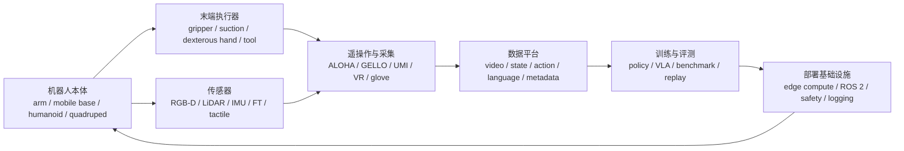
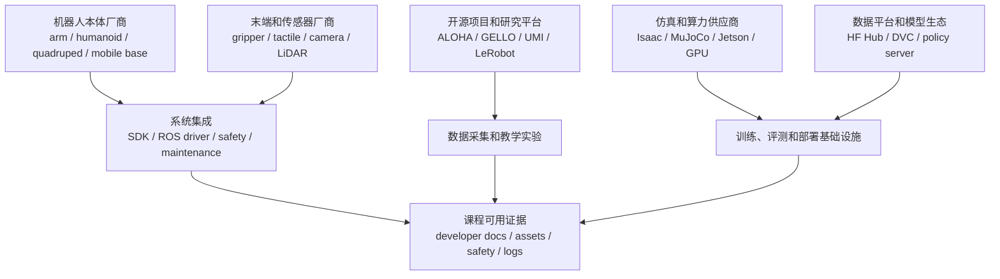

# 硬件与产业生态

目标：建立具身智能硬件与产业链地图，知道机器人本体、末端执行器、传感器、遥操作、算力平台和部署基础设施分别决定什么。

硬件与产业生态不是采购清单。本节只帮助你理解真实机器人系统依赖哪些硬件、接口、维护条件和产业资源。具体选型、安全验收和真机操作流程回到第 11 章。

<table>
  <tr>
    <td width="25%" align="center" valign="top">
      <a href="https://www.unitree.com/g1"></a><br>
      <sub>人形机器人：全身控制、移动操作和多模态交互</sub>
    </td>
    <td width="25%" align="center" valign="top">
      <a href="https://www.universal-robots.com/"></a><br>
      <sub>协作机械臂：桌面操作、装配、教学和工业集成</sub>
    </td>
    <td width="25%" align="center" valign="top">
      <a href="https://www.shadowrobot.com/dexterous-hand-series/"></a><br>
      <sub>末端执行器：抓取、触觉、力控和工具使用</sub>
    </td>
    <td width="25%" align="center" valign="top">
      <a href="https://developer.nvidia.com/isaac/sim"></a><br>
      <sub>基础设施：仿真、合成数据、训练和部署链路</sub>
    </td>
  </tr>
</table>

## 学习目标

读完 12.4 后，你应该能：

- 区分机器人本体、末端执行器、传感器、遥操作平台和算力部署平台的作用。
- 判断一个硬件资源是否适合“论文导读、数据采集、仿真实验、真机部署参考”。
- 说明硬件参数如何影响数据质量、动作空间、评测可比性和安全边界。
- 把产业宣传、产品页面、论文 demo 和可复现实验条件分开记录。

## 一、硬件系统图谱



图 12.4.1 真实系统是一条闭环。硬件不是孤立设备，本体、末端、传感器、遥操作和算力平台共同决定数据格式、动作空间、延迟、安全和维护成本。

## 二、产业关系图谱



图 12.4.2 产业生态不只是“谁卖机器人”。课程真正关心的是厂商、开源项目、研究平台、数据平台、算力/仿真供应商和系统集成资料，能否共同提供可回溯的工程证据。

## 三、子页

| 页面 | 内容 | 阅读重点 |
|---|---|---|
| [机器人本体](03-hardware-and-industry/01-robot-embodiments.md) | 机械臂、双臂、人形、四足、移动底盘、低成本教学臂 | 自由度、负载、控制接口、URDF/MJCF、维护与安全 |
| [末端执行器与灵巧手](03-hardware-and-industry/02-end-effectors-and-dexterous-hands.md) | 平行夹爪、吸盘、自适应夹爪、灵巧手、工具端 | 行程、夹持力、触觉/力反馈、仿真模型和易损件 |
| [传感器、触觉与数据采集硬件](03-hardware-and-industry/03-sensors-tactile-and-data-hardware.md) | RGB-D、工业相机、LiDAR、IMU、力/力矩、触觉 | 同步、标定、带宽、时间戳、数据质量 |
| [遥操作系统与数据采集平台](03-hardware-and-industry/04-teleoperation-and-data-platforms.md) | ALOHA、GELLO、UMI、VR、手套、动捕、Web 控制 | 主从映射、延迟、人体工学、数据 schema |
| [算力、仿真、数据平台与部署基础设施](03-hardware-and-industry/05-compute-simulation-data-platforms.md) | GPU、边缘计算、仿真平台、数据管理、policy serving、ROS 2 | 训练到部署的版本、延迟、日志和安全链路 |

## 四、硬件证据等级

| 等级 | 典型证据 | 课程动作 |
|---|---|---|
| L0 宣传层 | 发布会、短视频、媒体稿、概念图 | 只作生态观察 |
| L1 产品说明层 | 官网参数、白皮书、demo、应用案例 | 可做类别导读 |
| L2 开发资料层 | SDK、URDF/MJCF、ROS driver、API、标定文档 | 可做工程参考 |
| L3 数据/评测层 | 公开数据、benchmark、实验日志、失败案例 | 可支撑课程实验设计 |
| L4 部署层 | 安全手册、急停、维护流程、版本锁定、长期运行证据 | 可进入真机部署讨论 |

## 五、硬件检查卡片

```yaml
hardware_resource_card:
  name: ""
  category: "embodiment / end-effector / sensor / teleoperation / compute / deployment"
  official_page: ""
  developer_docs: ""
  open_assets: "URDF / MJCF / SDK / ROS driver / dataset / none"
  interface:
    control: ""
    data: ""
    sync: ""
  key_specs:
    dof: ""
    payload: ""
    frequency: ""
    latency: ""
  safety:
    e_stop: ""
    limits: ""
    logging: ""
  evidence_level: "L0 / L1 / L2 / L3 / L4"
  course_action: "track / cite / code-read / data-lab / deployment-reference / avoid"
  risks: []
```

已填写示例：

```yaml
hardware_resource_card:
  name: "typical collaborative robot arm"
  category: "embodiment"
  official_page: "vendor product page"
  developer_docs: "SDK / ROS driver / safety manual if available"
  open_assets: "URDF or CAD if available"
  interface:
    control: "joint / Cartesian command through SDK or ROS"
    data: "joint state, robot mode, error code, optional FT"
    sync: "robot clock must align with camera timestamps"
  key_specs:
    dof: "6 or 7"
    payload: "must exceed gripper + object + safety margin"
    frequency: "policy rate cannot exceed stable command rate"
    latency: "measure command-to-motion delay before data collection"
  safety:
    e_stop: "required for any course deployment"
    limits: "speed, force, workspace and joint limits"
    logging: "state/action/error logs needed for failure replay"
  evidence_level: "L2 if SDK/driver/docs are public; L4 only with safety and deployment evidence"
  course_action: "code-read / deployment-reference"
  risks:
    - "official demo alone is L0-L1, not enough for lab design"
    - "missing URDF or driver increases integration cost"
```

判断示例：如果一个人形机器人只有官网视频和参数页，它最多是 L0-L1，适合写成产业观察；如果一个机械臂有 SDK、ROS driver、URDF、安全手册和可回放日志，它可以进入 L2-L4，用作工程参考或真机部署讨论。

Sources:

产品与项目入口：
- [Unitree G1](https://www.unitree.com/g1)
- [Universal Robots](https://www.universal-robots.com/)
- [Shadow Robot Dexterous Hand Series](https://www.shadowrobot.com/dexterous-hand-series/)
- [NVIDIA Isaac Sim](https://developer.nvidia.com/isaac/sim)
- [ALOHA](https://tonyzhaozh.github.io/aloha/)
- [GELLO](https://wuphilipp.github.io/gello_site/)
- [UMI](https://umi-gripper.github.io/)

工程与开发入口：
- [Universal Robots ROS 2 Documentation](https://docs.universal-robots.com/Universal_Robots_ROS2_Documentation/)
- [Unitree SDK2](https://github.com/unitreerobotics/unitree_sdk2)
- [ROS 2 Documentation](https://docs.ros.org/)
- [MoveIt](https://moveit.picknik.ai/)
- [NVIDIA Isaac Sim Documentation](https://docs.isaacsim.omniverse.nvidia.com/)
- [NVIDIA Jetson Documentation](https://docs.nvidia.com/jetson/)

- 返回本章：[研究生态](README.md)
