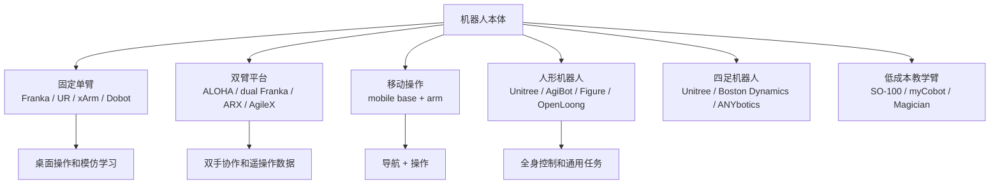

# 机器人本体

目标：理解具身智能中常见的机器人本体形态，掌握自由度、负载、控制接口、传感器布局以及安全机制如何影响算法设计与数据采集。

<table>
  <tr>
    <td width="33%" align="center" valign="top">
      <a href="https://www.universal-robots.com/"></a><br>
      <sub>协作臂：桌面操作、教学和工业集成的常见本体</sub>
    </td>
    <td width="33%" align="center" valign="top">
      <a href="https://www.unitree.com/g1"></a><br>
      <sub>人形：全身控制、移动操作和人类环境任务</sub>
    </td>
    <td width="33%" align="center" valign="top">
      <a href="https://bostondynamics.com/atlas/"></a><br>
      <sub>高动态本体：运动能力强，但课程复现门槛高</sub>
    </td>
  </tr>
</table>

## 本体形态地图



机器人本体（Embodiment）是具身智能系统与物理世界交互的载体，它不仅决定机器人能够完成哪些任务，也直接影响策略学习、数据采集、控制方式以及安全设计。

不同机器人之间最大的区别并不仅仅是外观，而是运动能力、自由度、传感器配置以及控制接口的不同。例如，一个桌面机械臂通常只需要控制末端执行器完成抓取，而移动操作机器人需要同时解决导航、定位和机械臂操作问题；人形机器人则需要进一步维持身体平衡、协调全身运动，并处理更加复杂的环境交互。

因此，在具身智能领域，同一个策略往往不能直接迁移到另一种机器人上，而需要重新设计动作空间（Action Space）、观测空间（Observation Space）、奖励函数以及控制接口。

图 12.3.2：本体形态直接决定动作空间、观测空间以及失败模式。机械臂、移动底盘、人形以及四足机器人的策略输入输出通常不能直接互换。

## 常见机器人本体

| 形态 | 代表生态 | 适合任务 | 课程判断 |
|---|---|---|---|
| 单臂 / 协作臂 | Franka、Universal Robots、xArm、Dobot、Aubo、JAKA、RealMan、Kinova、KUKA、ABB | 桌面操作、抓取、插拔、装配 | 最适合入门和可控实验 |
| 低成本教学臂 | LeRobot SO-100 / SO-101、Dobot Magician、Elephant Robotics myCobot | 入门采集、教学演示、轻量 Demo | 适合课程演示，需注意负载和精度限制 |
| 双臂平台 | ALOHA、Mobile ALOHA、dual Franka / UR / xArm、ARX、AgileX Cobot Magic、Airbot MMK2 / TOK2 | 双臂协作、长程操作、数据采集 | 适合 ACT / VLA 数据路线 |
| 移动操作平台 | Clearpath、AgileX、TurtleBot、Fetch / Stretch 类平台 | 导航、移动抓取、室内服务 | 重点关注底盘定位和机械臂标定 |
| 人形机器人 | Unitree G1 / H1、AgiBot、RobotEra、Fourier GR、Figure、1X、Apptronik、Sanctuary AI、OpenLoong、UBTECH | 全身控制、移动操作、人类环境任务 | 多为高门槛系统，适合生态导读 |
| 四足机器人 | Unitree、Boston Dynamics、ANYbotics | 巡检、复杂地形、移动感知 | 适合 Locomotion 和移动感知方向 |

不同机器人形态对应着不同的研究方向。协作机械臂通常拥有固定底座和相对稳定的工作空间，因此成为模仿学习、强化学习和视觉抓取研究中最常见的平台。双臂机器人能够完成递送、协同搬运和双手装配等任务，也是近年来 ACT、ALOHA 等数据集的重要载体。

移动操作机器人在机械臂基础上增加了移动底盘，需要同时处理导航、定位、避障以及机械臂控制，因此系统复杂度明显提升。人形机器人进一步增加了腿部、躯干以及头部等自由度，使机器人能够在面向人类设计的环境中完成更加通用的任务，但也意味着需要解决全身协调控制、平衡保持以及高频运动控制等问题。四足机器人则主要关注复杂地形运动、环境巡检以及自主导航，其研究重点通常集中于 locomotion、状态估计以及地形感知，而不是精细操作。

## 选择机器人本体时关注哪些指标

| 字段 | 为什么重要 |
|---|---|
| 自由度和运动范围 | 决定动作空间与可达任务 |
| 负载和末端重量 | 影响夹爪、相机、工具的选型及安全余量 |
| 控制频率和接口 | 底层控制、策略动作频率（Policy Action Rate）和延迟必须匹配 |
| URDF / MJCF / USD | 决定能否接入仿真、规划和 Sim-to-Real 迁移 |
| ROS 2 / SDK / API | 决定工程接入成本 |
| 急停、限位和碰撞检测 | 真机实验的安全底线 |
| 维护和供货 | 课程长期可复现依赖备件、校准和售后支持 |

这些指标共同决定了一台机器人是否适合作为具身智能平台，而不仅仅决定它的硬件性能。

**自由度（Degree of Freedom，DoF）** 决定机器人能够独立控制的运动维度。自由度越高，可完成的动作通常越丰富，但策略学习和控制难度也随之增加。例如，一个 6 自由度机械臂能够覆盖大多数桌面抓取任务，而双臂系统或人形机器人可能拥有数十个自由度，需要更复杂的动作表示和协调控制。

**负载（Payload）** 表示机器人能够稳定承载的最大重量。在真实部署中，机器人不仅需要携带被抓取物体，还需要安装夹爪、力传感器、腕部相机等设备，因此实际负载通常应留有足够安全余量，而不能简单参考官方标称值。

**控制接口和控制频率** 决定策略如何向机器人发送动作命令。具身智能策略通常以固定频率输出动作，如果机器人控制器只能稳定接收较低频率指令，或者通信延迟较高，就需要进行动作缓存、插值或轨迹生成，否则容易出现运动抖动甚至控制失稳。

**仿真模型**（如 URDF、MJCF）决定机器人是否能够快速接入 MuJoCo、Isaac Sim、Gazebo 等仿真平台。完整且准确的机器人模型能够降低 Sim-to-Real 的迁移成本，也是强化学习和大规模数据生成的重要基础。

**软件生态** 同样十分重要。官方 SDK、ROS 2 Driver、社区维护的接口以及完善的 API 文档都会显著降低开发成本，使机器人能够快速接入现有的数据采集、运动规划和视觉算法框架。

最后，**安全机制** 是所有真机实验必须优先考虑的内容。急停按钮、速度限制、工作空间限位、碰撞检测以及力矩保护能够有效降低实验风险，也是机器人进入长期部署阶段的基本要求。

机器人本体会向后约束整条系统链路：自由度决定 `action_schema`，传感器布局决定 `observation_schema`，控制接口决定策略输出格式，控制频率决定策略执行频率，安全机制则决定系统能够以何种方式部署到真实环境中。因此，更换机器人本体并不仅仅意味着更换硬件，而往往需要重新设计整条数据流、控制流以及评测流程。

## 本体检查卡片

在正式开展数据采集或策略部署之前，可以先填写一份 **Embodiment Card**。它类似于机器人平台的技术档案，用于统一记录本体能力、控制接口、仿真资产以及安全机制。对于课程实验而言，这份卡片能够帮助快速判断机器人是否满足实验要求，也方便不同团队之间共享平台信息。

```yaml
embodiment_card:
  name: ""
  type: "single-arm / dual-arm / mobile-manipulator / humanoid / quadruped"
  official_page: ""
  dof: ""
  payload: ""
  reach_or_workspace: ""
  control_interface: ""
  control_frequency: ""
  simulation_assets: "URDF / MJCF / Isaac / MuJoCo / none"
  ros_support: ""
  safety_features: []
  course_action: "intro-demo / data-collection / benchmark / ecosystem-only"
  risks: []
```

已填写示例（协作臂）：

```yaml
embodiment_card:
  name: "collaborative robot arm for tabletop manipulation"
  type: "single-arm"
  official_page: "vendor product page"
  dof: "6 或 7；以官方规格表为准"
  payload: "需覆盖夹爪、腕部相机和被操作物体的总重量"
  reach_or_workspace: "需覆盖桌面操作区、相机视野和复位区域"
  control_interface: "SDK / ROS 2 driver / 笛卡尔或关节空间控制"
  control_frequency: "策略部署前需实测稳定指令频率"
  simulation_assets: "URDF / MJCF 官方均有提供"
  ros_support: "优先选用官方驱动或社区长期维护的 wrapper"
  safety_features:
    - "急停"
    - "速度和工位限位"
    - "碰撞检测或力矩限制（如有）"
  evidence_level: "具备 SDK/驱动/仿真资产可达 L2；安全与日志验证通过后可到 L4"
  course_action: "data-collection / benchmark"
  risks:
    - "相机外参和机器人基坐标系必须固定"
    - "控制器模式必须与训练动作表示一致"
```

## 协作机械臂与人形机器人的对比

| 维度 | 协作机械臂 | 人形机器人 |
|---|---|---|
| 任务范围 | 桌面操作、装配、抓取 | 移动、全身操作、人类环境 |
| 数据采集 | 相机和工作台相对容易固定 | 需要全身状态估计、导航与安全监控 |
| 动作空间 | 关节角度或末端位姿（6–7 DoF） | 上肢 + 下肢 + 躯干 + 底层平衡控制（通常超过 20 DoF） |
| 课程适配 | 适合实战章节（第 6/7/11 章） | 多数适合生态导读和案例分析 |

对于大多数具身智能课程和科研入门而言，协作机械臂仍然是最容易获得稳定实验结果的平台。它们拥有固定工作空间、成熟的软件生态以及丰富的公开数据集，便于快速搭建完整的数据采集、训练和部署流程。

相比之下，人形机器人能够完成更加丰富的任务，但需要同时解决全身控制、平衡保持、定位导航以及多传感器融合等问题，对硬件、安全机制和软件系统都有更高要求。因此，在缺乏完善 SDK、仿真模型和安全接口的情况下，人形机器人更适合作为生态了解和案例分析对象，而不是课程初期的主要实验平台。

## 小任务

1. 任选一个机械臂或人形机器人，填写一份 `embodiment_card`。
2. 判断它是否具备公开 SDK、ROS Driver 或仿真模型。
3. 写出它进入课程实战前最可能遇到的一个工程瓶颈，并说明原因，例如控制接口限制、缺少仿真资产、标定困难或安全机制不足。

参考资源

产品入口：
- [Franka Robotics](https://franka.de/)
- [Universal Robots](https://www.universal-robots.com/)
- [UFACTORY xArm](https://www.ufactory.cc/)
- [Unitree Robotics](https://www.unitree.com/)
- [Boston Dynamics Atlas](https://bostondynamics.com/atlas/)
- [AgileX Robotics](https://global.agilex.ai/)
- [Dobot](https://www.dobot-robots.com/)
- [RealMan Robotics](https://www.realman-robotics.com/)
- [Clearpath Robotics](https://clearpathrobotics.com/)
- [OpenLoong](https://www.openloong.org.cn/)

开发与开源资产入口：
- [Universal Robots ROS 2 Documentation](https://docs.universal-robots.com/Universal_Robots_ROS2_Documentation/)
- [Unitree SDK2](https://github.com/unitreerobotics/unitree_sdk2)
- [Boston Dynamics Spot SDK](https://dev.bostondynamics.com/)
- [ROS 2 control](https://control.ros.org/)

- 上一级：[硬件与产业生态](../03-hardware-and-industry.md)
