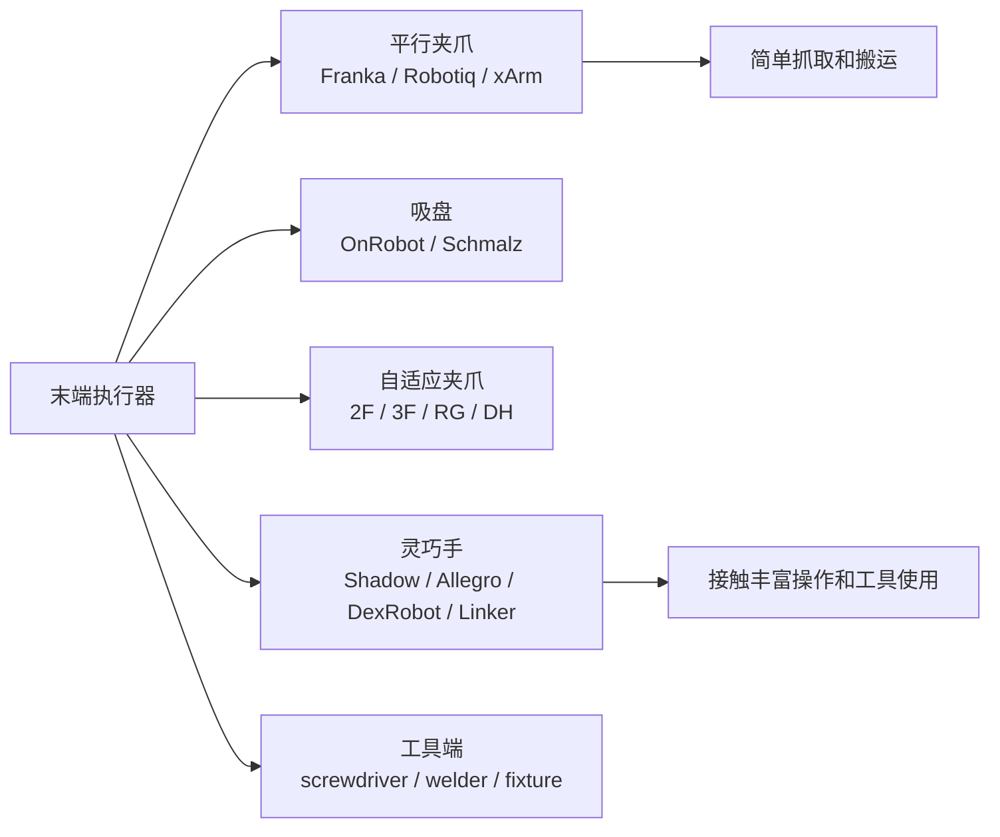

# 末端执行器与灵巧手

> 目标：理解夹爪、吸盘、灵巧手和工具端如何改变动作空间、接触建模、数据采集和真机安全。

<table>
  <tr>
    <td width="50%" align="center" valign="top">
      <a href="https://www.shadowrobot.com/dexterous-hand-series/"></a><br>
      <sub>Shadow Dexterous Hand：灵巧手、触觉和复杂接触研究入口</sub>
    </td>
    <td width="50%" align="center" valign="top">
      <a href="https://onrobot.com/en/products/2fg7"></a><br>
      <sub>OnRobot 2FG7：自适应夹爪、工业抓取和力控接口</sub>
    </td>
  </tr>
</table>

## 末端执行器分类



末端执行器（End Effector）是机器人与环境发生物理接触的最终执行部件，也是具身智能系统真正完成任务的位置。对于同一台机械臂而言，更换不同的末端执行器，往往意味着机器人能够完成完全不同类型的任务。

例如，两指夹爪适合完成抓取、搬运和放置等稳定操作；吸盘适用于包装、物流和仓储中的平面物体；灵巧手能够完成手内操作（In-Hand Manipulation）、工具使用以及复杂接触任务；而焊枪、螺丝刀等工具端则面向特定工业工艺。

因此，在具身智能系统中，末端执行器不仅决定机器人能够“抓什么”，更决定动作空间、接触建模方式、控制策略以及数据集标注方式。即使保持相同的机械臂和视觉系统，仅仅更换末端执行器，也往往需要重新设计策略输出、奖励函数以及失败判据。

> 图 12.3.3：末端执行器决定机器人"动作能够做到什么"。两指夹爪适合稳定抓取，灵巧手能够完成更加复杂的接触操作，但控制、建模和数据采集成本也会显著提高。

## 常见末端执行器

| 类型 | 代表生态 | 适合任务 | 风险 |
|---|---|---|---|
| 平行夹爪 | Robotiq、Franka Hand、xArm Gripper、Dynamixel/Feetech 夹爪 | 抓取、搬运、桌面操作 | 接触模式简单，难以完成复杂手内操作 |
| 吸盘 | OnRobot、Schmalz、工业吸附系统 | 平面物体、包装、仓储 | 对材质、表面、气路和密封性敏感 |
| 自适应夹爪 | Robotiq 2F/3F、OnRobot RG、DH Robotics、Weiss、SCHUNK | 多形状物体、教学和轻工业 | 控制接口和力反馈差异较大 |
| 灵巧手 | Shadow Hand、Allegro Hand、DexRobot、Linker Hand、Inspire、Psyonic、Paxini、RobotEra XHAND | Dexterous Manipulation、触觉操作、工具使用 | 标定、仿真、维护和数据采集成本高 |
| 工具端 | 螺丝刀、焊接头、打磨头、夹具 | 专用工业任务 | 泛化能力弱，工艺和安全约束较强 |

不同类型的末端执行器对应不同的接触方式。两指夹爪通常形成两个稳定接触点，通过夹持力固定目标物体；吸盘依赖负压形成吸附力，因此更加关注密封性和表面材质；自适应夹爪能够利用柔顺结构自动适应不同形状的物体，在工业抓取中具有较好的鲁棒性；灵巧手则拥有多个手指和更多自由度，可以实现连续接触、手内重定位以及复杂工具操作，但同时需要更加复杂的运动规划、接触建模和控制算法。

对于具身智能研究而言，两指夹爪仍然是目前应用最广泛的方案，因为动作表示简单、数据采集方便、仿真模型成熟，也是 LeRobot、ALOHA 等公开数据集最常见的配置。而灵巧手更多应用于 Dexterous Manipulation、触觉感知以及复杂操作研究，目前仍然具有较高的硬件成本和开发门槛。

## 选择末端执行器时关注哪些指标

| 字段 | 为什么重要 |
|---|---|
| 开合行程 / 指尖自由度 | 决定能够抓取的物体尺寸及是否支持手内操作 |
| 夹持力 / 力控能力 | 决定是否能够稳定抓取易碎或较重物体 |
| 重量和安装法兰 | 影响机械臂负载、动力学和运动性能 |
| 通信接口 | Modbus、CAN、EtherCAT、USB、串口等接口会影响控制频率和开发成本 |
| 触觉 / 力反馈 | 决定是否能够进行滑移检测、接触分类和闭环控制 |
| 仿真模型 | 决定是否能够开展仿真训练和 Sim-to-Real |
| 易损件和维护 | 指尖皮肤、气路和传感器会影响长期实验稳定性 |

这些指标共同决定了一种末端执行器是否适合用于具身智能系统，而不仅仅决定其抓取能力。

**自由度与开合范围**决定机器人能够完成哪些动作。对于两指夹爪而言，动作通常只有一个开合宽度；而灵巧手往往拥有十几个甚至二十多个自由度，每根手指都需要独立控制，因此动作空间会大幅增加。

**夹持力与力控制能力**决定机器人是否能够稳定抓取不同材质的物体。抓取纸杯、海绵、水果等易碎物体时，机器人不仅需要知道夹紧，还需要控制合适的接触力，否则容易发生滑移或损坏目标。

**安装重量**直接影响机械臂能够承载的有效负载。安装较重的夹爪或灵巧手后，可用于搬运目标物体的剩余负载会减少，同时机械臂的运动惯量也会发生变化，需要重新调整控制参数。

**通信接口与控制频率**决定末端执行器能够如何与机器人系统通信。例如，一些夹爪只支持简单的串口或 Modbus 控制，而高端灵巧手通常支持 EtherCAT 或 CAN 总线，可以实现更高频率、更低延迟的控制。

**触觉和力反馈**是近年来具身智能的重要研究方向。传统夹爪通常只能获得位置反馈，而带有触觉阵列或六维力传感器的末端执行器能够感知接触位置、压力分布以及滑移状态，使机器人能够进行更加稳定的闭环操作。

最后，**仿真模型和维护成本**同样不可忽视。拥有完整 URDF、MJCF 或 Isaac Sim 模型的末端执行器更容易开展强化学习和模仿学习训练，而缺乏公开模型的设备通常需要自行建立碰撞模型和动力学参数。与此同时，柔性指尖、触觉皮肤和气动系统等部件也需要定期维护，否则容易影响实验结果的一致性。

更换末端执行器不仅意味着更换硬件，还意味着重新定义整条数据链。动作空间可能从一个夹爪开合量扩展为十几个关节角度；观测空间可能增加触觉、力矩或滑移信息；仿真环境需要重新建立碰撞模型和摩擦参数；数据集中的动作标签、成功标准以及失败模式也需要重新设计。

## 末端执行器检查卡片

在正式部署机器人之前，可以先填写一份 **End Effector Card**，用于统一记录末端执行器的安装方式、控制接口、反馈能力以及仿真支持情况。对于课程实验而言，这份卡片能够帮助快速判断不同夹爪或灵巧手是否适合作为数据采集和策略验证平台。

```yaml
end_effector_card:
  name: ""
  type: "parallel gripper / suction / adaptive gripper / dexterous hand / tool"
  official_page: ""
  mount: ""
  payload_impact: ""
  stroke_or_dof: ""
  force_or_torque: ""
  feedback: "none / force / tactile / position"
  interface: ""
  simulation_model: ""
  course_action: "simple-grasp / dexterous-demo / tactile-study / industrial-reference"
  risks: []
```

已填写示例：

```yaml
end_effector_card:
  name: "parallel gripper for tabletop imitation learning"
  type: "parallel gripper"
  official_page: "vendor product page"
  mount: "robot flange adapter must be fixed and modeled"
  payload_impact: "gripper mass reduces usable payload"
  stroke_or_dof: "single open-close command or width target"
  force_or_torque: "force limit needed for fragile objects"
  feedback: "position or simple force feedback if available"
  interface: "serial / Modbus / ROS driver / vendor SDK"
  simulation_model: "URDF/MJCF collision geometry preferred"
  evidence_level: "L2 if driver and model are public; L3 if used in benchmark/data collection"
  course_action: "simple-grasp"
  risks:
    - "two-finger action cannot be directly reused by dexterous hand policy"
    - "missing contact feedback limits slip detection"
```

## 如何选择合适的末端执行器

| 任务目标 | 更合适的末端 |
|---|---|
| 入门抓取和模仿学习 | 平行夹爪 |
| 包装、平面物体和仓储场景 | 吸盘或吸夹组合 |
| 接触丰富任务和工具使用 | 灵巧手或带力/触觉反馈的夹爪 |
| 工业装配、打磨和加工 | 专用工具端配合力控传感器 |
| 低成本教学 | 简单电动夹爪，但需接受精度和耐久性限制 |

对于大多数具身智能课程而言，两指夹爪仍然是最推荐的选择。其控制接口简单、公开数据丰富、仿真模型成熟，能够快速搭建完整的数据采集和训练流程。

相比之下，灵巧手虽然能够完成更加复杂的操作任务，但策略需要输出更多关节动作，并依赖更加精细的接触建模和触觉反馈。两指夹爪采集得到的数据通常不能直接迁移到灵巧手，因为两者的动作表示、接触方式以及成功判据均存在明显差异。即使视觉输入保持一致，策略输出和训练目标也需要重新设计。

## 小任务

1.选择一个夹爪或灵巧手，填写一份 `end_effector_card`。
2.判断它是否提供触觉或力反馈，以及公开的仿真模型。
3.分析如果将当前末端执行器更换为该设备，策略动作空间、观测空间以及数据标注方式需要发生哪些变化。

Sources:

产品入口：
- [Robotiq](https://robotiq.com/)
- [Shadow Robot Dexterous Hand Series](https://www.shadowrobot.com/dexterous-hand-series/)
- [OnRobot 2FG7](https://onrobot.com/en/products/2fg7)
- [OnRobot](https://onrobot.com/)
- [Schmalz](https://www.schmalz.com/)
- [SCHUNK](https://schunk.com/)
- [DH Robotics](https://en.dh-robotics.com/)

开发与模型入口：
- [Shadow Robot documentation](https://shadow-robot-company-dexterous-hand.readthedocs-hosted.com/)
- [Robotiq support documents](https://robotiq.com/support)
- [OnRobot downloads](https://onrobot.com/en/downloads)

- 上一级：[硬件与产业生态](../03-hardware-and-industry.md)
