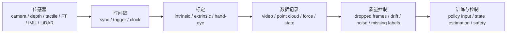

# 传感器、触觉与数据采集硬件

> 目标：理解视觉、深度、力/力矩、IMU、LiDAR 和触觉传感器如何影响具身智能数据质量和闭环控制。

<table>
  <tr>
    <td width="25%" align="center" valign="top">
      <a href="https://www.realsenseai.com/"></a><br>
      <sub>RealSense：RGB-D 与空间感知硬件生态</sub>
    </td>
    <td width="25%" align="center" valign="top">
      <a href="https://www.stereolabs.com/store/products/zed-2i"></a><br>
      <sub>ZED：双目深度、空间感知和机器人视觉</sub>
    </td>
    <td width="25%" align="center" valign="top">
      <a href="https://www.gelsight.com/products/gelsightmini/"></a><br>
      <sub>GelSight Mini：视触觉和接触几何采集</sub>
    </td>
    <td width="25%" align="center" valign="top">
      <a href="https://ouster.com/"></a><br>
      <sub>Ouster：LiDAR、移动机器人和室外感知</sub>
    </td>
  </tr>
</table>

传感器问题经常比模型问题更早成为瓶颈。相机不同步、外参漂移、深度噪声、触觉延迟、力传感器零漂，都会让数据集看起来很大但不可用。

传感器决定了机器人能够感知哪些信息，也是具身智能系统观测空间（Observation Space）的来源。对于同一套控制算法而言，更换不同类型的传感器，往往意味着策略输入、状态估计方式以及数据采集流程都需要重新设计。

在实际项目中，传感器问题往往比模型问题更早成为瓶颈。相机不同步、外参漂移、深度噪声、触觉延迟、力传感器零漂等问题，都会让数据集看起来规模很大，却无法支撑稳定训练或真实部署。因此，高质量的数据采集不仅依赖更好的模型，更依赖稳定的传感器、准确的标定以及可靠的同步机制。

## 感知链路



数据采集并不是把相机安装到机器人上就结束了，而是一条完整的数据处理链路。传感器首先需要完成时间同步，随后进行内参、外参以及手眼标定，之后才能记录图像、点云、机器人状态等数据。最终，这些数据还需要经过质量检查，确认不存在丢帧、漂移、噪声或标签错误，才能进入模仿学习、强化学习或视觉语言动作模型（VLA）的训练流程。

因此，数据质量不仅取决于传感器本身，更取决于整个感知链路是否稳定可靠。

> 图 12.3.4：时间同步、标定和质量控制决定采集的数据能否真正用于具身智能训练，而不仅仅是能够被记录下来。

## 常见视觉与状态传感器

| 类型 | 代表生态 | 用途 | 重点风险 |
|---|---|---|---|
| RGB-D 相机 | RealSense、Orbbec、Azure Kinect 历史生态、ZED、Luxonis OAK-D | 桌面操作、点云、深度感知 | 深度噪声、反光物体、同步和驱动版本 |
| 工业相机 | Basler、FLIR、Hikrobot、Daheng、Allied Vision | 高帧率、高稳定性、标定系统 | 触发、曝光、带宽和镜头选择 |
| 双目/空间相机 | ZED、Luxonis OAK、Structure 系列 | 深度估计、移动机器人感知 | 标定和低纹理场景 |
| IMU | Xsens、VectorNav、MicroStrain | 移动机器人、人形、状态估计 | 零偏、漂移和坐标系定义 |
| 力/力矩传感器 | ATI、Robotiq FT、OnRobot HEX | 接触任务、力控、插拔、打磨 | 零漂、过载和安装刚度 |
| LiDAR | Ouster、Velodyne、Hesai、RoboSense、Livox | 移动机器人、室外导航、建图 | 多传感器同步、动态物体和点云密度 |

不同类型的传感器能够提供不同形式的观测信息。RGB 相机提供颜色和纹理，是目前模仿学习和 VLA 数据集最常见的输入；RGB-D 相机进一步增加深度信息，使机器人能够恢复目标物体的三维结构，在抓取和操作任务中得到广泛应用。

工业相机通常具有更高的图像质量和同步能力，更适合需要严格标定和高速采集的实验。双目相机通过双目匹配恢复深度，适用于移动机器人和空间感知，但在低纹理或重复纹理环境下容易出现误差。

对于移动机器人、人形机器人以及四足机器人而言，仅依赖视觉通常无法稳定估计运动状态，因此需要 IMU 提供角速度和加速度信息，与视觉共同完成状态估计。LiDAR 则能够直接获取环境几何结构，在建图、定位和导航任务中具有重要作用。

力/力矩传感器通常安装在机器人腕部或末端执行器附近，用于检测接触力、执行力控任务以及实现更加稳定的插拔、装配和打磨操作，也是接触丰富任务的重要观测来源。

## 触觉与接触传感

| 类型 | 代表生态 | 用途 | 课程关注 |
|---|---|---|---|
| 视触觉 | GelSight、DIGIT、GelSlim、TacTip | 接触形变、纹理、滑移检测 | 图像到接触状态的标定和延迟 |
| 电子皮肤/阵列触觉 | XELA、Paxini、Touchence 等 | 灵巧手、接触丰富任务 | 阵列密度、耐久性和布线 |
| 末端力反馈 | 夹爪内置力传感、腕部 FT | 抓取稳定性、力位混合控制 | 与控制器频率和安全阈值绑定 |
| 声音/麦克风阵列 | ReSpeaker、工业麦克风阵列 | 接触声音、异常检测、人机交互 | 噪声、同步和隐私 |

随着灵巧操作的发展，机器人越来越需要感知"已经接触到什么"，而不仅仅依赖视觉判断目标位置。触觉传感器能够提供视觉难以获取的信息，例如接触位置、压力分布、摩擦状态以及滑移情况，从而帮助机器人完成更加稳定的闭环控制。

近年来，视触觉传感器逐渐成为研究热点。这类传感器通过内部相机观察柔性介质的形变，将接触信息转换为图像，再利用视觉算法恢复接触几何、法向力以及纹理信息，因此能够获得远高于传统压力阵列的空间分辨率。

相比之下，电子皮肤更加关注大面积触觉覆盖，适用于灵巧手、多指机器人以及人形机器人。腕部六维力/力矩传感器则主要用于检测整体接触力，帮助机器人完成插拔、装配以及柔顺控制等任务。

在未来的具身智能系统中，视觉、触觉、力觉以及听觉将越来越多地融合使用，共同构成机器人的多模态观测空间，而不再依赖单一传感器完成全部感知任务。

## 数据采集检查卡片

在正式开展数据采集之前，可以先填写一份 **Sensor Setup Card**，用于记录整个采集系统的传感器配置、同步方式、标定信息以及质量检查流程。这份记录不仅能够帮助复现实验，也能够快速定位数据集中的潜在问题。

```yaml
sensor_setup_card:
  sensors:
    cameras: []
    tactile: []
    force_torque: ""
    imu_or_lidar: ""
  synchronization:
    clock: ""
    trigger: ""
    max_skew_ms: ""
  calibration:
    intrinsic: ""
    extrinsic: ""
    hand_eye: ""
  data_recording:
    format: "mp4 / image folders / rosbag / hdf5 / parquet"
    fps: ""
    resolution: ""
    compression: ""
  quality_checks:
    dropped_frames: ""
    depth_noise: ""
    timestamp_gaps: ""
    extrinsic_drift: ""
    tactile_latency: ""
  course_action: "data-lab / perception-demo / deployment-reference"
```

已填写示例：

```yaml
sensor_setup_card:
  sensors:
    cameras:
      - "front RGB-D camera"
      - "wrist RGB camera"
    tactile:
      - "optional fingertip tactile sensor"
    force_torque: "optional wrist FT"
    imu_or_lidar: "not required for fixed tabletop arm"
  synchronization:
    clock: "single host clock or hardware trigger"
    trigger: "software trigger acceptable for demo; hardware trigger preferred for dataset"
    max_skew_ms: "record and inspect; high-speed manipulation needs tighter skew"
  calibration:
    intrinsic: "camera intrinsics saved with dataset"
    extrinsic: "base-to-camera and wrist-to-camera transforms"
    hand_eye: "required for wrist camera and robot-frame labels"
  data_recording:
    format: "HDF5 or LeRobot-compatible video + metadata"
    fps: "must match policy observation rate"
    resolution: "fixed across train and eval"
    compression: "avoid settings that remove contact details"
  quality_checks:
    dropped_frames: "flag any trajectory with missing frames"
    depth_noise: "inspect reflective and transparent objects separately"
    timestamp_gaps: "plot action and frame intervals"
    extrinsic_drift: "rerun calibration target check after long sessions"
    tactile_latency: "tap test against video timestamps"
  evidence_level: "L3 when schema, sync, calibration and QC logs are saved"
  course_action: "data-lab"
```

## 常见数据采集问题

| 现象 | 可能原因 | 处理方式 |
|---|---|---|
| 模型训练 loss 正常但真机失败 | 相机外参漂移或动作时间戳错位 | 回放轨迹，检查视觉和动作对齐 |
| 深度图大片空洞 | 反光、透明、黑色物体或距离不合适 | 换视角、补 RGB 或点云滤波 |
| 触觉信号不可重复 | 指尖磨损、安装松动、温漂 | 做接触基线和定期校准 |
| 力控插拔抖动 | FT 零漂、控制频率低、刚度不匹配 | 重新置零，降低速度，记录安全阈值 |

在真实项目中，模型训练效果正常但真机表现较差，很多时候并不是模型没有学会任务，而是训练数据本身存在问题。例如，相机时间戳与机器人动作存在偏移，会导致策略学习到错误的动作对应关系；相机外参发生漂移，则会使机器人认为目标物体始终位于错误的位置。

排查这类问题时，最有效的方法通常不是立即修改模型，而是回放采集轨迹，将视频、机器人状态、动作命令以及成功标签绘制到同一时间轴上。如果能够发现视觉变化始终落后于机器人动作，或者不同传感器之间存在明显时间偏移，就应优先修正同步和标定问题，再重新训练模型。

## 小任务

1. 为一个桌面操作数据采集系统填写一份 `sensor_setup_card`。
2. 写出至少三条需要进行时间同步的数据流，例如 RGB 图像、机器人状态、动作命令、深度图或触觉数据。
3. 设计一个能够检测相机外参漂移的实验流程，并说明如何判断是否需要重新标定。

Sources:

产品入口：
- [RealSense](https://www.realsenseai.com/)
- [Orbbec](https://www.orbbec.com/)
- [Stereolabs ZED 2i](https://www.stereolabs.com/store/products/zed-2i)
- [Luxonis OAK-D](https://shop.luxonis.com/products/oak-d)
- [ATI Industrial Automation](https://www.ati-ia.com/)
- [GelSight](https://www.gelsight.com/)
- [DIGIT tactile sensor](https://digit.ml/)
- [Ouster](https://ouster.com/)
- [VectorNav](https://www.vectornav.com/)

开发文档与 SDK：
- [RealSense SDK](https://github.com/realsenseai/librealsense)
- [Stereolabs documentation](https://www.stereolabs.com/docs)
- [Ouster SDK Documentation](https://static.ouster.dev/sdk-docs/)
- [GelSight Mini product page](https://www.gelsight.com/products/gelsightmini/)
- [DIGIT interface](https://github.com/facebookresearch/digit-interface)

- 上一级：[硬件与产业生态](../03-hardware-and-industry.md)
