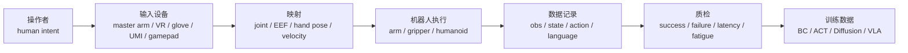

# 遥操作系统与数据采集平台

> 目标：理解真实机器人数据采集中常见的遥操作、示教和采集平台，知道它们如何影响数据质量和动作表示。

<table>
  <tr>
    <td width="33%" align="center" valign="top">
      <a href="https://tonyzhaozh.github.io/aloha/"></a><br>
      <sub>ALOHA：双臂主从遥操作、ACT 数据采集和训练</sub>
    </td>
    <td width="33%" align="center" valign="top">
      <a href="https://wuphilipp.github.io/gello_site/"></a><br>
      <sub>GELLO：低成本同构主臂遥操作</sub>
    </td>
    <td width="33%" align="center" valign="top">
      <a href="https://umi-gripper.github.io/"></a><br>
      <sub>UMI：手持夹爪和腕部相机采集人类演示</sub>
    </td>
  </tr>
</table>

## 遥操作链路



一次完整的遥操作数据采集通常包括七个环节。操作者首先通过主臂、VR、数据手套或其他输入设备表达操作意图，系统随后将这些输入映射为机器人能够执行的动作命令，例如关节角度、末端位姿或速度控制命令。机器人完成动作后，同时记录图像、机器人状态、动作序列以及语言标签等信息，并对采集数据进行质量检查，最终形成能够用于训练策略的数据集。

整个过程中，每一个环节都会影响最终的数据质量。例如，动作映射方式决定了策略需要学习什么样的动作空间；系统延迟会改变操作者的控制习惯；人体疲劳则可能导致动作不稳定，从而影响轨迹质量。因此，遥操作系统不仅是一套控制系统，更是一条完整的数据生成流水线。

> 图 12.3.5：遥操作系统既负责机器人控制，也负责训练数据生成。映射方式、系统延迟以及人体工学都会直接影响数据分布和策略学习效果。

## 常见遥操作系统

| 系统 | 入口 | 主要定位 | 重点检查 |
|---|---|---|---|
| ALOHA / Mobile ALOHA | ALOHA | 低成本双臂主从遥操作、ACT 数据采集和训练 | 双臂映射、相机布局、Action Chunk |
| GELLO | GELLO | 低成本关节同构主臂，适配 Franka、UR、xArm 等 | 主从关节对应、延迟、机械装配 |
| UMI | UMI | 手持夹爪和腕部相机采集人类演示 | 人类动作到机器人动作的映射 |
| Open TeleVision | Open TeleVision | VR 主动立体视觉遥操作，人形和双臂任务 | VR 视角、延迟、双手映射 |
| LeRobot SO-100 / SO-101 | LeRobot | 低成本主从臂、教学和开源数据采集 | 数据格式、校准、低成本硬件误差 |
| SpaceMouse / Gamepad / Keyboard | 通用输入设备 | 调试和简单采集 | 动作维度有限，采集效率较低 |
| 外骨骼与数据手套 | Manus、SenseGlove、Noitom、Rokoko | 手部动作、人形和灵巧手映射 | 手部标定、佩戴舒适性和长期疲劳 |
| 动捕系统 | OptiTrack、Vicon、Xsens、Noitom | 人体动作捕捉、全身遥操作、数据标注 | 坐标系、遮挡和同步 |

近年来出现了多种不同的数据采集平台，它们在动作表示、适用机器人以及采集成本方面各有特点。

ALOHA 和 Mobile ALOHA 采用双臂主从结构，机器人动作能够直接映射到目标机器人，因此生成的数据与机器人控制接口具有较高一致性，也是 ACT 等工作的主要数据来源。

GELLO 使用关节同构主臂作为输入设备，通过保持主臂与目标机械臂之间一致的关节结构，减少逆运动学求解，提高了遥操作稳定性，适合桌面机械臂的数据采集。

UMI 则采用完全不同的思路，通过手持夹爪配合腕部相机直接采集人类操作，不需要真实机器人即可获得大量示教数据。这种方式采集成本更低、场景更加灵活，但需要后续完成从人类动作到机器人动作的重定向（Retargeting）。

除此之外，VR 遥操作、数据手套、外骨骼以及人体动作捕捉系统也越来越多地应用于双臂机器人、人形机器人以及灵巧手的数据采集，为复杂操作任务提供更加丰富的动作来源。

## 遥操作数据质量

| 维度 | 具体问题 | 为什么重要 |
|---|---|---|
| 映射方式 | 关节空间、末端位姿、人体动作还是视觉轨迹 | 决定 Action Schema |
| 延迟和抖动 | 操作端到机器人端的延迟是否稳定 | 延迟会改变操作者行为和失败模式 |
| 同步 | 多相机、状态、动作和语言标注是否对齐 | 时序错位会影响模仿学习 |
| 人体工学 | 操作者疲劳、学习成本、长期采集稳定性 | 疲劳会降低数据质量 |
| 数据格式 | 是否支持 LeRobot、RLDS、HDF5 等格式 | 决定后续训练成本 |
| 失败标注 | 是否记录失败轨迹和失败原因 | 影响策略鲁棒性分析 |

遥操作平台采集的数据质量不仅取决于机器人是否完成任务，更取决于数据是否能够真实反映操作者的决策过程。

其中最重要的是动作映射方式。不同系统可能记录关节角度、末端位姿、速度命令甚至人体骨架信息，这些都会直接决定数据集的 Action Schema。如果目标机器人采用不同的控制接口，就需要重新设计动作表示或进行动作重定向。

系统延迟也是影响数据质量的重要因素。较大的通信延迟会迫使操作者提前预测机器人运动，从而改变操作习惯；而不稳定的延迟还会增加轨迹抖动，使采集到的数据更加难以学习。

与此同时，多路传感器的同步、统一的数据格式以及成功与失败轨迹的完整标注，也是保证数据能够进入训练流程的重要条件。对于大规模数据集而言，失败轨迹往往与成功轨迹同样重要，因为它们能够帮助策略学习恢复行为和异常处理能力。

## 遥操作采集卡片

在正式开展数据采集之前，可以填写一份 **Teleoperation Card**，记录遥操作平台的输入设备、动作映射方式、数据格式以及同步方案。这份记录不仅能够帮助复现实验，也便于不同采集平台之间统一数据格式。

```yaml 
teleoperation_card: 
  system: "" 
  input_device: "master arm / VR / glove / handheld gripper / gamepad" 
  target_robot: "" 
  mapping: "joint / EEF pose / velocity / hand pose" 
  latency_ms: "" 
  observation_streams: [] 
  action_schema: "" 
  data_format: "LeRobot / RLDS / HDF5 / rosbag / custom" 
  annotation: language: "" 
  success_failure: "" 
  ergonomics_risk: "" 
  evidence_level: "L1 / L2 / L3 / L4" 
  course_action: "data-demo / collection-lab / ecosystem-only"
```

## GELLO 与 UMI 的区别

| 维度 | GELLO | UMI |
|---|---|---|
| 数据来源 | 主从遥操作机器人执行 | 人手持夹爪采集人类演示 |
| 优势 | 动作与目标机器人更加一致 | 成本低、场景覆盖灵活 |
| 风险 | 需要机械装配和目标机器人映射 | 人类轨迹与机器人动作之间存在重定向误差 |
| 课程定位 | 适合遥操作系统导读和机器人数据采集实验 | 适合低成本数据采集和动作重定向案例 |

两种系统分别代表了目前具身智能数据采集的两条主要路线。

GELLO 更接近传统机器人遥操作，通过控制真实机器人直接生成训练数据，因此动作表示与机器人控制接口高度一致，能够较方便地用于模仿学习训练。

UMI 更强调利用人类自身完成示教，通过手持夹爪和腕部相机记录人类操作过程，再将这些动作映射到机器人执行。这种方案能够显著降低采集成本，并覆盖更多真实场景，但需要解决动作重定向和人机运动差异带来的问题。

对于后续策略训练而言，无论采用哪一种方案，都需要重点检查四个方面：观测数据是否完整、动作表示是否与目标机器人一致、各类数据是否完成时间同步，以及成功与失败轨迹是否经过统一标注。只有满足这些条件，采集得到的数据才能稳定进入训练流程。

## 小任务

1.从 ALOHA、GELLO 或 UMI 中任选一个平台，填写一份 `teleoperation_card`。
2.列出该系统记录的 Observation、State、Action 以及语言标注内容。
3.根据 Observation、Action Schema、时间同步以及成功/失败标注四个方面，分析该系统采集的数据是否能够直接用于策略训练，并说明理由。

Sources:

项目入口：
- [ALOHA](https://tonyzhaozh.github.io/aloha/)
- [GELLO](https://wuphilipp.github.io/gello_site/)
- [UMI](https://umi-gripper.github.io/)
- [Open TeleVision](https://robot-tv.github.io/)
- [LeRobot documentation](https://huggingface.co/docs/lerobot/)

代码与工程入口：
- [ALOHA GitHub](https://github.com/tonyzhaozh/aloha)
- [GELLO software](https://github.com/wuphilipp/gello_software)
- [UMI GitHub](https://github.com/real-stanford/universal_manipulation_interface)
- [LeRobot GitHub](https://github.com/huggingface/lerobot)

设备与采集工具：
- [3Dconnexion SpaceMouse](https://3dconnexion.com/)
- [Manus](https://www.manus-meta.com/)
- [SenseGlove](https://www.senseglove.com/)
- [OptiTrack](https://optitrack.com/)
- [Vicon](https://www.vicon.com/)

- 上一级：[硬件与产业生态](../03-hardware-and-industry.md)
