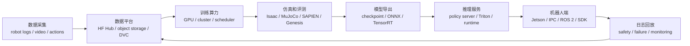

# 算力、仿真、数据平台与部署基础设施

> 目标：理解具身智能从训练到真机部署依赖的算力、仿真、数据管理、推理服务和机器人中间件。

<table>
  <tr>
    <td width="50%" align="center" valign="top">
      <a href="https://developer.nvidia.com/isaac/sim"></a><br>
      <sub>Isaac Sim：仿真、合成数据和机器人开发生态</sub>
    </td>
    <td width="50%" align="center" valign="top">
      <a href="https://www.nvidia.com/en-us/autonomous-machines/embedded-systems/"></a><br>
      <sub>边缘计算：机器人端推理、传感器接入和低延迟控制</sub>
    </td>
  </tr>
</table>

具身智能系统不仅由机器人和模型组成，还依赖一套完整的基础设施完成数据管理、模型训练、仿真验证、在线推理以及真机部署。对于实际工程而言，一个能够稳定运行的机器人系统，往往比一个性能更高的模型更加依赖完善的基础设施。

从采集数据到机器人执行动作，需要经历数据存储、模型训练、仿真评测、模型导出、推理部署以及日志回放等多个阶段。每一个阶段都需要对应的软件平台和工程工具共同支撑，才能保证模型能够稳定训练、正确部署，并且在出现问题时能够快速定位原因。

## 基础设施闭环



具身智能基础设施构成了一条完整的工程闭环。机器人首先采集图像、状态和动作等数据，并上传到统一的数据平台进行版本管理；随后利用 GPU 或计算集群完成模型训练，并在仿真环境中进行验证和评测。训练完成后，模型通常需要导出为适合部署的格式，例如 ONNX 或 TensorRT，再通过推理服务部署到机器人端，由 ROS 2、厂商 SDK 或其他控制系统负责执行策略输出。

机器人运行过程中还需要持续记录日志，包括观测数据、动作命令、推理结果以及异常信息。当系统出现问题时，可以利用这些日志进行轨迹回放、故障定位和重新训练，从而形成持续迭代的数据闭环。

> 图 12.4.6：模型部署并不是将模型文件复制到机器人即可完成，而是依赖数据管理、训练环境、仿真评测、推理服务、机器人接口以及日志回放共同组成的完整基础设施。

## 基础设施组成

| 层级 | 代表生态 | 用途 | 课程关注 |
|---|---|---|---|
| GPU 训练 | NVIDIA CUDA、PyTorch、JAX、集群调度 | VLA、强化学习、世界模型训练 | 软件版本、显存、分布式训练 |
| 仿真平台 | Isaac Sim/Lab、MuJoCo、SAPIEN、Genesis | 数据生成、强化学习、评测、数字孪生 | 仿真资产、物理参数、渲染一致性 |
| 数据平台 | Hugging Face Hub、对象存储、DVC、LakeFS | 数据集、模型权重、Metadata 管理 | License、版本控制、完整性校验 |
| 实验管理 | Weights & Biases、TensorBoard、MLflow、Trackio | 日志、指标、可视化 | Config、Seed、Artifact 管理 |
| 推理部署 | TensorRT、ONNX Runtime、Triton Inference Server、Policy Server | 在线推理和服务化部署 | 延迟、吞吐量、异常回退 |
| 机器人中间件 | ROS 2、MoveIt 2、DDS、厂商 SDK | 控制、通信、传感器接入 | Topic、Clock、QoS、安全机制 |
| 边缘计算 | Jetson、工业 PC、NUC、实时控制器 | 机器人端推理和设备管理 | 功耗、温度、实时性 |

整个基础设施通常可以划分为训练、仿真、数据管理、部署以及机器人运行五个部分。

GPU 训练平台负责完成模型优化，是具身智能计算资源最集中的环节。随着 VLA、世界模型以及扩散策略的发展，训练往往需要多块 GPU 甚至计算集群协同完成，因此 CUDA、驱动版本以及深度学习框架之间的兼容性尤为重要。

仿真平台承担着数字孪生、强化学习和策略评测等任务。目前 Isaac Sim、MuJoCo、SAPIEN 和 Genesis 等平台分别面向不同的应用场景，它们共同目标都是在真实部署之前验证模型性能，并降低真机实验成本。

数据平台负责统一管理轨迹数据、视频、模型权重以及元数据，使不同实验能够共享数据，并保证整个训练过程具有可追溯性。与此同时，实验管理工具负责记录训练配置、随机种子、指标变化以及模型版本，方便后续复现实验结果。

模型完成训练后，需要部署到机器人端进行在线推理。根据硬件条件不同，可以直接使用 PyTorch，也可以转换为 ONNX 或 TensorRT，以获得更低的推理延迟。推理服务通常需要与 ROS 2、机器人 SDK 以及控制器共同工作，才能将策略输出转换为机器人能够执行的控制命令。

## 部署检查卡片

在正式部署策略之前，可以填写一份 **Deployment Infrastructure Card**，统一记录训练环境、仿真平台、推理服务、机器人端配置以及日志方案。这些信息不仅能够帮助复现实验，也能够在模型出现异常时快速定位问题。

```yaml
deployment_infra_card:
  training:
    framework: ""
    gpu: ""
    environment: ""
    checkpoint_version: ""
  simulation_eval:
    simulator: ""
    task_version: ""
    metric: ""
  serving:
    runtime: "PyTorch / ONNX / TensorRT / Triton / custom"
    latency_ms: ""
    fallback: ""
  robot_side:
    compute: ""
    middleware: "ROS 2 / SDK / custom"
    control_frequency: ""
    safety_limits: []
  logging:
    observations: []
    actions: []
    failures: ""
  course_action: "deploy-reference / benchmark-lab / ecosystem-only"
```

已填写示例：

```yaml
deployment_infra_card:
  training:
    framework: "imitation policy or VLA fine-tuning codebase"
    gpu: "record GPU type, CUDA, driver and batch setting"
    environment: "conda/docker image hash"
    checkpoint_version: "model commit + checkpoint filename"
  simulation_eval:
    simulator: "ManiSkill / LIBERO / Isaac / real replay"
    task_version: "exact task suite and seed"
    metric: "success rate plus failure categories"
  serving:
    runtime: "PyTorch first; ONNX/TensorRT only after numerical check"
    latency_ms: "measure p50 and p95"
    fallback: "hold position / stop / human takeover"
  robot_side:
    compute: "workstation or edge computer"
    middleware: "ROS 2 / vendor SDK"
    control_frequency: "must match policy output rate or use interpolation"
    safety_limits:
      - "workspace limit"
      - "speed and force limit"
      - "emergency stop"
  logging:
    observations:
      - "camera frames"
      - "robot state"
    actions:
      - "raw policy action"
      - "denormalized robot command"
    failures: "record stop reason and replay packet"
  evidence_level: "L4 only after dry-run, low-speed test and logging are validated"
  course_action: "deploy-reference"
```

## 部署前需要检查什么

| 关注点 | 为什么重要 |
|---|---|
| 动作反归一化 | 策略输出需要转换为机器人能够执行的物理量 |
| 推理延迟 | 推理速度必须满足机器人控制频率 |
| 异步传感 | 多种传感器不同步会影响闭环稳定性 |
| 安全监控 | 限位、速度限制、力阈值和急停必须独立于模型 |
| 日志回放 | 没有完整日志就难以定位失败原因 |
| 版本追踪 | 数据、模型、代码和机器人参数需要一一对应 |

| 缺失条件 | 课程建议 |
|---|---|
| 缺少真机接口和安全规范 | 仅适合作为 Benchmark 或生态案例 |
| 缺少动作反归一化记录 | 不建议直接部署到真实机器人 |
| 缺少推理延迟和控制频率测试 | 建议仅进行离线回放验证 |
| 缺少日志回放系统 | 无法定位失败原因，不适合作为部署案例 |
| 缺少人工接管和急停机制 | 不应进入真机实验阶段 |

真正决定模型能否部署到机器人上的，往往不是策略本身，而是整个部署链路是否完整。例如，训练得到的动作通常经过归一化处理，在机器人端必须恢复为真实关节角度、速度或末端位姿；推理延迟必须低于机器人控制周期，否则控制器会出现动作滞后；安全监控必须独立于模型运行，确保模型失效时机器人仍然能够及时停止。

与此同时，日志系统也是部署过程中不可缺少的一部分。只有完整记录机器人观测、动作、推理输出以及异常信息，才能在失败后回放整个执行过程，分析模型、控制器还是硬件导致了错误。

## 从训练到机器人部署

| 阶段 | 需要记录 |
|---|---|
| 训练 | 数据版本、模型 Commit、超参数、随机种子、GPU 环境 |
| 导出 | Checkpoint 名称、动作归一化参数、输入尺寸 |
| 推理 | 推理框架、平均延迟、尾部延迟、回退策略 |
| 接口 | ROS Topic、SDK 接口、控制频率、安全限位 |
| 验收 | Dry Run、低速测试、人工接管、日志及失败案例 |

模型真正部署到机器人之前，需要完成一系列工程验证。首先保证训练过程可以复现，然后确认导出的模型与训练版本一致，再测试推理速度是否满足控制要求，最后验证机器人接口、安全机制以及日志系统是否正常工作。

只有当数据版本、模型版本、控制接口以及部署环境全部能够对应起来时，整个具身智能系统才具备稳定迭代和持续优化的基础。这也是现代机器人系统越来越强调工程基础设施的重要原因。

## 小任务

1.为一个 VLA 或模仿学习策略填写一份 `deployment_infra_card`。
2.写出从训练 Checkpoint 到机器人执行动作过程中必须记录的至少五个版本信息。
3.说明为什么模型部署和真机安全应分别由独立模块负责，而不能依赖同一个部署脚本完成。

Sources:

产品与项目入口：
- [NVIDIA Isaac Sim](https://developer.nvidia.com/isaac/sim)
- [NVIDIA Jetson](https://www.nvidia.com/en-us/autonomous-machines/embedded-systems/)
- [MuJoCo](https://mujoco.org/)
- [SAPIEN](https://sapien.ucsd.edu/)
- [Genesis World](https://genesis-world.readthedocs.io/)
- [Hugging Face Hub](https://huggingface.co/)
- [DVC](https://dvc.org/)
- [MLflow](https://mlflow.org/)
- [TensorRT](https://developer.nvidia.com/tensorrt)
- [Triton Inference Server Documentation](https://docs.nvidia.com/deeplearning/triton-inference-server/user-guide/docs/)
- [Triton Inference Server GitHub](https://github.com/triton-inference-server/server)
- [ROS 2 Documentation](https://docs.ros.org/)
- [MoveIt](https://moveit.picknik.ai/)

工程文档：
- [NVIDIA Isaac Sim Documentation](https://docs.isaacsim.omniverse.nvidia.com/)
- [NVIDIA Jetson Documentation](https://docs.nvidia.com/jetson/)
- [ROS 2 control](https://control.ros.org/)

- 上一级：[硬件与产业生态](../03-hardware-and-industry.md)
